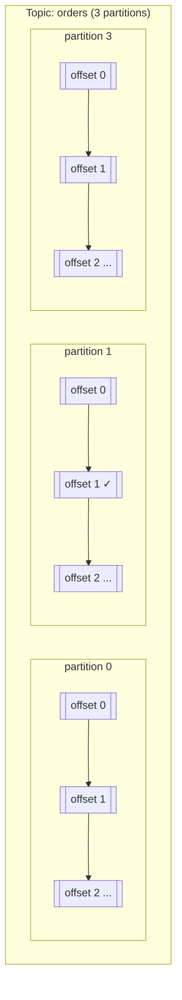
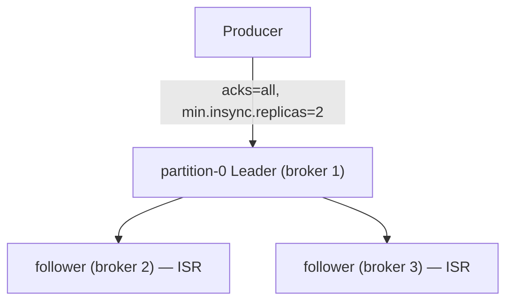
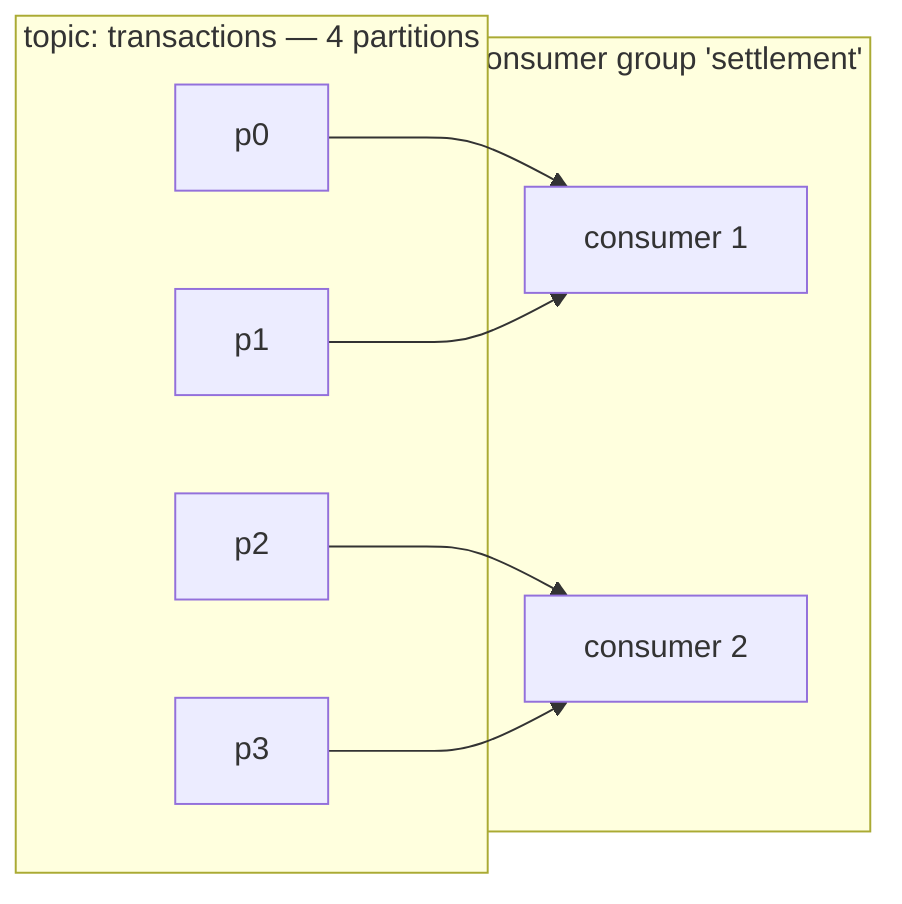
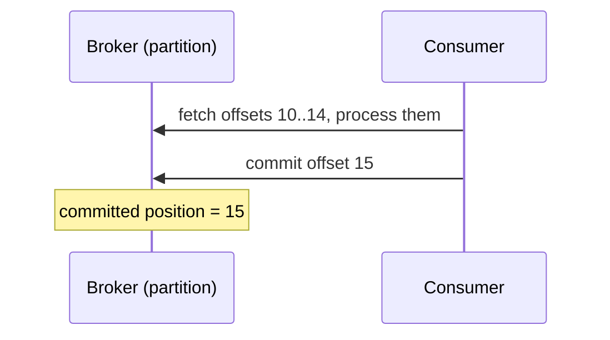
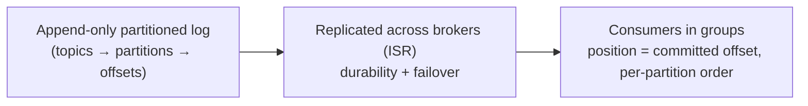

# Kafka Architecture

Kafka is a **distributed, partitioned, replicated commit log**. Internalize that one
sentence and most of Kafka's behavior follows from it.

## Topics, partitions, offsets



- A **topic** is a named, append-only log.
- A topic is split into **partitions** — this is where parallelism lives. Each
  partition is an ordered, immutable sequence of records.
- Each record has an **offset** — its position in the partition, assigned by the broker.
- **Offsets are only meaningful within a partition.** Kafka gives you *per-partition*
  ordering, never global ordering (unless the topic has 1 partition).

## Partitioning and the message key

The **key** of a message decides its partition:

```
partition = hash(key) mod num_partitions
```

That single line is why ordering works: **all records with the same key go to the
same partition, hence remain in order**. `orderId` as key → all events of one order
are ordered. `customerId` as key → all events of one customer are ordered *but*
parallel work happens per customer.

!!! warning "Key design is order design"
    Choosing the wrong key (e.g. `null` → round-robin across partitions) silently
    destroys per-entity ordering. Projects P2 and the [ordering](../02-concepts/ordering.md)
    concept page attack this directly.

## Brokers, replication, ISR

- **Brokers**: Kafka servers. Each broker hosts some partition *leaders* and some
  *followers*.
- **Replication factor** (e.g. `--replication-factor 3`): how many brokers hold a copy
  of a partition. Producers write to the **leader** only; followers replicate.
- **ISR (In-Sync Replicas)**: the set of followers that are caught up with the leader.
  If the leader dies, an ISR follower takes over. `min.insync.replicas` (e.g. 2) says
  "you need at least 2 copies before I ack a write" — this is what turns Kafka from
  "fast" into "doesn't lose acknowledged data".



### Producer durability knobs (learn these like spelling)

| Config | Meaning | When |
|--------|---------|------|
| `acks=0` | Fire and forget; no confirmation | Telemetry, metrics — loss ok |
| `acks=1` | Leader wrote to its log (default) | Leader crash may lose it |
| `acks=all` | All ISR followers confirmed | **Most business events require this** |
| `min.insync.replicas` | Min copies required to ack | 2–3 for Kafka clusters |
| `retries` + `enable.idempotence` | Re-send safely without duplicates on the broker side | On with `acks=all` |

## Consumer groups — the heart of load balancing

A **consumer group** is a set of consumers that *collaborate* to read a topic:

- Each partition is consumed by **exactly one member** of the group at a time.
- **Number of consumers > partitions** → the extra consumers idle (this surprises
  everyone once; design topic partition counts up front).
- Scaling the group = the **rebalance protocol**: on join/leave, assignments are
  redistributed, consumers re-fetch, and *processing pauses briefly*.



!!! danger "The classic trap"
    1 consumer, 6 partitions, bursts of traffic → one machine processes everything.
    Add 5 consumers → rebalances, flood of fetches, possible lag *increase* during
    the reshuffle. That rebalance during heavy load is what "stuck lag" looks like.

## Offsets & the consumer's checkpoint

Each consumer commits its **position** (next offset to read) so it can resume after a
crash.



Ordering of *commit vs process* is the entire delivery-semantics story
([delivery semantics](../02-concepts/delivery-semantics.md)):

- **Commit first, then process** → at-most-once (crash → records skipped forever).
- **Process first, then commit** → at-least-once (crash → records re-delivered, duplicates possible).
- Without extra machinery that's the real choice. Everything "exactly-once" is built
  on one of these two plus idempotency.

## Groups, lag, retention — the operational view

- **Consumer lag** = last committed offset vs the newest record. Lag is *the* health
  metric of async systems. (Project P2 builds a lag dashboard you will keep reusing.)
- **Retention**: topics keep data for `retention.ms` (default usually 7 days) or by
  size. More partitions → more parallelism, but also more broker overhead and more
  files/open handles.
- **Infinite retention?** Yes — that's basically what an event-sourced system wants
  (`log.retention.ms=-1` or a compacted topic).

## KRaft vs ZooKeeper

Modern Kafka (3.x with KRaft) manages its own quorum metadata — **no ZooKeeper
needed**. All setup in this guide uses KRaft, which simplifies the Docker Compose
stack a lot.

## The mental model



!!! quote "30-second interview summary"
    Kafka = distributed commit log. Topics → partitions for parallelism. Keys →
    consistent hashing → per-key ordering. ISR + acks=all + min.insync.replicas →
    acknowledged writes survive failures. Consumer groups → partition assignments,
    committed offsets → resume from crash. And because of that, Kafka gives
    **at-least-once by default**; everything fancier is built on idempotency and
    transactions.

## Checkpoint

??? question "1. Two messages with the same key are always...? With different keys?"
    Same key → `hash(key) % partitions` → **the same partition** → they are
    **strictly ordered** (offsets ascending, assuming one producer or the same
    producer id, and no broker truncation).
    Different keys → very likely *different* partitions → **no ordering guarantee
    between them**; they can even be read in either order by different consumers.

??? question "2. You have 3 consumers and 8 partitions. What happens when you add a 4th consumer? Add 6 more?"
    - 4th consumer → the group rebalances; partitions redistribute so each of the
      4 owns 2.
    - Add 6 more (9 total) → each consumer now owns **at most 1** partition (8
      consumers get one each), and **the 9th sits idle** — you can never have more
      active consumers than partitions.
    - Every add/remove triggers a **rebalance**: consumption pauses briefly while
      assignments are recalculated.

??? question "3. What does `acks=all` + `min.insync.replicas=2` protect you from?"
    **Acknowledged data loss on broker failure.** A write is only acked once *at
    least 2 in-sync replicas* hold it. If the leader dies nanoseconds later, a
    follower that already has the record takes over — the record survives. It also
    makes the broker stop accepting writes (not silently losing them) when the ISR
    shrinks below 2 — e.g. two brokers dying in a 3-node cluster: producers get
    errors instead of believing their data is safe.

??? question "4. Why can't lowering consumer count cause data loss? (Think offsets.)"
    Consumers never own data past their **committed offset** — and the committed
    offset lives in Kafka's own `__consumer_offsets` topic, not in the consumer.
    If you stop one consumer and drop the group to zero members, nothing is
    deleted; the group's committed positions stay, and a future consumer resumes
    from there. Data is removed only by **retention** (time/size), never by
    consumption. Fewer consumers = more lag, not less data.

## Learn more

- **Watch** — [Apache Kafka 101 (Confluent Developer)](https://developer.confluent.io/courses/apache-kafka/events/) — modules on producers, consumers, brokers, partitions, replication and KRaft map 1:1 to this page.
- **Watch** — [Kafka Summit's best-rated internals talks](https://kafka.apache.org/community/videos/) — the official curated list (produce/fetch API internals, replication hardening, Kafka cloud-native).
- **Read** — [Designing Data-Intensive Applications](http://dataintensive.net), ch. 11 "Stream Processing" — the theoretical skeleton behind brokers, logs and partitions.
- **Docs** — [Apache Kafka documentation — Core concepts](https://kafka.apache.org/documentation/) — the reference for every term used on this page.

Next: [Local Environment Setup](setup.md) — get Kafka running in Docker and see these
concepts with your own eyes.