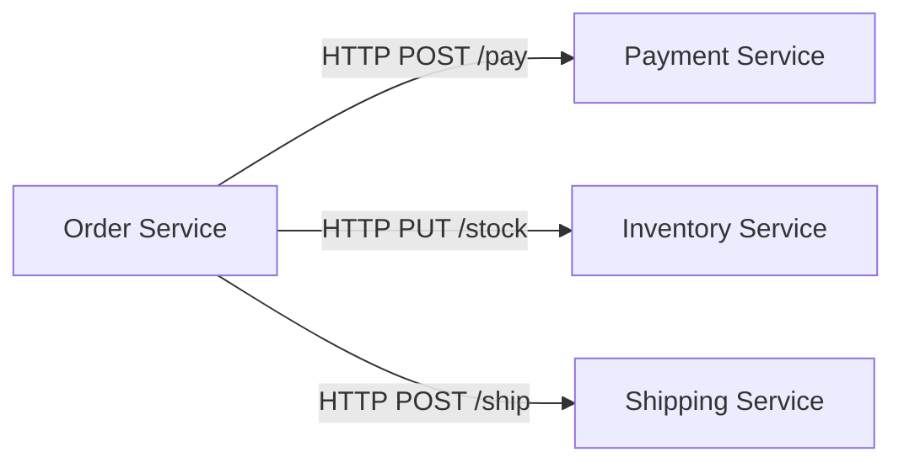
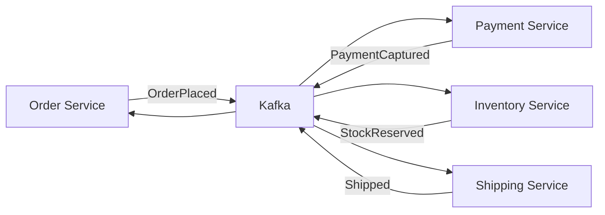
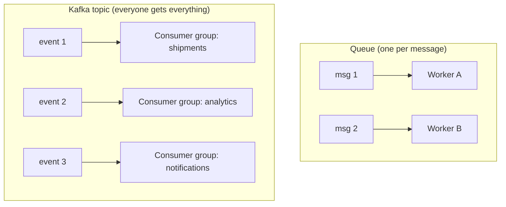

# Messaging & Event-Driven Basics

Before Kafka-specific details, understand *why* we build systems this way and what the
moving pieces are.

## Synchronous calls: where they break

A system where services talk over direct HTTP (URL to URL) is **synchronous and
coupled**:

Problems appear quickly:

1. **Latency = sum of all calls.** The order request waits for payment *and*
   inventory *and* shipping.
2. **Availability = product of all services.** If shipping is down, checkout is down.
3. **No replay.** If a call times out, do you retry? You don't know if the side effect
   happened → *duplicate payments*.
4. **No buffering.** If payment takes 2s during a spike, your web tier is full of
   parked threads.

## The async, event-driven alternative

Services communicate by **exchanging events** (facts that already happened) via a
**message broker** in the middle:

Properties this buys you:

| Property | How |
|----------|-----|
| Decoupling | Producers don't know who consumes. Adding a new consumer = no change to producers. |
| Buffering | Kafka holds events; a slow consumer just lags instead of blocking the caller. |
| Resilience | A failed consumer can replay from its last committed offset. |
| Auditability | Every event is a durable record of "what happened" — perfect for auditing and analytics. |
| Scaling | Many consumers can read the same topic independently (different use cases). |

## Core vocabulary

- **Event**: a fact that happened in the past, e.g. `OrderPlaced { orderId, customerId, total }`.
  Name it in **past tense**, include the entity id, and keep it **self-contained**
  (the consumer should not have to call back to ask what the payload means).
- **Message**: the unit of data — a key, a value (payload), headers (metadata).
- **Producer**: whatever publishes events.
- **Consumer**: whatever reads events and reacts.
- **Broker**: the durable middleman (Kafka itself).
- **Queue vs Topic/Stream**: a *queue* delivers each message to exactly one worker
  (competing consumers). A *topic/stream* delivers each event to every interested
  consumer group. Kafka's model is **log-based**: a topic is an append-only log that
  groups of consumers each read independently.

## When to use events (and when not to)

**Use events when:**

- You need replay/audit (orders, payments, ledgers)
- Consumers are slow or bursty (email, reports, ML)
- You want independent scaling and loose coupling
- The consumer can derive its own result from the event

**Prefer synchronous HTTP when:**

- Response latency matters to the user (you must return the payment result in the
  request/response cycle) — or
- The operation is simple and the caller needs a strong confirmation (auth checks,
  id lookups)

A common hybrid: **sync for the happy-path decision, async for everything after.**
Checkout returns "order accepted" synchronously; the payment/shipping workflow happens
in events.

## Event types you'll meet

| Type | Meaning | Example |
|------|---------|---------|
| Domain event | Something happened in a service | `OrderPlaced` |
| Command / request message | "Please do X" (expects action) | `ValidateCard` |
| Event notification | Signals an action is needed (choreography) | `PaymentCaptured → ShipOrder` |
| Snapshot / state event | Full state published for read models | `InventorySnapshot` |
| Dead letter | Event that failed processing many times | `OrderPlaced.dead` |

## The three laws of event design

!!! quote "Design heuristics"
    1. **An event carries its own context.** A consumer of `OrderPlaced` should need
       nothing except the event to do its job.
    2. **An event is immutable.** Once published it is never changed; correction =
       a new event (`OrderCancelled`, `AmountCorrected`).
    3. **An event describes business fact, not UI intent.** No `ButtonClicked` —
       `OrderSubmitted` yes.

## Checkpoint — answer these before moving on

??? question "1. Why can't a retried HTTP `POST /pay` be safely assumed to be a single payment?"
    Because a retry is a reaction to a **timeout** — and a timeout tells you nothing
    about the first request's fate. The first call may have reached the server and
    succeeded right before the network hiccup; the retry then is a *second*
    payment. Without idempotency (an `Idempotency-Key` or a unique business id that
    the server dedupes against), "retry = risk". This is the exact problem
    Project P3 builds.

??? question "2. If analytics is 30 minutes behind, who is impacted — the order service? The customer?"
    Nobody on the happy path. The order service never waits on analytics — that's
    the entire point of the broker in the middle. The impact is internal: the
    analytics consumer group has **lag**, dashboards/reports are stale, and the
    analytics team's SLA is missing. The customer finishes checkout normally and
    the order pipeline is unaffected. (If analytics drives recommendations, users
    experience slightly stale suggestions — still not an availability issue.)

??? question "3. Name three problems that a durable log (Kafka) solves that an RPC call cannot."
    1. **Replay** — consumers can re-read history (recovery, rebuild read models,
       reproject state, debug "what happened").
    2. **Buffering** — a slow or down consumer just accumulates lag; it never
       blocks producers or the HTTP tier.
    3. **Fan-out** — every interested consumer group reads the same log
       independently, without the producer knowing or caring.
    4. **Durability as audit** — the record is a lasting fact ("this happened, in
       this order, at this time"), not a transient request.

Next: [Kafka Architecture](kafka-architecture.md) — topics, partitions, offsets, and
why "log" is the right mental model.