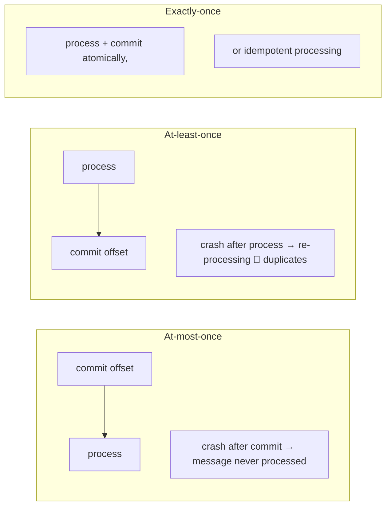

# Delivery Semantics

The single most important concept in this entire course. Everything else —
idempotency, outbox, sagas, exactly-once — exists to cope with the fact that
**distributed systems deliver messages *eventually*, and usually more than once**.

## The fundamental problem

A consumer has two operations on a message:

```
process(message)   → does the business effect (insert row, call API, send email)
commit(offset)     → tells the broker "I'm done with this message"
```

These two operations cannot be made atomic on a network. Either order has a failure
window where the system misbehaves.

## The three semantics



| Semantics | What it means | How you get it |
|-----------|---------------|----------------|
| **At-most-once** | Each message processed 0 or 1 times. Data can be lost. | Commit offset *before* processing (`enable.auto.offset.commit=true` with default behavior, or manual commit-first). |
| **At-least-once** | Each message processed 1 or more times. No loss, but duplicates. | Process *then* commit. **This is Kafka's default and the de-facto standard for business systems.** |
| **Exactly-once** | Each message processed exactly once. | Kafka transactions (P10), or at-least-once **+ idempotent consumers** (P3). On a network, "exactly-once" is always implemented as "at-least-once + make duplicates harmless". |

!!! danger "Duplicate is the default, not the bug"
    If you don't design for duplicates, your payment service will charge twice, your
    email service will send two invoices, and your inventory will be double-deducted.
    **At-least-once + idempotency is the industry-standard answer.**

## Where the duplicates actually come from

```mermaid
sequenceDiagram
    participant P as Producer
    participant B as Broker
    participant C as Consumer
    Note over P,B: 1. Producer retry after timeout
    P->>B: send OrderPlaced (timeout!)
    Note over P: assumes it failed
    P->>B: resend OrderPlaced → duplicate in partition
    Note over B,C: 2. Consumer crashes after processing
    C->>B: fetch msg 12, process 12...
    Note over C: crash before commit
    C->>B: refetch from 12 ♻️ reprocess
```



Two sources of duplication, two defenses:

| Duplication source | Defense |
|--------------------|---------|
| Producer retries → broker duplicates (after timeout) | `enable.idempotence=true` (P10) |
| Consumer reprocessing after crash | Idempotent processing / unique keys (P3) |

## Consumer configs that define semantics

```python
{
    "enable.auto.offset.commit": False,   # never auto-commit; you control offsets
    "auto.offset.reset": "earliest",      # where to start if no committed offset
    "session.timeout.ms": 10000,
    "max.poll.interval.ms": 300000,       # if processing takes longer → kicked → rebalance
}
```

The discipline:

```python
# OK — at-least-once
for msg in consumer:
    process(msg)              # side effects happen
    consumer.commit(asynchronous=False)   # only then checkpoint
```

```python
# DANGEROUS — at-most-once in disguise
for msg in consumer:
    consumer.commit(asynchronous=False)   # checkpoint first!
    process(msg)              # crash → skipped forever
```

!!! quiz "Why does this matter in practice?"
    ❌ Payment sent but offset never committed → customer charged twice.
    ✅ Charge recorded in DB with a unique `event_id` constraint → second attempt
    rejected by the constraint, offset commits fine. The *sensitive* resource
    (money, inventory) is protected at the database level, not by hoping.

## Event vs state processing

A deeper reason duplicates are survivable: **think about what the consumer is doing.**

- **State update**: `UPDATE inventory SET qty = qty - x WHERE sku = ?`
  → *not* idempotent. Running twice double-deducts.
- **Event-driven**: `INSERT INTO inventory_movement(event_id UNIQUE, ...)`
  → idempotent by construction. Or better: keep applying the event with a uniqueness
  guard.

Idempotent consumers process **facts**, not commands. See
[Idempotency](idempotency.md) for the full toolkit.

## The offset cheat sheet

| Thing | Meaning |
|-------|---------|
| `auto.offset.reset=latest` | New group starts reading from now (misses history) |
| `auto.offset.reset=earliest` | New group reads from the beginning (replayed history) |
| Empty group + committed offset | Resumes from committed offset, reset is irrelevant |
| Commit position `N` | Next read starts at `N` (position = next, not last-processed) |
| Stored offset < topic's oldest | Zip to oldest; no data loss for new consumers if retention allows |

## Common sniff test questions

??? question "1. Your consumer commits in a finally block. At-least-once or at-most-once?"
    It **depends on where `process()` sits relative to the commit** — the finally
    block only guarantees the commit runs, not its ordering with the side effect:
    - side effect happens **before** the commit, unconditionally → **at-least-once**
      (crash between → record reprocessed)
    - commit happens **before** the side effect → **at-most-once** (crash between
      → effect never happens, offset already past)
    Rule: look for the *ordering of the two operations*, not for finally/cleanup
    code. The pattern that ends this ambiguity:
    `process(msg); consumer.commit()` in that order, with no code path between them.

??? question "2. Your message handler calls a downstream HTTP API that retries 3 times internally. What can you prove about delivery?"
    Almost nothing about the *downstream effect*. You can prove your consumer
    received the Kafka record (its broker contract is at-least-once). But the
    downstream call was attempted **up to 3 times from your side**, and you cannot
    know whether the API applied any attempt before a timeout. So the *effect* may
    have happened 0, 1, 2, or 3 times in the API's world. That's why "I retried
    inside the handler" is not a delivery guarantee — it's a side effect blur.
    The only proof arrives when the downstream API is **idempotent** (it dedupes
    on a key you send).

??? question "3. Why is *exactly-once* not achievable for a consumer that calls an external API without transactional support from that API?"
    Exactly-once for a consumer means "process the record exactly once **and**
    checkpoint it exactly once, atomically." An external API can't participate in
    your offset commit — there is no transaction spanning "your consumer + the
    API's state". The crash window is permanent: call the API → crash → record
    redelivered → you must call the API again. Since the API has no idempotency
    contract ("same key = no-op"), duplicates are unavoidable. At-least-once
    delivery + an API-provided idempotency key is the only achievable equivalent.

??? question "4. Is it safe to send an email to a customer from a message handler? How would you make it safe?"
    No — at-least-once means the handler can run twice for the same record
    (crash between effect and commit, or a replay), so the customer can get **two
    emails**. To make it safe:
    1. **Dedup by event id** — `processed_events` row with `UNIQUE(event_id)` in
       the same transaction as the email-job insert (Project P3).
    2. Or record the **intent** (`email_jobs` row with a unique `event_id`) and let
       a worker send with a provider-side idempotency key.
    3. Or go through an **outbox** so the email intent is durable and the send loop
       is idempotent (Projects P4–P8 build all of this).
    Rule of thumb: never let a handler with external side effects run unguarded —
    give each event a unique id and make the side effect key by it.

## Summary

- Default Kafka contract: **at-least-once**. Producer side: `acks=all` +
  `enable.idempotence`. Consumer side: process-then-commit.
- Duplicates are not a bug *you* can eliminate by config — you **absorb them** with
  idempotency (next page) or Kafka transactions (P10).
- Never auto-commit in a business consumer. Take ownership of offsets.

## Learn more

- **Docs** — [Kafka documentation — Message delivery semantics](https://kafka.apache.org/documentation/#semantics) — the authoritative statement of at-most-once / at-least-once / exactly-once and where "once" actually means "once *per committed offset*".
- **Read** — [Exactly-once Semantics Are Possible: Here's How Kafka Does It](https://www.confluent.io/blog/exactly-once-semantics-are-possible-heres-how-apache-kafka-does-it/) (Neha Narkhede) — the "B is different from C" framing used throughout this page.
- **Watch** — [Reliable Message Delivery with Apache Kafka (Kafka Summit SF 2018)](https://www.confluent.io/kafka-summit-sf18/reliable-message-delivery-with-apache-kafka/) — the design-space walkthrough from producers through to consumers, in 26 minutes.
- **Read** — [Designing Data-Intensive Applications](http://dataintensive.net), ch. 11 "Stream Processing" — idempotence and exactly-once trade-offs in depth.

Next: [Idempotency](idempotency.md)