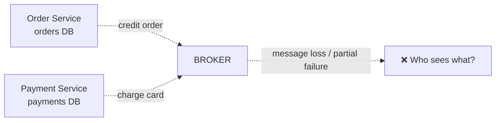
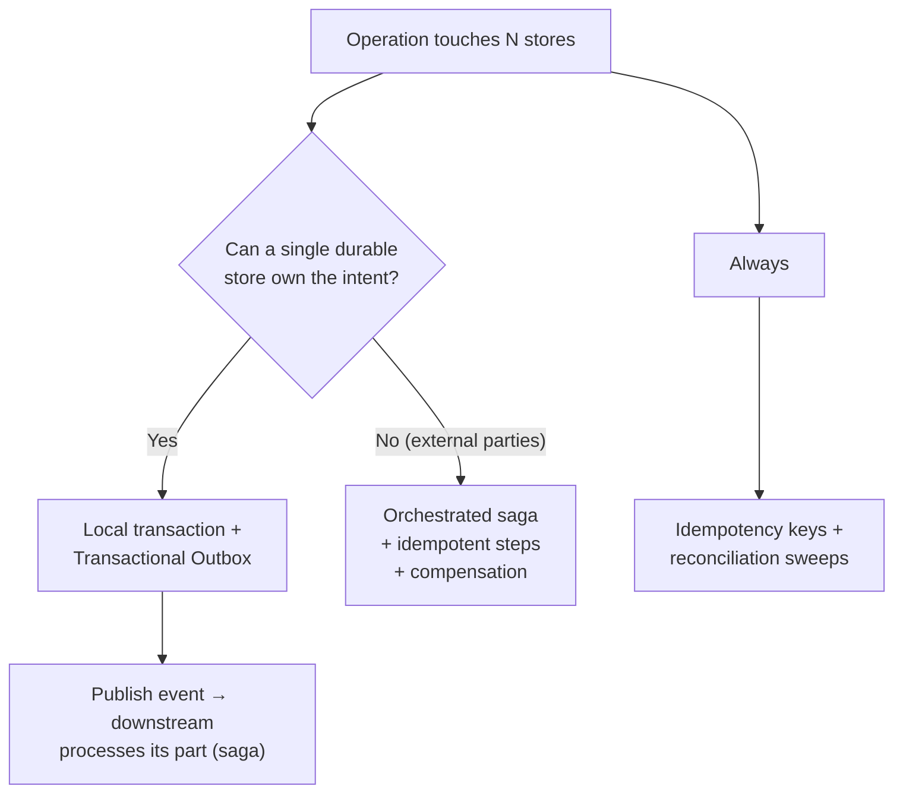

# Distributed Transactions: What They Are & Why We Avoid Them

People say "distributed transactions are bad" — that's half the story. The full story:
**atomic commits across independent databases/brokers are either impossible or
prohibitively expensive, so we design *around* them with patterns** — outbox, saga,
compensation, idempotency.

## The problem in one picture



Every "distributed transaction" question is really: *three independent state holders
(order, payment, broker) need to stay consistent, with no single point of control.*

## The options table (know this cold)

| Approach | Mechanism | Verdict |
|----------|-----------|---------|
| **2PC / XA** | Coordinator, prepare/commit/rollback phases | Works only within a single trust domain. Locks held during prepare → availability collapses; coordinator = SPOF; no partition tolerance (CAP). Bank-ledger + broker combos sometimes tolerate it; microservices mostly don't. |
| **SAGA** | Chain of local transactions + compensating transactions on failure | **The industry answer for business workflows.** Eventual consistency by design. See [Saga](saga.md). |
| **Transactional Outbox** | Business write + event insert in *one local* transaction; a relay publishes the event | **The industry answer for DB→Kafka consistency.** See [Outbox](outbox.md). |
| **Kafka Transactions** | Atomicity across produce+consume within Kafka's own cluster (and with external DB via the outbox table trick) | Closes the gap *inside* the broker; does not solve external APIs. |
| **Best-effort messaging + reconciliation** | Publish, maybe fail, then periodic reconciliation/sweeper jobs correct drift | Pragmatic fallback; slow but simple. |

## Why 2PC fails in practice

```
Coordinator: PREPARE payments...  (rows locked!)
Coordinator: PREPARE orders...
Coordinator: COMMIT!              (network partition → coordinator waits forever)
```

- Locks are held from *prepare* to *commit* — a slow participant blocks everyone.
- The coordinator must be highly available, yet is itself a memory hole across
  crashes (uncertain commit states).
- Each participant is a different vendor (Postgres, Kafka, an external payment API) —
  the external API **cannot join your transaction at all**.

Rule of thumb used by real systems:

!!! quote
    If an external party (another company, a bank API, an email provider) is in the
    workflow, **2PC is off the table**. If it's two of *your* components, 2PC is
    still usually avoided in favor of outbox/saga because of the coordination cost.

## What "consistency" means for async systems

The outbox/saga world gives you **eventual consistency** with explicit windows:

- "Order created, payment processing" — visible states, not a global instant.
- Consistency is restored by **retrying** the pending step (background relay) rather
  than by rolling back.
- The system exposes *partial states as first-class*: `pending`, `awaiting_payment`,
  `compensating`, and reconciles via idempotent retries. Users' mental model of
  e-commerce already works this way ("pending", "processing", "failed").

## The mental framework



The "single durable store owns the intent" trick is the essence of the
**transactional outbox**: the *intent* lives in your DB; the broker only carries
*effects*. Division of labor:

| Store | Owns |
|-------|------|
| Your DB | The truth (`orders`, `outbox`) |
| Kafka | The *delivery* of what the truth says |

## Checkpoint

??? question "1. Why can't a Stripe payment API participate in your 2PC?"
    Three reasons, any one of them fatal:
    1. **Protocol** — 2PC needs participants that honor `prepare`/`commit`/`abort`
       over a shared coordinator; a third-party API has no such protocol, it's a
       fire-and-await-results HTTP call.
    2. **No rollback from your side** — you cannot force the API to "un-charge";
       only the API's own refund facility can undo it (and even that is a new
       operation).
    3. **Trust & availability** — you can't hold Stripe's rows locked while your
       coordinator waits; and if *your* coordinator crashes mid-phase, you're
       uncertain of outcomes with no way to ask the coordinator.
    External parties collapse 2PC → the only tools are sagas + idempotent steps.

??? question "2. In an outbox+saga world, an order that was charged then failed shipment: describe the eventual state, and who fixes what."
    **Eventual state**: order `cancelled`, payment **refunded** (a new, separate,
    successful refund transaction), stock re-released (if reserved). Final state
    sums to "nothing happened", but through visible intermediate transitions:
    `new → payment_captured → shipment_failed → compensating → cancelled/refunded`.
    **Who fixes what**: the saga's compensation steps — `ReleaseStock` (inventory
    service, idempotent), `Refund` (payments service, keyed by charge/saga id),
    and `CancelOrder` (orders service). Each runs as an ordinary reliable event
    (outbox → consumer → local txn). If any compensation itself fails, an
    idempotent retry loop (or a reconciliation sweep that queries "running" sagas)
    keeps pushing until convergence. Nobody "rolls back" — they *repair from
    intent*.

??? question "3. Your boss says 'just wrap the whole checkout in a transaction.' What do you say?"
    Say "which transaction?" — and name the stores: orders DB, payments provider
    (external), inventory DB, shipping API. No single ACID transaction can span
    all of them (2PC doesn't reach externals; locks would kill checkout
    availability). Propose the alternative stack: **one local transaction per
    service** (business row + outbox row), **events to drive the next step**,
    **saga compensations on failure**, and **idempotency keys** so retries are
    safe. You get ACID where it's local, eventual consistency across services, and
    availability — the industry answer.

## Learn more

- **Read** — [Life Beyond Distributed Transactions](https://queue.acm.org/detail.cfm?id=3025012) (Pat Helland, ACM Queue 2016) — the definitive argument that the *only* safe protocol is "expand the form of the message"; the intellectual parent of the outbox and saga patterns.
- **Read** — [Designing Data-Intensive Applications](http://dataintensive.net), ch. 9 "Consistency and Consensus" — why 2PC fails, and the alternatives.
- **Watch** — [Turning the Database Inside Out (talk recording)](https://www.youtube.com/watch?v=fU9hR3kiOK0) (Martin Kleppmann) — frames exactly the problem this page's patterns solve: coordinating writes across two stores in a distributed world.

Next: [The Saga Pattern](saga.md)