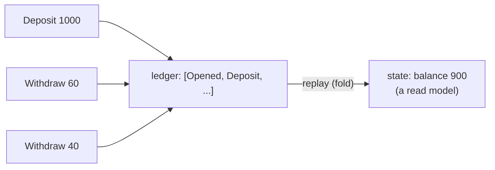
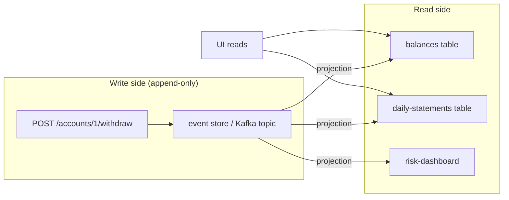

# Event Sourcing & CQRS

Two patterns that *pair with* event-driven architecture and show up constantly in
senior interviews. P11 builds a real bank ledger with both.

## Event Sourcing: state is a fold

**Normal CRUD** stores *current state*: the customer row is `balance: 900`.

**Event sourcing** stores *everything that happened*: a ledger of
`Opened(1000) → Withdrawn(60) → Withdrawn(40)`. **Current state is derived** by
replaying events.

Properties:

- **Append-only, immutable** history: a refund is a new `Refund` event, never a
  mutation.
- **Full audit trail for free** — who, what, when, in order, forever.
- **Ability to rewind/reproject**: rebuild any point in time (financial
  reconciliation, debugging) from the log.
- **Time-travel debug**: reproject with different logic to answer "what would
  balance be if we never had fee X".

Costs (be honest about them in interviews):

- **Event schema evolution burden** — old events must remain *readable* forever
  (p. [schema-evolution](schema-evolution.md)); version each event type.
- **Complexity of projection** — many read models to maintain and re-sync.
- **Event streams are the source of truth**, which makes *queries* awkward unless
  you pair with CQRS.

## CQRS: separate the write side from the read side

**Command Query Responsibility Segregation**: the *write side* accepts commands and
appends events; the *read side* maintains purpose-built projections
(denormalized tables, search indexes) tailored to the queries.

- *Commands*: `Withdraw(amount, idempotency_key)` — validated, idempotent.
- *Events*: `Withdrawn{id, amount, seq}` — published facts.
- *Projections*: derived views, rebuilt by replay; **never written directly by
  commands**.

Kafka's native role in CQRS: the event store *is* the topic (append-only, replayable,
partitioned). Databases implement projections, or Kafka Streams tables do.

## Event sourcing + outbox — the Ouroboros

Fun fact: the outbox table is *already* a mini event store.

| Concern | Outbox | Event sourcing |
|---------|--------|----------------|
| Append-only fact log | limited (events will be purged) | the whole point |
| Source of truth | business tables | the event stream |
| Rebuildable state | no | yes, by projection |

Systems wanting **DB-truth + audit history** often impose *both*: business table for
current state + outbox for delivery, and a parallel archived kafka topic as the
durable ledger (with infinite retention for the ledger).

## When the combo shines (use cases)

- Money movement, balances, bookings, inventory counts — anything where "what
  happened" has legal/audit value
- Multistep workflows wanting time-travel debugging (sagas + event sourcing pair
  well: the saga's state can be event-sourced itself)
- Read-heavy systems with tricky queries → specialized projections beat
  organic table joins
- Multi-team polyglot: teams own their projections

When to *avoid*:

- Simple CRUD with no history need and no replay requirement
- Query patterns dead simple (a join beats a projection pipeline)
- When a single strong-consistency row is mandated by regulations around *current*
  truth (note: ledger-style designs usually handle this by making events the
  authoritative *changes* and keeping per-account balance rows)

## Event sourcing on Kafka vs on a DB

| Choice | Kafka topic | DB event table |
|--------|-------------|----------------|
| Retroactive replay | retention-window-bound (or infinite topic, cost) | forever, cheaper queries |
| Queries on events by id | awkward (scan) | SQL (indexed `SELECT ... ORDER BY seq`) |
| Delivery to consumers | native | outbox/CDC needed |
| Transactionality with business writes | outbox pattern | same-DB trivial (dual use) |

Sane default: **DB tables for current state + SQL events or outbox** inside the same
store; Kafka topics when other services *consume* those events. P11 builds exactly
this and then wires a Kafka projection.

## Interview reflex answers

- **"Event sourcing vs outbox — is the outbox an event store?"** → Related but
  different jobs: outbox guarantees *delivery*; event sourcing makes the log the
  *truth*. Some systems keep the event table as the store and it doubles as the
  outbox — the cleanest trick in the book.
- **"How do you read current state in an event-sourced system?"** → Projection from
  the event log; optionally cached snapshots to bound replay cost; CQRS view tables
  for specific queries.
- **"Balance query needs <50ms and there are 1e9 events."** → Snapshot at
  intervals + replay after last snapshot; project into a dedicated read model
  (balance table) maintained by a stream consumer; the log stays the truth but
  queries never scan it.
- **"Can you retrofit event sourcing? "** → Yes, typically via outbox going forward,
  honoring past as legacy snapshots — full rename typically only in greenfield.

## Checkpoint

??? question "1. Sketch the tables for a bank account: event table vs current-balance view. How do you keep the view in sync? (All the pieces are in this guide.)"
    **Event table** (the source of truth):
    `account_events(aggregate_id, seq, type, payload, created_at)`,
    `PRIMARY KEY (aggregate_id, seq)` — the append-only record of facts.
    **Balance view** (the projection):
    `account_balances(account_id, balance, updated_at)` — the derived state
    served to reads.
    **Sync** = a projector consumer: reads events in order (per aggregate, by
    `seq`), applies them, and **writes the new view in the same transaction as
    its dedup marker** (p. [idempotency](idempotency.md)):
    `BEGIN; UPDATE account_balances; INSERT INTO processed_events ...; COMMIT;`
    Redelivery → dedup marker → no double-apply. Ordering comes from keying the
    topic by `aggregate_id` (p. [ordering](ordering.md)), which reverses the
    event-source → topic pipeline of p. [outbox](outbox.md).

??? question "2. Which two database invariants protect an event store from double-applies (hint: p. 3 + unique seq per aggregate)?"
    1. **P3's idempotency guard**: the projector writes its dedup marker
       (`UNIQUE(event_id, consumer)`) in the same transaction as the view update —
       no marker, no update; redelivered event → constraint violation → no-op.
    2. **`PRIMARY KEY (aggregate_id, seq)` on events**: the same event cannot be
       appended twice — a retried append violates the uniqueness of
       (aggregate, sequence number), keeping history exactly-once even if the
       writer retries.
    Together: history is unique by construction, and derived views can't be
    double-applied. Exactly-once emerges from these two rows — no Kafka
    transaction needed.

??? question "3. Why is a 'delete' in event sourcing a *new event*, not a deletion?"
    Because the event log is *append-only by definition* — history is immutable,
    and a physical delete would rewrite the past, breaking replays. A deletion is
    therefore a fact like any other: `AccountDeleted(account_id, seq+1)` is
    appended; projections apply it by hiding/marking the account. Compensation
    (delete the wrong thing, restore it) = another event (`AccountRestored`), not
    a restore-from-backup. Legal viewer seeing a "deleted" record is fine,
    because the *facts* are the contract — hiding is a projection concern
    (GDPR: erase at the projection layer + keep the append-only log, per policy).

??? question "4. Give three systems where you'd refuse event sourcing and why."
    1. **High-latency hot path / chatty CRUD dashboards** — every read re-runs
       projections; caching complexity, latency & memory cost usually exceed
       value.
    2. **Short-lived data with high write volume** — event logs grow unbounded;
       an append-only store for counters that reset hourly yields huge retention
       cost.
    3. **Strictly relational constraints (FKs, constraints across aggregates)** —
       ES doesn't remove the need for strong integrity; enforcing it across
       event boundaries is awkward.
    4. **Small, single-team crud services (domain fit < adoption cost)** — the
       outbox + projection (+) modeling carry a learning tax; with no replay,
       audit, or business-history requirement, plain CRUD is pragmatically safer.

Next: [Observability for Async Systems](observability.md)