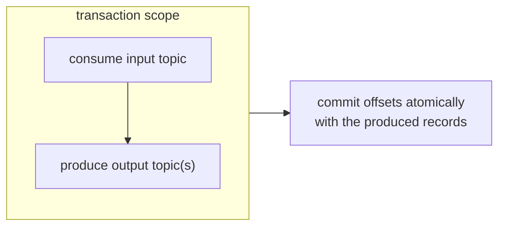

# Exactly-Once Semantics (EOS)

"Exactly-once" is the most oversold phrase in Kafka. This page gives you the honest
version: **what Kafka's transactions actually guarantee, what they don't, and where
product systems actually land.**

## The stacking of guarantees

| Level | What is guaranteed | How |
|-------|--------------------|-----|
| Broker write | Each produce is atomic (all-or-nothing per record) | Record batch + queue flush |
| **Idempotent producer** (`enable.idempotence=true`) | Broker stores each producer retry exactly once | (producer_id, sequence) dedup — see [idempotency](idempotency.md) |
| **Exactly-once semantics (producer)** | One write per send → no dupes *on the broker* | `acks=all` + idempotence (default since 3.0) |
| **Kafka transactions** | Group of produces (and consumes) commit atomically | transactional.id + Read Committed consumers |
| **Exactly-once streaming** (Streams) | End-to-end *materialized view* exactly-once | Transactions + stateful consumers, idempotent joins |

Crucial:

1. Broker-level "exactly-once" only removes **producer-side** duplicates. It does
   not remove duplicates from **consumer redelivery** (rebalance, crash between
   process-commit) — because at-least-once *remains*.
2. The only system where "exactly-once" is *measurable end-to-end* is Kafka Streams
   (a stateful consumer+producer where the state store and offsets move in the same
   transaction). Generic programs consuming-any-topic and calling external systems
   cannot claim EOS.

## What transactions buy you (P10 builds exactly this)



The atomic unit: **output records + input offsets + (optionally) a state-store
update**. Consumers with `isolation.level=read_committed` only see committed
output — no partial batches, no "we consumed but never produced the reply".

| Promise | Meaning |
|---------|---------|
| `transactional.id` | Lets the broker fence zombie producers (same id → old instance cut off) |
| `begin/commit/abort` | All records in the transaction appear atomically |
| `read_committed` | Consumers skip uncommitted + aborted batches |
| `abortable` | Reader sees a sentinel `ABORT` marker → skips |

## The uncomfortable trade-offs (engineer-level honesty)

- Transactions **cost**: ZK/KRaft coordination per transaction, higher commit
  latency (fsync), throughput drops (measured 20–40% in many benchmarks for
  transactional micro-batches).
- **`read_committed` vs ordering**: consumers in read_committed still see per-key
  order *within* a partition — but delivery to *other partitions* is not atomic
  (only the write to the chosen target partition is).
- Transactions do **not** make your external DB writes, emails, or third-party API
  calls atomic. The moment your handler touches anything outside Kafka, you're back
  to at-least-once + idempotency for *that* effect.
- **Transactions + outbox hybrid**: the classic trick to get "DB + Kafka" atomic:
  transactional producer commits on the **consumer side** while the handler writes
  its DB row; the outbox table itself is drained in the same transaction. The pair
  is one of the strongest reliable-publish patterns and is an interview flex
  (build it in P10 if you want the belt-and-braces version).

## The decision cheat sheet

```
Does the consumer touch anything outside Kafka?
 ├─ No, and you use Streams / a stateful store → use transactions (EOS) ✔
 ├─ Yes, a DB — and the DB row + events must be consistent
 │    → outbox (relay) is simpler + battle-tested ✔✔
 ├─ Yes, external APIs (payment, email)
 │    → transactions cannot help; idempotent effects only ✔✔✔
 └─ Don't need atomicity across produce+consume
      → idempotent producer + idempotent consumer, skip transactions
```

## Interview reflex answers

- **"Does Kafka give exactly-once?"** → Broker/producer yes (idempotence);
  Streams yes (transactional state store); a generic consumer calling a DB/API:
  no — that's at-least-once + idempotent processing, by design.
- **"idempotent producer vs transactions — difference?"** → Idempotence dedups
  retried writes for one producer; transactions make *a group* of writes plus
  consumed-offsets commit together, w/ zombie fencing.
- **"When is EOS worth it?"** → When downstream *state* must match upstream events
  byte-perfect and reprocessing is expensive/dangerous (banking reconciliation,
  exactly-once materialized views). When not: 99% of event pipelines where
  idempotency keys already make duplicates harmless — you pay the transaction tax
  for nothing.

## Checkpoint

??? question "1. A consumer reads a topic, calls Stripe (charge💰), then commits with a transactional producer. What can still duplicate? What can't?"
    - **Can still duplicate**: the Stripe charge. The transaction covers
      "consume + produce within Kafka" only — Stripe is outside it. Crash between
      the charge API call and `commit_transaction` → the record redelivers →
      the handler charges again. Stripe's own idempotency key (per payment) is
      the only shield.
    - **Can't duplicate**: the *produced records* (idempotent producer + commit
      ordering) and the *offsets* (they commit atomically with the batch) — no
      partial batches visible to `read_committed` consumers.
    The sentence that keeps you honest: *transactions fence Kafka, they don't
    fence the world.*

??? question "2. Why does the producer need `transactional.id` — what attack does it block?"
    **Zombie fencing.** If an old producer instance "dies" from the group's point
    of view but is actually still alive (GC pause, network partition), it may keep
    producing with the same identity. Without fencing, its stale writes interleave
    with the current instance → duplicate/out-of-order data with a *valid* commit
    signature. `transactional.id` binds the transaction session to a
    (producer, epoch): a new instance with the same id **invalidates the old
    session's epoch**, so any commit from the zombie is rejected by the broker.
    One id, one winner — that's fencing.

??? question "3. Your boss lights up: 'Let's wrap everything in Kafka transactions — that's our distributed transactions problem solved.' What's missing?"
    Three gaps, spelled out:
    1. **Non-Kafka stores don't participate** — your Postgres writes, emails,
       Stripe charges, and third-party APIs aren't transaction members. Wrap all
       you like, those effects still double-apply on reposition.
    2. **Cost** — transactions add coordination + fsync latency (the "tax" you
       measure in P10) and `read_committed` isolation surprises for other
       readers.
    3. **The outbox already solved DB↔Kafka** — for the "DB + broker must agree"
       case, the outbox (P4) is simpler, battle-tested, and doesn't couple your
       DB shape to Kafka's transaction protocol. Kafka transactions shine where
       *Kafka-internal atomicity* is the requirement (Streams, producer+consumer
       loops) — not as a general distributed-transaction substitute.

??? question "4. Being honest: which layer actually guarantees 'no double apply' for most systems? (Answer: the DB constraint / idempotency key, p. 3.)"
    The **database constraint / idempotency key** — `processed_events`
    `UNIQUE(event_id, group)` or a natural unique key on the business row, written
    in the *same transaction* as the side effect (P3). That layer spans the actual
    effect — DB, external API (via its own key), everything. Kafka transactions
    only guarantee broker-side atomicity; for systems touching anything else,
    the "no double apply" invoice is always paid at the DB/API constraint.

Next: [Event Sourcing & CQRS](event-sourcing-cqrs.md)