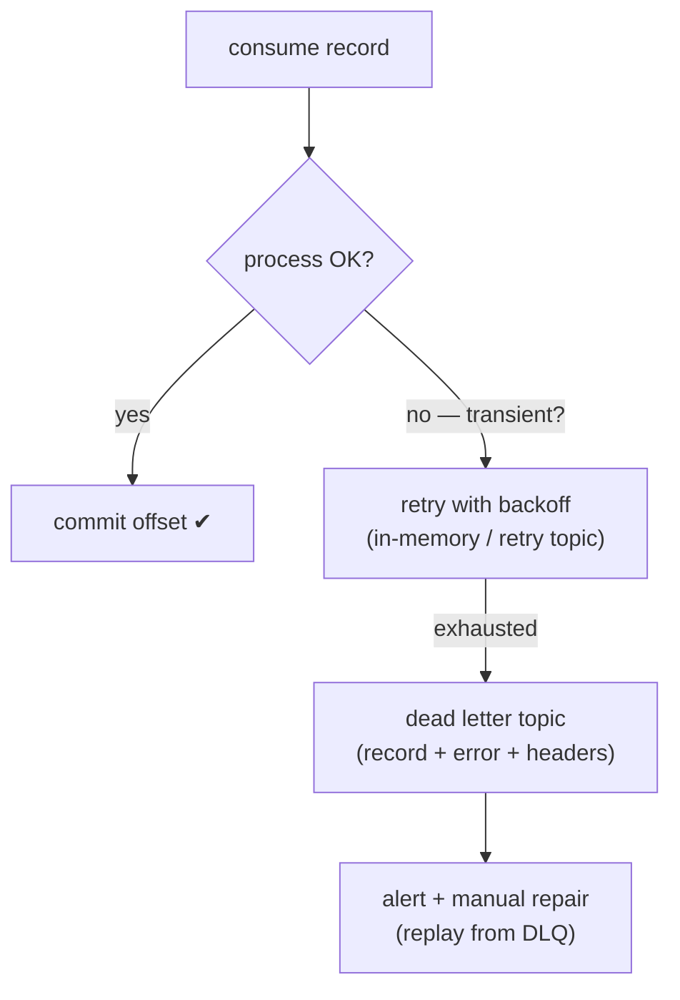
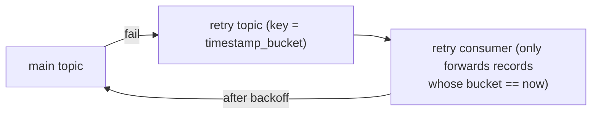
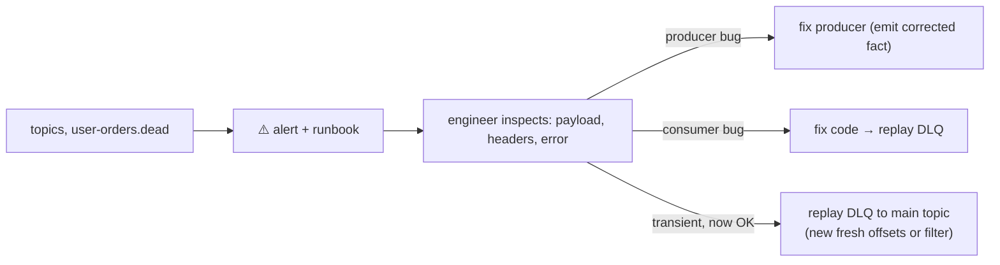

# Failure Handling: Retries, Backoff & Dead Letter Queues

A consumer **will** encounter unprocessable records: a temporary DB outage, a
malformed payload from a buggy producer, a downstream API returning 5xx for an hour.
A production-grade consumer has an explicit ladder for each case.

## The failure ladder



## 1. Transient failures — retry strategy

**Never retry blindly in a tight loop inside `poll()`** — that's what causes
rebalance timeouts (`max.poll.interval.ms`) and turns one bad record into a slow
whole partition.

Good retries are **bounded and backed off**:

- In-memory retry: `tenacity`/custom backoff (quick, but lost on crash).
- **Retry topics** (the durable pattern): failed records go to `orders.retry`
  instead of being comitted past. A retry consumer with a *timer* re-emits them to
  the main topic after backoff. Kafka doesn't natively delay message delivery, so a
  popular trick is **time-indexed keys**: the retry consumer produces to a *scheduled*
  topic partitioned by minute, and only forwards records whose scheduled minute
  matches the clock:



With **exponential buckets** (1m, 5m, 10m, 30m, 1h...) you get reliable delayed
redelivery with zero timers. (Project P8 builds a simplified version: same topic,
JIT sleep + max-delivery-count → DLQ.)

**Retry semantics matter**: if the consumer commits nothing while retrying the
record, then crashes — the record redelivers from the committed offset anyway.
Retry topics let you commit the *main* record and keep retrying *in the topic* —
that's the durable version. Trade-off: more moving parts.

| Approach | Durable | Simple | Crash-safe ordering |
|----------|---------|--------|---------------------|
| In-memory backoff | ❌ | ✅ | ✅ (blocking) |
| Retry topic + buckets | ✅ | ⚠️ | ✅ per key |
| Just sleep + commit later | binary | ✅✅ | ✅ but violates max.poll |
| Autosuppressed (rebalance away) | ❌ | ✅ | ❌ |

## 2. The Dead Letter Topic

After N failed attempts (or on a *definitely-invalid* payload — fail fast), the
record is **poison** and must leave the hot path:

```
orders.dead  ← record, original headers, plus:
  x-error-message  "db timeout after 5 attempts"
  x-error-trace    stack/context
  x-attempts       5
  x-dead-at        ISO timestamp
```

**What DLQ is**:

- A Kafka topic *per application/consumer*, consumed by humans/tools for repair.
- A system-of-record for "this couldn't be processed", never silently dropped.
- Replayable: fix the schema/code, then **reproduce from DLQ to the main topic**
  (or a restore topic) so the consumer reprocesses with dedup safety.

**What DLQ is not**:

- Not "the trash" — DLQ backlog is an alertable, owned queue with an explicit
  runbook for each event type in it.
- Not an excuse for broken producers. Alert on DLQ rate, not just presence, and
  page producers on volume spikes.
- Not a place to *forget*. Every DLQ should have a retention decision: replay within
  hours-days, archive after 30 days.

## 3. Manual repair workflow (P8 core)



A disciplined replay path: consume from DLQ in small batches, **re-attach the
original event_id** (the dedup table absorbs any straggling duplicates), produce to
the main topic with `retries` + `idempotence`.

## Headers: the compact forensics kit

Put context on the Kafka record itself; consumers of failure topics shouldn't need
to join against the source DB to understand a dead record:

| Header | Value |
|--------|-------|
| `event_id` | stable business id / event uuid |
| `x-error-type` | `transient` \| `invalid` \| `downstream` |
| `x-error-detail` | short machine-readable classifier |
| `x-attempts` | delivery attempt count |
| `x-source-partition-offset` | origin `p2/1047` so you can trace lineage |
| `traceparent` | OpenTelemetry trace id (P12) |

## Poison-message taxonomy (interview cheat sheet)

| Poison type | Symptom | Veteran move |
|-------------|---------|--------------|
| Malformed JSON / schema violation | Consumer deserialization exception | DLQ immediately with error; page producer (it's a schema-contract breach) |
| Transient downstream outage | API 5xx / timeout | Retry with backoff; commit-pause; DLQ after budget |
| Permanent business reject | e.g. order already cancelled | Skip (or DLQ for audit) — *business logic*, not retries |
| Record that blows memory | e.g. 50 MB payload | Guard size; boundary check before deserialize |
| Rebalance-loop breakdown | Everything slow, retries pile | Fix max.poll + worker pool (p. scaling page) |

## Interview reflex answers

- **"How do you handle a poison message?"** → Attempt budget → DLQ with headers →
  alert → runbook → replay after fix; fail-fast on schema-invalid, backoff-retry on
  transient, never retry-forever in the poll loop, and keep idempotency so replays
  are safe.
- **"Does Kafka support delayed messages?"** → Not natively; use a scheduled/keyed
  retry topic or an external scheduler; or block-upstream MS-style "time-based
  partition" trick.
- **"DLQ is empty but the pipeline is failing. Where's my debugging line?"** →
  Check committed offsets vs producer `acks`; check the consumer group's partition
  assignment and lag; check producer error callbacks; check `min.insync.replicas`.
  Then instrument the error callback (producers swallow async errors by default!).

## Checkpoint

??? question "1. Why must you commit *past* a record before routing it to a retry topic? (What does commit-past accomplish, and what risk does it carry?)"
    **Accomplishes**: the poison record stops blocking its partition — the
    consumer's committed offset moves past it, so the rest of the topic flows;
    the record is *not lost* (it's durable in the retry topic).
    **Risk**: a small gap between "commit past" and "published to retry". Crash in
    that window → the record is committed as handled but was never retried — a
    *handled-but-delivered-nowhere* gap. Mitigations:
    - publish-to-retry **before** the commit, accepting possible re-publish on
      restart (duplicates absorbed by dedup),
    - or route the retry decision through the same DB (retry row written in the
      consumer's own transaction, drained by a relay) — the outbox idea applied
      to retries,
    - plus reconcile: a periodic "count processed-vs-retried" alert for the gap.

??? question "2. List the metadata you must attach to DLQ records and why each matters."
    | Metadata | Why it matters |
    |----------|----------------|
    | original `key` + `value` | the actable artifact — you re-apply this |
    | `x-error-type` | `invalid` (contract breach, no retries) vs `transient` (retry budget) — picks the runbook |
    | `x-attempts` | decides replay vs drop vs escalate |
    | `x-error-detail` / message | the diagnosis without joining source systems |
    | `x-source-partition-offset` | lineage: where this came from, reproducibility |
    | `trace_id` (W3C header) | jump into tracing for the full journey (P12) |
    | timestamps (`x-dead-at`) | SLA/aging alerts: "this DLQ is older than X" |
    Without these, a DLQ is just a parking lot you can't triage.

??? question "3. Malformed JSON vs 30-minute DB outage: different strategies? Explain."
    **Malformed JSON** → a *permanent* contract breach: retrying can't fix garbage
    bytes. Fail fast: DLQ immediately with `x-error-type=invalid`, alert the
    producer's owner (schema/serializer bug), never spend retry budget.
    **30-minute DB outage** → *transient*: retry with **exponential backoff**
    (buckets: +1m, +5m, +10m, +30m), each new attempt after service recovery
    succeeds; DLQ only after the budget is exhausted, `x-error-type=transient`,
    and the operator replays when the DB is back.
    The discriminator: **will this failure fix itself?** Choose the ladder by that,
    not by the error message's tone.

??? question "4. Design the replay policy for DLQ of an idempotent consumer (order events)."
    A workable policy:
    - **Replay channel**: reproduce from `orders.dead` to `orders` (main topic)
      with the **original `event_id`** preserved — the consumer's `processed_events`
      table makes repeated deliveries no-ops (this is why replays are safe).
    - **Triggers**: fix landed in code/schema → replay automatically (agapeless
      batches with limit); business decision → replay selectively filtered
      (runbook per `x-error-type`).
    - **Ordering**: replay keyed by original key and committed per record →
      per-entity order preserved even across rounds.
    - **Budgets & aging**: DLQ age alert at X h; auto-replay for
      `x-error-type=transient` up to N/day; `invalid` never auto-replays.
    - **Retention**: archive DLQ after 30 days (replay window honest), keep
      forever if audit requires.
    - **Observability**: every replay logs trace id + count; DLQ rate is an
      alertable metric, not just dead-letter presence.

Next: [Schema Evolution & Registry](schema-evolution.md)