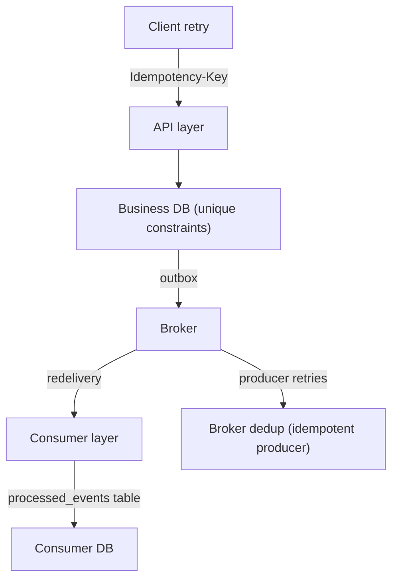

# Idempotency

> An operation is **idempotent** if performing it multiple times has the same effect
> as performing it once.

Idempotency is your #1 tool against at-least-once delivery. It is also a subtle,
interview-heavy topic. There are three distinct kinds:

1. **Idempotent API** — HTTP clients retry; the server must not double-charge.
2. **Idempotent consumer** — Kafka redelivers; processing must not double-apply.
3. **Idempotent producer** — producer retries; the broker must not store duplicates
   (P10, `enable.idempotence`).

## 1. Idempotent API (the Idempotency-Key pattern)

The client sends a stable identifier for the logical operation:

```http
POST /v1/payments
Idempotency-Key: 9b1deb4d-3b7d-4bad-9bdd-2b0d7b3dcb6d
Content-Type: application/json

{"amount": 100, "currency": "USD"}
```

The server stores `key → {status, response}` in a table with a **unique constraint**:

```sql
CREATE TABLE idempotency_keys (
  idempotency_key TEXT PRIMARY KEY,
  request_hash    TEXT NOT NULL,      -- detect same key, different payload
  status          TEXT NOT NULL,      -- 'in_progress' | 'completed'
  response        JSONB,              -- the response to replay
  created_at      TIMESTAMPTZ DEFAULT now()
);
```

```python
@app.post("/v1/payments")
async def create_payment(req: PaymentRequest, idempotency_key: str = Header(...)):
    async with db.transaction():
        row = await db.fetchone(
            "INSERT INTO idempotency_keys(key, request_hash, status) "
            "VALUES($1, $2, 'in_progress') "
            "ON CONFLICT (key) DO NOTHING RETURNING *", idempotency_key, hash(req))
        if row is None:
            existing = await db.fetchone("SELECT * FROM idempotency_keys WHERE key=$1", idempotency_key)
            if existing.request_hash != hash(req):
                raise HTTPException(422, "Same key, different request")
            return JSONResponse(existing.response, status_code=existing.status)
        # ... do the real work inside the SAME transaction ...
        await db.execute("UPDATE idempotency_keys SET status='completed', response=$1 WHERE key=$2", ...)
    return response
```

Rules that make it correct:

- **Key uniqueness is the guard.** `ON CONFLICT DO NOTHING` + re-select = race-safe:
  two parallel retries, one wins.
- **The business effect and the idempotency row commit atomically** (same DB txn).
  If the money moved but the response row didn't commit, the client retries and we
  detect → return the same outcome. (This is the exact problem the
  [Outbox pattern](outbox.md) solves at Kafka scale.)
- Same key + different body → reject (or hash-compare). Prevents silent confusion bugs.
- Key must be **client-generated UUID**, not derived from the payload (two different
  charges with same amount would collide).
- Expire keys after N days (7–90) to bound table growth.

## 2. Idempotent consumers

Kafka redelivers. The consumer's defense: **record the event id it already applied,**
and skip it on re-delivery.

```sql
CREATE TABLE processed_events (
  event_id TEXT PRIMARY KEY,          -- unique id of the Kafka event
  consumer_group TEXT NOT NULL,       -- scoping (shared DBs)
  processed_at TIMESTAMPTZ DEFAULT now()
);
```

```python
def process(event):
    id = event["event_id"]
    with db.transaction():
        # attempt insert; if it exists, someone already applied this event
        done = db.execute("INSERT INTO processed_events(event_id, consumer_group) "
                          "VALUES(:id, :group) ON CONFLICT DO NOTHING RETURNING *", ...)
        if done:
            apply_event_logic(event)   # stock move, ledger entry, email job row
```

Or rely on a natural unique key when one exists: `INSERT ... ON CONFLICT (charge_id)
DO NOTHING` on the business table itself. The `processed_events` table generalizes it.

!!! warning "Race on the guard"
    If two workers could process the same event concurrently (same consumer group —
    that's impossible by partition assignment; but *different groups* or manual
    replays can), the unique constraint is the only safe guard — check-then-insert
    in Python races. Always express dedup as a constraint, never as a SELECT check.

### Where do unique event ids come from?

| Scheme | Example | Notes |
|--------|---------|-------|
| Producer-generated UUID | `orderId + "-" + random` | Need the producer to be disciplined |
| Natural business key | `charge_id`, `order_line_id` | Best: the event *is* a business fact with its own id |
| `key + partition + offset` | `"orders-2-1047"` | Guaranteed unique per record; P10 pair with transactions |

## 3. Idempotent producer

On the producer side, retries can create duplicates on the broker:

```
send(msg) → timeout → resend → broker stores BOTH
```

`enable.idempotence=true` makes the broker dedupe by (producer_id, sequence). Cheap,
safe → **always on** in production for `acks=all` producers. Full story in
[Exactly-Once Semantics (P10)](../03-projects/p10-exactly-once.md).

## The three-layer idempotency stack



| Layer | Defense | Protects against |
|-------|---------|------------------|
| API | Idempotency-Key table, unique constraint | Client HTTP retries / timeouts |
| Business DB | Unique key on business entity | Double-processing of facts |
| Broker (producer) | `enable.idempotence` | Producer retransmission dupes |
| Consumer DB | `processed_events` / unique constraints | Redelivery after crash/rebalance |

## Interview reflex answers

- **"How do you make an API idempotent?"** → Idempotency-Key header, server-side
  key table with unique constraint, return stored response for replays, same-key =
  same-payload validation, keys expire.
- **"Kafka consumers can see duplicates. How do you handle it?"** → At-least-once +
  idempotent consumers: unique business keys / `processed_events` table, applied
  inside the same DB transaction as side effects.
- **"Can you ensure no duplicates with Kafka alone?"** → Transactions give you
  atomicity across produce+consume (P10), but the processed-effect guard stays the
  ultimate authority; external side effects (emails, third-party APIs) can still be
  duplicated — those need their own idempotency contract with the downstream system.

## Checkpoint

??? question "1. Why must the idempotency row and the business effect be written in a *single DB transaction*?"
    Because otherwise there are two orderings of two writes, and **either crash
    window corrupts the contract**:
    - effect written, key row missing (crash before key insert) → client retries →
      the effect repeats → **double charge**.
    - key row written, effect missing (crash before effect) → client retries →
      we answer "already done" with the stored response → **no charge, user lied
      to**.
    One transaction makes "key exists" ⇔ "effect happened" atomic — that single
    invariant is the whole pattern. (It's the same invariant the outbox pattern
    exploits at the Kafka level.)

??? question "2. Your event has no natural business id. Design the event id scheme."
    The scheme must be (a) **deterministic** for the same logical event (retries
    reuse it) and (b) **unique across different events**. Good scheme:
    ```
    <source>.<aggregate>.<type>.<sequence-or-uuid>
    order.ord-123.placed.7            # deterministic by construction
    payment.pay-<uuid>.captured.v1    # stable, collision-safe
    ```
    Notes: prefer content-derived facts when you can (natural `charge_id`,
    `shipment_id`); the consumer stores it in `processed_events` with a unique
    constraint, so ANY scheme that satisfies determinism+uniqueness is fine.

??? question "3. Two services share a `processed_events` table. What column do you *need*?"
    A **scope column** — `consumer_group` (or `service_name`) — plus
    `UNIQUE(event_id, consumer_group)`. Without scoping, service A's `INSERT`
    would mark the event "done" for service B, silently skipping B's processing.
    Each group must track its own "I already applied this" set.

??? question "4. Same `Idempotency-Key`, different body: name two acceptable behaviors."
    1. **Reject (422/409)** — the standard choice: a key is bound to exactly one
       payload; a different body means a client bug. Store the request hash and
       compare (this guide's implementation).
    2. **Override with a defined semantic** — e.g. the key points at a *logical
       operation* that legitimately changes its payload over time (like a payment
       `status` transition endpoint designed for it) — explicit, documented, and
       still returning the *current* stored response on replay.
    Never: silently process the new body under the old key — that breaks replay
    semantics and can double-charge.

## Learn more

- **Read** — [How Stripe Works: Idempotency](https://stripe.com/blog/idempotency) (Brandur Leach) — the canonical write-up of an idempotency-key table with its subtle failure analysis.
- **Read** — [Idempotent Consumers and Kafka: Deduplicating Every Data Case](https://www.lydtechconsulting.com/blog/kafka-deduplication-patterns---part-1-of-2) — side-table, store-before-commit and dedup-in-the-datalake patterns compared.
- **Docs** — [Stripe API — Idempotent requests](https://docs.stripe.com/api/idempotent_requests) — what the semantics of an idempotency key are, from the API that defined them.
- **Watch** — [Reliable Message Delivery with Apache Kafka (Kafka Summit SF 2018)](https://www.confluent.io/kafka-summit-sf18/reliable-message-delivery-with-apache-kafka/) — the consumer side: why retries happen and what "safe processing" means.

Next: [Distributed Transactions](distributed-transactions.md) — and why the industry
avoids 2PC in favor of patterns like outbox and saga.