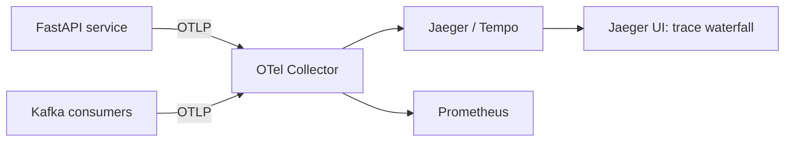

# Observability for Async Systems

Async systems are beautiful until you must answer **"is this order stuck?"** — and
then you need a chain of breadcrumbs. Sync systems have a stack trace; async systems
have **trace context carried on message headers** and **lag as the pulse**.

## The three pillars, async-flavored

| Pillar | Async twist |
|--------|-------------|
| **Metrics** | Consumer **lag** (per group, per partition), DLQ rate, error counters, produce latency, throughput |
| **Logs** | Correlation id (`order_id`, `trace_id`) on every line; structured JSON logs for grep at scale |
| **Traces** | A trace spans producer → broker → consumer → DB/API via **propagated trace context** |

## Correlation ids and trace context propagation

The trick that makes async debugging possible: **carry an id on every message** and
carry **OpenTelemetry context** in Kafka headers.

```python
# producer: put W3C traceparent/tracestate into message headers
headers = [("traceparent", traceparent_bytes), ("tracestate", tracestate_bytes)]
producer.produce("orders", key=..., value=..., headers=headers)

# consumer: extract and continue the trace
from opentelemetry.propagators import b3, tracecontext
ctx = tracecontext.TraceContextTextMapPropagator().extract({k: v for k, v in msg.headers()})
with tracer.start_as_current_span("orders.process", context=ctx):
    ...  # every downstream span (DB, API) attaches to the same trace
```

Now one `trace_id` on a Jaeger/OTel UI shows the entire journey:
HTTP POST → outbox insert → relay publish → consumer → inventory update → saga step.

**Works exactly like request ids in HTTP** — but you must thread it manually through
broker headers (there is no HTTP middleware for Kafka).

## Metrics every async system must expose

| Metric | Alert when |
|--------|-----------|
| **Consumer lag** (per group+partition) | Growing for N minutes (but *not* the rebalance storm shape) |
| DLQ events per topic | > 0 for critical topics for N minutes |
| Producer error rate / delivery-failure callbacks | > 0 (producers swallow errors silently unless you count them!) |
| Retry topic depth | Growth beyond budget |
| Outbox `published=FALSE` count & age | Stale rows = relay dead |
| Commit latency / fetch latency | Slow broker or apprimens |
| Rebalance events / partition assignments | Frequency spike = alert |

!!! danger "Producer errors are invisible by default"
    `producer.produce(...)` is **async** — failures surface only in the
    `on_delivery` callback. Every codebase in this course wires a callback that
    increments a counter and logs; most production incidents start here.

## Logging conventions

```python
import json, logging
logging.basicConfig(format="%(message)s")
record = {
    "ts": ..., "level": "error",
    "service": "payments", "event": "payment_failed",
    "order_id": "ord-123", "trace_id": "...",
    "partition": 2, "offset": 1047,
    "error_type": "transient", "attempts": 5,
}
print(json.dumps(record))
```

- Include: `order_id`/aggregate id, `trace_id`, `partition`, `offset`, `event_type`.
- Never log secrets; never log raw payloads by default (PII churn + logs blow up).

## Distributed tracing stack for the capstone



- OTel Python: `opentelemetry-instrumentation-fastapi`, `-kafka-python`
  (confluent client: manual header injection — small wrapper).
- Simulator scripts in P12 fire order traffic; you answer questions like
  "how long does stock reservation spend blocked on the DB?" purely from traces.

## The "is it stuck?" walkthrough (interview scenario)

> An order is `in_progress` for 6 hours. Your runbook, in order:

1. **Ask the trace**: `trace_id` from the order row → Jaeger → which step is the
   dead end?
2. **Ask the lag**: consumer group for the step topic → 0 lag but no progress?
   → rebalance loop / consumer stuck (p. scaling). Growing lag → downstream slow.
3. **Ask the DLQ**: is the step failing into the dead letter topic?
   → runbook for that event type, replay.
4. **Ask the outbox**: `published=FALSE` rows older than X → relay dead.
5. **Ask the broker**: partitions under-replicated, controller flapping.

Every project from P4 on expects you to install the *one* missing piece (lag
script, DLQ alert, trace id on events) and prove a stuck flow with it.

## Interview reflex answers

- **"A message is processed twice — how do you find it?"** → trace_id spanning the
  consumer + dedup table; or search logs by `event_id` showing two
  `processed` lines with same id; correlate timestamps/attempts.
- **"Producing 10k msgs/s, nothing arrives downstream. What do you check?"** →
  Producer error callback (visible!) → broker health (`kafka-topics --describe`,
  ISR) → consumer group offsets/lag → then consumer error handling/DLQ.
- **"How do you keep traces working across services written by different teams?"** →
  OTel conventions in a shared header lib; standard header names; schema/header lint.

## Checkpoint

??? question "1. Why is `trace_id` practically *required* in async (vs sync) debugging?"
    Because an async flow's causal chain breaks across **latency, processes, and
    queues** — a consumer receiving an event at a different time isn't "the same
    request" anymore. Sync debugging follows the call stack of a single thread;
    in async, there is no stack — only a shared header (`trace_id`, propagated
    through brokers, stored with side effects) that reconnects producer → topic →
    consumer → DB/API. Without it you have N correlated-by-heuristic logs and a
    "which process did this?" archaeology problem. In *any* async system, tracing
    is not an optional extra — it is the primary debugging tool (and lag/DLQ
    alerting tells you *where*, not *why*).

??? question "2. What does lag > 0 but *stable* mean? Lag growing? Lag when consumers > partitions?"
    - **Lag > 0, stable** → equilibrium: consumption rate matches production, only
      a bounded buffer ahead — healthy (as long as it stays under your latency
      SLA). A *stable nonzero* lag is a design state, not a bug.
    - **Lag growing** → consumers are keeping *less* than production: either the
      consumer is genuinely slow (missing `poll` vs `max.poll.interval` budget,
      blocking calls) or partitions > consumers under-utilizes them — or the
      *producer* is having a burst. Growth rate + consumer CPU/GC tells you which.
    - **Consumers > partitions** → extra consumers are **idle by construction**;
      total processing capacity is partition-bound. Lag here means: add
      partitions (or diagnose the hot partition), not "more instances".

??? question "3. Producer callback code that only `print()`s — one sentence on why it's a production bug."
    A fire-and-forget producer callback hides **in-flight delivery failures**
    (broker down, serialization error, DLQ policy never triggered) — the event
    silently disappears and you only notice via downstream lag or a customer,
    instead of a metric + alert the moment the ack fails.

??? question "4. Sketch the header map you'd standardize for your org's events (name, type, owner)."
    | Header | Type | Owner |
    |--------|------|-------|
    | `trace_id` | string (W3C) | OTel lib — generated at entry |
    | `event_id` | string (ULID) | producer — dedup contract |
    | `event_type` | string (e.g. `order.placed`) | producer schema owner |
    | `producer` | string (service name) | runtime |
    | `created_at` | RFC3339 | runtime |
    | `schema_version` | int (registry subject version) | producer contract |
    | `retry_count` | int | consumer on replay |
    | `source_partition_offset` | string `t:p:o` | consumer on DLQ |
    Plus a trivially testable convention: every producer emits ≥ these headers;
    CS/validation gate rejects topics without them.

## Learn more

- **Docs** — [OpenTelemetry — Python documentation](https://opentelemetry.io/docs/languages/python/) — tracing setup, context propagation and exporters for the exact stack the ladder's P5 uses.
- **Docs** — [W3C Trace Context](https://www.w3.org/TR/trace-context/) — the `traceparent`/`tracestate` headers every message-carried trace relies on; worth reading once, forever.
- **Watch** — [Turning the Database Inside Out (talk recording)](https://www.youtube.com/watch?v=fU9hR3kiOK0) (Martin Kleppmann) — observability as the flip side of event-driven systems: if the log is the truth, reading it becomes debugging.
- **Read** — [Designing Data-Intensive Applications](http://dataintensive.net), ch. 11 "Stream Processing" — offset lags and reprocessing as diagnostic tools, in depth.

Next, the fun part: start [The Project Ladder](../03-projects/overview.md) — every
concept above gets built, broken, and repaired by hand.