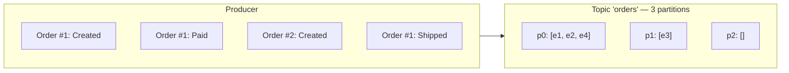

# Event Ordering

> Kafka guarantees **per-partition ordering**, nothing else. All ordering design
> flows from that sentence.

## The guarantee hierarchy

| Saying | Reality |
|--------|---------|
| "Kafka is ordered" | Only within a single partition. |
| "Records with the same key are ordered" | Yes — same key → same partition, and per-partition order is total. |
| "Records with different keys are ordered" | No. They may land on any partition; race by design. |
| "Global order" | Only if the topic has exactly **1 partition** (kills parallelism for all groups). |

## The mental model



If all keys are `order_id`, every event of order #1 lands in the same partition, in
producer-send order → `Created, Paid, Shipped` is guaranteed. Order #2's events are
independent. **Key = the entity whose causal order matters.**

## Choosing partition keys — the decision tree

```
Is there an entity whose event sequence must be processed in order?
  Yes → key = aggregate id (order_id, account_id, device_id). ← most cases
  No  → key = null or high-cardinality (user_id) for maximum parallelism.
```

!!! danger "Ordering killers you will ship by accident"
    1. **Changing the key between events of the same entity** — e.g. keying
       `OrderCreated` by `customer_id` and `OrderPaid` by `order_id` → same order
       split across partitions → consumers see Paid before Created.
    2. **`null` keys for entity events** — round-robin → totally unordered entity
       history. (Fix: producer must set the key explicitly; `kcat -K:` defaults.)
    3. **Multi-consumer groups without keys** — even with keys, only **one consumer
       can own a partition**; if your group has more consumers than partitions,
       extra consumers sit idle → order preserved *but* parallelism lost — a
       *scaling* mistake, not ordering breakage.
    4. **Retries mean re-insertion at the tail** — replaying an event stream for
       repair re-orders events physically; consumers of *streams* must not assume
       broker offsets == business time. Use event timestamps + sequence numbers.

## Ordering guarantees consumers can actually rely on

For a **single consumer group** (one partition assigned):

1. Records are delivered in offset order (strict).
2. **When processing crosses the DB**: order is preserved only if you *write*
   sequentially — parallel DB writes from one consumer can reorder the *effects*.
3. A crash + auto-offset-reset → rebaked reruns can cause **out-of-order replay**:
   a consumer that already read offset 5 and reprocesses from offset 3 must be
   idempotent *and* order-tolerant (or skip ahead — P3's dedup table does exactly this).

## Ordering in downstream pipelines

- **State replication**: consumer applies events → DB. Order per entity preserved if
  one consumer per partition (naive) or per-key serialization with concurrency
  (contextual concurrency / keyed worker pools).
- **Aggregation**: count/sum over events — order usually irrelevant *unless*
  incremental corrections exist (`StockReserved -1`, `StockReleased +1` must apply
  in event order per sku) → key by `sku`.
- **Sagas** (P6/P7): orchestration messages for one order → key by `order_id`, one
  partition per order pipeline.

## Exactly-once delivery isn't ordering

Two classic confusions:

| | Ordering | Deduplication |
|--|----------|---------------|
| Concern | Effects applied in causal order | Effects applied only once |
| Works per | Partition (key) | Consumer/DB dedup |
| Kafka tool | partition key | EOS transactions / idempotent consumers |

A "transactional" pipeline (P10) groups a batch of records into one atomic delivery,
which can *reorder* batches relative to a naive stream — beware "exactly-once +
ordering" marketing claims; check the docs of the stack you use.

## Design checklist

- [ ] One stable key per entity across ALL event types
- [ ] Partition count chosen for peak parallelism of the *largest* consumer group
- [ ] No event type maps to two different key schemes
- [ ] Consumers don't assume global order (they get per-partition)
- [ ] Replays/repair routes through a topic keyed the same way (or a repair topic)
- [ ] Tests include a "reversed delivery" scenario (out-of-order safe in dedup layer)

## Interview reflex answer

Q: "How would you ensure events for an order arrive in order?"
A: Key every event by `order_id`; Kafka hashes to a single partition; per-partition
order is total; one consumer group reads that partition; make the consumer commit
after processing to survive crashes without reordering effects externally; and keep
the system safe for the unavoidable replayed/duplicated tail events via idempotency.

Q: "And performance?"
A: Fairness comes from many partitions (many orders interleaved); a single tricky
entity (a hot account) is a "hot partition" problem — you accept per-entity
serialization, and mitigate hot keys with splitting strategy (account_id vs
account_id + shard segment).

## Checkpoint

??? question "1. Why is `null` key a data-loss-adjacent decision for entity history?"
    With `null` keys, records are round-robined across partitions — so the same
    entity's events spread over different partitions and **their causal order is
    destroyed**. A consumer may apply `PaymentCaptured` before `OrderPlaced`, or
    `StockReleased` before `StockReserved` — producing *wrong state that looks
    fine in isolation* and is very hard to detect. Losing ordering is
    "data-loss-adjacent" because corrections, cancellations and compensations all
    become unsound — the system behaves as if facts were missing.

??? question "2. 12 partitions, 20 consumers, entity keyed by `order_id`. What is the max concurrency? What goes wrong if a customer panel is shared?"
    Max concurrency = **12** — one consumer per partition; the remaining 8
    consumers sit idle (and each add/leave triggers a rebalance).
    What goes wrong with a shared key: if you accidentally key some events by
    `customer_id` and others by `order_id` (or share a hot key like `store_id`),
    the entity's events scatter → per-entity order breaks; and a hot key (e.g.
    one customer with 50% of traffic) concentrates on a single partition → a
    **hot partition** where that key's consumer becomes the bottleneck while
    others idle.

??? question "3. An outbox row causes the relay to publish `OrderPlaced` twice. Where does the order degradation show? (Think both the broker and the consumer's dedup table.)"
    - **Broker side**: two identical records, same key → same partition (order
      per key preserved, but duplicates present — downstream replay/analytics
      consumers see both unless they dedup).
    - **Consumer side**: the dedup table (`processed_events`) records
      `event_id` — the second copy is a no-op *only if the guard exists*. If a
      consumer lacks it, the double-publish becomes a double side effect
      (double stock deduction) — the degradation shows up as **silent business
      drift**, not as a crash.
    - **Ordering itself**: not visibly degraded on the broker (same-key order
      holds), but each duplicate multiplies processing cost and any non-idempotent
      consumer turns it into corruption. This is why the outbox contract always
      ships with dedup (p. [outbox](outbox.md)).

??? question "4. Design the key for a 'telemetry per device' topic and a 'user feed' topic."
    - **Telemetry per device**: key = `device_id` — per-device sequences stay
      ordered (sensor events for one device must apply in order), and parallelism
      comes from many devices. For very hot devices, key = `device_id + shard`
      (e.g. `device_id + seq/1000`) and let the consumer re-sort per shard window.
    - **User feed**: key = `user_id` — per-user causal order preserved (their
      events apply in sequence) while millions of users distribute perfectly
      across partitions. Same rule both times: **key = the entity whose order
      matters**.

## Learn more

- **Read** — [How to Choose the Number of Topics/Partitions in a Kafka Cluster](https://www.confluent.io/blog/how-choose-number-topics-partitions-kafka-cluster/) (Jun Rao) — the authoritative trade-off matrix behind "one partition per order key".
- **Watch** — [Multiple Event Types in the Same Kafka Topic (Confluent)](https://www.confluent.io/blog/multiple-event-types-in-the-same-kafka-topic/) — when *not* to split topics, the flip side of per-entity topics.
- **Read** — [Designing Data-Intensive Applications](http://dataintensive.net), ch. 11 "Stream Processing" — the fundamental trade-off between ordering and parallelism, in theory form.
- **Docs** — [Kafka documentation — Logs and partition ordering](https://kafka.apache.org/documentation/#intro_consumers) — the official statement of per-partition ordering.

Next: [Scaling Consumers & Backpressure](scaling-consumer-groups.md)