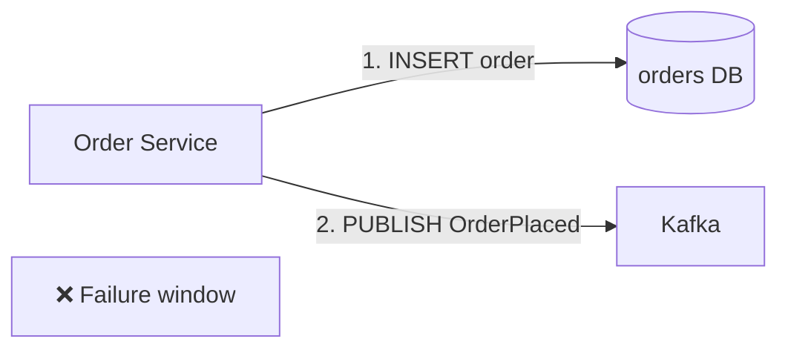
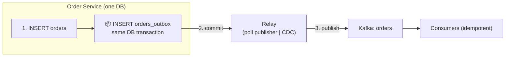
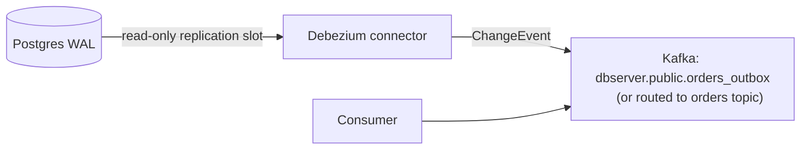

# The Transactional Outbox Pattern

The workhorse pattern of reliable async systems. It solves the hardest problem in
event-driven design: **how do you make a DB write and a message publish atomic?**

## The dual-write problem



Either order can fail:

| Failure | Result |
|---------|--------|
| DB write succeeds, publish fails | Order exists but nobody knows → **lost event**, no inventory reservation |
| Publish succeeds, DB write fails (or rolls back) | Event exists for an order that isn't stored → **phantom event**, warehouse ships nothing/duplicates |

This is a **distributed transaction** between your DB and Kafka — and per the
previous page, we don't do distributed transactions. The outbox makes it a *local*
transaction.

## The pattern



1. In the **same local transaction** as the business change, insert a row into an
   `orders_outbox` table carrying the event payload.
2. A **relay** reads unpublished outbox rows (by `id` ascending → preserves order!),
   publishes them to Kafka, then marks them published (or deletes them).
3. Consumers receive events **at-least-once** — an event row is only "published" after
   the broker acknowledged `acks=all`. If the relay crashes between publish and mark,
   the row is re-published → duplicates → absorbed by idempotent consumers/unique
   event ids.

**Atomicity achieved**: DB commit = event guaranteed to exist in the outbox. The
broker's record of deliveries can lag, but the *intent* can never be lost.

## The outbox table

```sql
CREATE TABLE orders_outbox (
  id            BIGSERIAL PRIMARY KEY,       -- global order = global ordering
  aggregate_id  TEXT NOT NULL,               -- order_id (partition key)
  event_type    TEXT NOT NULL,               -- 'OrderPlaced'
  payload       JSONB NOT NULL,              -- self-contained event body
  published     BOOLEAN NOT NULL DEFAULT FALSE,
  published_at  TIMESTAMPTZ,
  created_at    TIMESTAMPTZ DEFAULT now()
);

CREATE INDEX idx_outbox_unpublished ON orders_outbox (published, id) WHERE published = FALSE;
```

Design points:

- `BIGSERIAL id` ascending → relay publishes in insert order → **per-topic ordering
  matches DB commit order** (for multi-partition consumption, keep key = aggregate
  for per-entity order, p. [ordering](ordering.md)).
- **Relay writes status back in its own short transaction** and marks published with
  `published_at` for observability. `UPDATE ... SET published = TRUE WHERE id = ?` —
  no need for pub/sub locks at this scale.
- Retention: long-lived consumers need history → keep rows; else purge `published`
  rows older than N days (configurable — never purge before consumers can replay).

## The two relay flavors

### 1. Polling publisher (you own it)

A loop that queries unpublished rows and publishes:

```python
while True:
    rows = db.execute(
        "SELECT * FROM orders_outbox WHERE published = FALSE ORDER BY id LIMIT 100")
    for row in rows:
        producer.produce("orders", key=row.aggregate_id, value=row.payload)
        producer.flush()          # synchronous: broker acked → then mark
    for row in rows:
        db.execute("UPDATE orders_outbox SET published = TRUE WHERE id = :id")
    sleep(interval)               # e.g. 100ms; tune vs freshness needs
```

| Pros | Cons |
|------|------|
| Dead simple; no infra | Poll latency (freshness) |
| You control exactly once-publish marking | Extra table polling load (nothing at this scale) |
| Easy ordering (ORDER BY id) | You implement backoff/alerting when DB is down |

**When:** latency SLAs are seconds, you want minimal moving parts, single-writer
services.

### 2. Transaction log tailing / CDC (Debezium)

Debezium tails the **Postgres WAL (binlog)** and converts transaction-committed
inserts into Kafka events — *the relay you never have to build*:



| Pros | Cons |
|------|------|
| Zero polling; millisecond freshness | Another infra component (Kafka Connect) |
| Doesn't touch the app DB (no polling load) | Replication slots / WAL tuning |
| Captures deletes too (delete-marked outbox rows) | Schema change handling |
| Enforces publish-if-committed (WAL only shows committed) | Ordering across the CDC topic needs care (partition by aggregate) |

**When:** freshness < 1s matters, multiple services share one DB, or you already pay
for Kafka Connect.

### Compare and choose

| | Polling publisher | Debezium CDC |
|--|-------------------|--------------|
| Components | Your relay code | Kafka Connect + Debezium + slot |
| Freshness | 100ms–seconds | ~ms |
| Ordering | Trivial (ORDER BY id) | Keep keyed partitions + route by `aggregate_id` |
| Ops surface | Table polling | WAL slots, connector restarts |
| Debuggability | `published` column is self-evident | Connector status + `__consumer_offsets` gizmo |

You build **both** (P4 and P5) because interviews and real codebases mix them.

## Why not just publish directly after the commit?

```python
# ✗ fragile
db.execute("INSERT INTO orders ...")
db.commit()
producer.produce("orders", ...)      # crash between → event lost
```

The window between commit and produce drops events *silently* on crash/timeout.
The outbox moves that window *inside* an ACID boundary. There is no meaningful reason
to write the "insert then publish" version once you know this pattern.

## The outbox + idempotency contract

- Event carries a stable **event id** (or the row id doubles as it) →
  consumer dedups via unique constraint (p. [idempotency](idempotency.md)).
- Relay may republish duplicates → consumers must tolerate.
- `published` flag only says "broker acknowledged at least once" — never assert more.

## Outbox pitfalls (interview gold)

| Pitfall | Fix |
|---------|-----|
| Relay publishes but crash before marking → duplicates | Design for it (idempotent consumers) |
| Polling query without index → full scans worsen over time | The partial index above |
| Outbox partition chosen wrong (e.g. `event_type` as key) → global order destroyed | Key by `aggregate_id`; partition layout is an architecture decision |
| Multiple app instances poll the same table | Either single relay writer, or `FOR UPDATE SKIP LOCKED` per batch; publish-mark in same txn per row |
| `published = TRUE` rows never cleaned → table bloat | Archival job, keep replay window honest |
| Relay marks published but Kafka never acked (flush failure) | Mark only **after** broker ack (`producer.flush()` returns success) |
| Downstream service processes events before source txn durably committed (CDC) | CDC only emits after commit — correct by design; check isolation with `read_committed` consumers |

## Checkpoint

??? question "1. List the exact failure windows of outbox + polling publisher and the defense for each."
    | Window | What can happen | Defense |
    |--------|-----------------|---------|
    | DB commit → relay reads the row | Nothing lost — row is durable in the DB | Relay restart resumes; alert on stale `published=FALSE` |
    | Relay reads → broker ack | Crash here = event not yet published | Republished after restart — no loss, duplicates possible |
    | Broker ack → mark `published` | Crash here = duplicate publish | Consumers dedup by event id / unique business key |
    | Relay processes rows, DB throws | Rows stay unpublished | Retry loop + alerting |
    | `producer.flush()` fails | No ack → don't mark | Mark only after ack; failed flush = retry |
    The only recurring event is **duplicates**, and idempotent consumers absorb them —
    that's why outbox systems are always built on top of [idempotency](idempotency.md).

??? question "2. When is CDC strictly better than polling? When is it strictly worse?"
    **Better**: freshness below ~1 s matters (milliseconds vs poll interval);
    many services share one DB and you don't want N polling relays; ops budget can
    absorb Kafka Connect + Debezium; you already run Connect; you want commit-time
    emission with zero app coupling.
    **Worse**: you want minimal moving parts (relay code vs a connector + WAL
    replication slots); you need simple ordering guarantees (polling's
    `ORDER BY id` is trivial, CDC needs keyed routing and slot discipline);
    debugging must live in `published` flags; the DB is a managed service where
    logical replication is unavailable/expensive; multiple teams must not depend
    on connector availability for their features.

??? question "3. The relay crashes right after broker ack, before marking. What do consumers receive? Why is that safe?"
    They receive **the same event again** (a duplicate delivery of an identical
    payload). Safe because:
    - the payload carries a stable identity (`event_id`), and
    - consumers dedup via `processed_events`/unique business keys in the same
      transaction as their side effect (P3) — the second delivery is a no-op.
    Duplicates are *expected* in at-least-once; the invariant you must never give
    up is `mark ⇐ AFTER ack` — flip it the other way and you get loss, which
    dedup can't fix.

??? question "4. Why `ORDER BY id`? What breaks if the relay polls by `created_at` with clock skew?"
    `BIGSERIAL id` is assigned at insert time and increases in **commit order** —
    polling by ascending id replays events in the same order the business committed
    them. `created_at` is **wall-clock**: two rows committed in the same
    millisecond tie (nondeterministic pickup), and with any clock skew between
    app nodes (or NTP jitter), an event committed later can have an earlier
    `created_at` → the relay publishes it first → **consumers observe out-of-order
    history** (e.g. `OrderCancelled` before `OrderPlaced`). Ordering is a factual
    guarantee (p. [ordering](ordering.md)) — never base it on clocks.

Next: [Event Ordering](ordering.md)