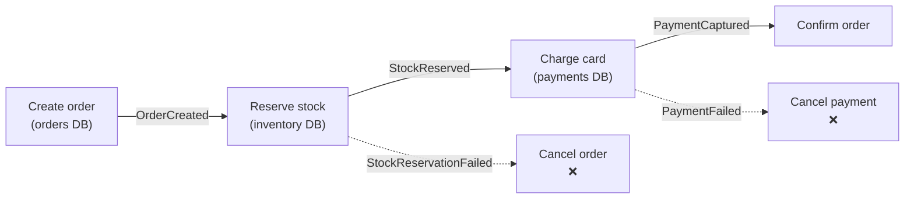
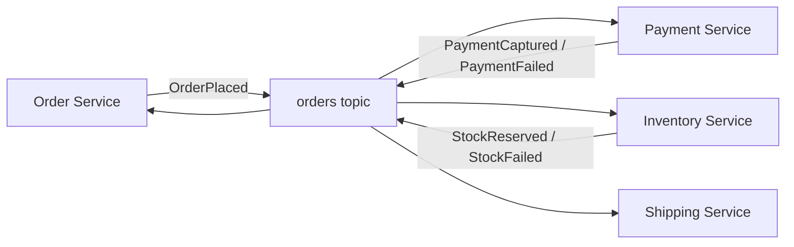
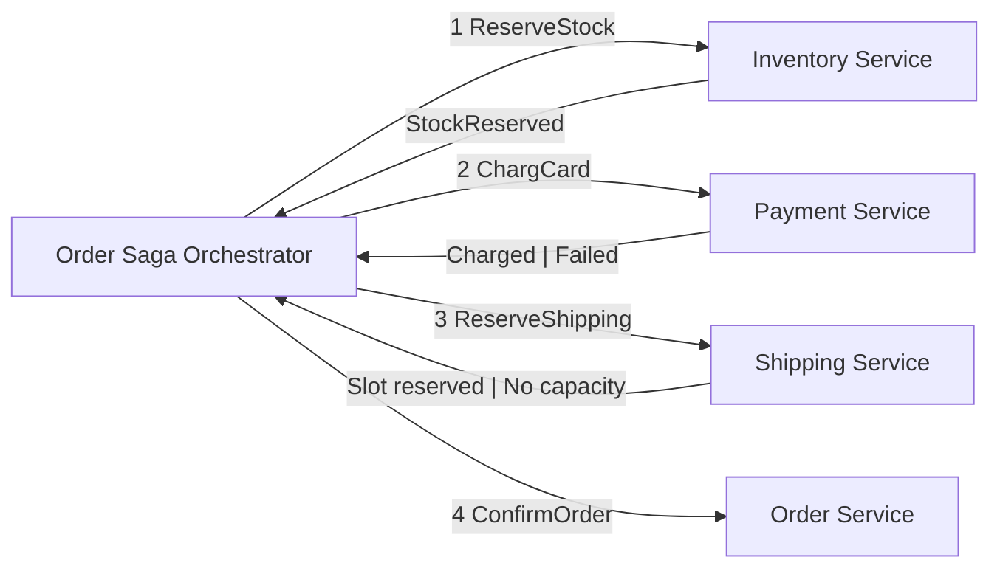
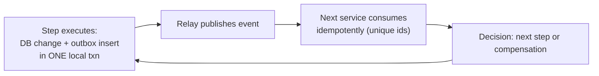

# The Saga Pattern

A **saga** is a sequence of local transactions across services where each step
publishes an event that triggers the next step — and every step that *can* succeed
has a corresponding **compensating transaction** that undoes it when a later step
fails.



Key properties:

- Each step is a **local ACID transaction** in one service.
- There is **no global lock** anywhere; services commit independently.
- On failure, the saga **walks backwards** executing compensations (refund, release
  stock, cancel order).
- The system is **eventually consistent**: there is a transient window where an order
  is `in_progress`; nothing pretends otherwise.

!!! danger "Compensation is not rollback"
    A compensation is a *new* successful operation ("refund the charge") that
    undoes a *committed* effect. It can fail, and must then be retried —
    compensations need idempotency and durable state too. This is why saga systems
    are built on top of outbox + idempotent consumers, which is exactly the combo
    you build in Projects P4–P7.

## Choreography vs Orchestration

### Choreography (event-driven, decentralized)



| Pros | Cons |
|------|------|
| No orchestrator to build or scale | Workflow lives nowhere visible — "where is the state?" |
| Services stay fully decoupled | Failure paths get tangled (which compensation fires for which event combos?) |
| New subscribers join free | Hard to test end-to-end |
| Natural fit for fan-out events | Being stepped on by 15 consumers, rarely right for money flows |

**Use for**: notifications, analytics copying, things where "react to a fact" is the
whole job.

### Orchestration (central coordinator)



| Pros | Cons |
|------|------|
| Workflow state is **one place** (orchestrator DB) | Orchestrator is a special service to build/vet |
| Sequence + compensation logic readable and testable | More coupling; services get called *through* a controller |
| Easy to add steps, retries, timeouts per-step | Orchestrator becomes the thing you must not lose (needs DB + events) |

**Use for**: money flows, multi-step booking, anything with a defined sequence
(checkout, travel booking, onboarding).

!!! quote "Rule of thumb"
    Tell the story of the workflow out loud. If it's "then... then... then... and if
    that fails..." → **orchestration**. If it's "here's a fact, whoever cares reacts"
    → **choreography**. You will build both (P6, P7) and feel the difference.

## Saga state machine (orchestrated)

The orchestrator persists a row per saga instance:

```sql
CREATE TABLE saga_instances (
  saga_id        UUID PRIMARY KEY,
  saga_type      TEXT NOT NULL,          -- 'order_placement'
  status         TEXT NOT NULL,          -- running | succeeded | compensating | failed
  current_step   TEXT NOT NULL,          -- 'charge_payment'
  payload        JSONB NOT NULL,         -- order snapshot (self-contained!)
  state          JSONB,                  -- step results, compensations fired
  created_at     TIMESTAMPTZ DEFAULT now(),
  updated_at     TIMESTAMPTZ DEFAULT now()
);
```

Stepping is **event-driven** (the orchestrator consumes replies from a topic) — never
block on HTTP from inside the orchestrator for each step. This is the "long-running,
durable process" pattern. Projects P7 implements this exactly.

## Saga failure catalog (know these by name)

| Failure | What breaks | The fix |
|---------|-------------|---------|
| No compensation for a step | Money charged, no refund path | Audit every step: "if this later fails, what undoes it?" |
| Compensation not idempotent | Double refund | Idempotency keys/unique ids on compensations |
| Timeout without a decided outcome | "Did payment succeed?" | Dead-letter + manual repair + `auto.offset.reset` discipline |
| Missed events (consumer failed silently) | Saga stuck in `in_progress` | Timeout/watchdog per saga id; failure topics; alerts on `running` age |
| Orchestrator loses its DB state | Orphaned saga | Orchestrator writes state before emitting each step event (outbox!) |

## Saga + outbox + idempotency = the stack



Saga steps are just outbox-publishing local transactions; saga *durability* is the
outbox; saga *safety under retries* is idempotent consumers. If you only remember one
diagram from this guide, remember this one.

## Interview reflex answers

- **"Saga vs distributed transaction?"** → Sagas avoid global locks via local txns +
  compensations; eventual consistency; the coordinator (if orchestrated) is a
  durable state machine.
- **"Choreography or orchestration for order placement?"** → Orchestration for a
  defined money flow (sequence, timeouts, compensations visible); choreography for
  fan-out reactions.
- **"How does the saga survive a crash?"** → Each step + each emitted event committed
  atomically (outbox); orchestrator rehydrates state from DB and continues from
  `current_step`; persistent subscriptions resume by offset.
- **"What's the worst saga bug you know?"** → A step with a side effect but no
  compensation, e.g. shipping label created before payment confirmed. Auditing
  forward + backward coverage is the review checklist.

## Checkpoint

??? question "1. Inventory reserved, then payment fails. Enumerate the compensations in order."
    Compensations run in **reverse order of the forward steps** (undo the newest
    committed effect first):
    1. **ReleaseStock** — release exactly the units this order reserved (inventory
       service, idempotent: never release more than reserved).
    2. **CancelOrder** — flip the order to `cancelled` (orders service).
    There is no payment compensation needed — payment never happened (it *failed*).
    If the forward steps had been `create → reserve → charge`, the charge step's
    own compensation (**Refund**) would fire first, then release, then cancel.

??? question "2. Choreographed saga: who owns '5 minutes without progress → escalate'?"
    **Nobody — and that is the defining weakness of choreography.** There is no
    central state; each service knows only its own rows. The standard answer is a
    **watchdog/reconciliation service**: a background job that queries all
    services' state tables (or a per-service `order_pipeline` table) for stuck
    states — e.g. `payment_captured` but no shipment event for N minutes — and
    escalates or re-emits the missing event. That you must *add* a watchdog is the
    argument P7 makes for orchestration.

??? question "3. Why must the orchestrator persist its state *before* publishing a step event?"
    Because the **published event is not recoverable**, but the DB row is:
    - persist first, crash before publish → on restart, the orchestrator rehydrates
      from DB and (via the outbox) re-emits the step. Nothing is lost, nothing
      double-run (event ids make the re-emit idempotent).
    - publish first, crash before persist → the step *ran* in a downstream service,
      but the orchestrator has no record of it → it will re-run the step (or lose
      track of progress) → duplicate effects or a corrupted workflow state.
    "Persist-then-publish" is exactly the outbox discipline applied to workflow,
    and it's why the orchestrator's DB is a *state machine database*, never a
    cache.

??? question "4. Can a step be both a normal step and its own compensation? Give an example (hint: idempotent status flips — e.g. 'mark order cancelled' is its own undo)."
    Yes — whenever the step is an **idempotent status flip**, its "undo" is the
    same operation. Examples:
    - `Mark order cancelled` — running it again keeps it cancelled (idempotent);
      forward = cancel, compensation = cancel (already done).
    - `Deactivate card` / `Freeze account` — freeze is both the action and the
      undo of "unfreeze" scenarios (the compensation for unfreeze is freeze).
    - `Set status: unavailable` for a stock item.
    The catch: the *effect* must be convergent (same result on repeat). If a step
    has side effects (money moved, email sent), it can *not* be its own
    compensation — those need distinct compensating operations.

Next: [The Transactional Outbox Pattern](outbox.md) — the foundation under every saga.