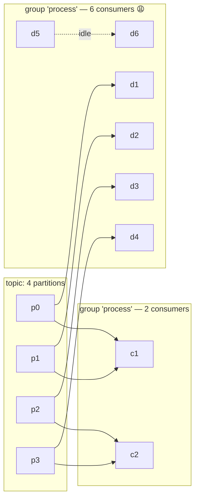

# Scaling Consumers, Backpressure & Lag

Kafka's parallelism is *partition-bound*. Everything about scaling consumers follows
from: **one partition is owned by exactly one consumer in a group at a time.**

## The scaling model



**Throughput ceiling of a group = sum of partition throughputs.** Adding consumers
beyond partition count buys nothing (they idle and can cause rebalance churn).

## Consumer-lag: the load meter

- **Lag** = newest broker offset − last committed offset, per partition.
  It is the health metric for consumers, pipelines, and queues.
- A growing lag with constant traffic = consumer too slow, or a poison message
  blocking progress.
- A growing lag with *falling* traffic = runaway rebalances (see below).

```bash
kafka-consumer-groups.sh --bootstrap-server localhost:9092 \
  --describe --group settlement
# GROUP  TOPIC  PARTITION CURRENT-OFFSET LOG-END-OFFSET LAG
```

**Practical autoscaling rule**: scale consumer instances when lag-per-partition
exceeds X for Y minutes; shrink when idle. Public cloud autoscalers can read lag
directly (or you write a tiny lag→webhook adapter — a P2 exercise).

## Rebalances: understand before you suffer

When a consumer joins/leaves/fails, the group reassigns partitions. Consumers pause
processing, fetch new assignments, and often re-seek to committed offsets — which
can *reprocess* records (back to
[delivery semantics](delivery-semantics.md) — duplicates are why idempotency is
non-negotiable).

```
member joins → group coordinator approves → rebalance → assign → resume
```

Rebalance storm symptoms (classic production incident):

1. A consumer takes longer than `max.poll.interval.ms` per poll (slow processing or
   a blocked DB call) → it's declared dead and *kicked*.
2. Rebalance → remaining consumers get more partitions → slower each → they trip
   timeouts too → cascading kicks. Lag explodes while nobody actually processes.

Fixes (in order of affect):

- `max.poll.interval.ms` aligned to real processing time + allow longer SLAs
- Do **not** auto-commit; commit per record or in small batches
- Use a worker pool *inside* the consumer (one consumer thread → N workers) instead
  of spawning external consumers per thread
- Keep consumer count ≤ partitions; prefer many partitions up front (partition count
  can only grow, never shrink — old partitions stay)
- Always commit **before** termination/shutdown hooks

## Backpressure inside the consumer

`max.poll.records` (e.g. 500) caps the per-poll batch, so one slow record doesn't
pin a big batch... but the whole batch can still get stuck on a poison message —
that's what [retries/DLQ](failure-handling.md) and the skipped poison-pill guards
handle, combined with `max.poll.interval`.

For batch semantics, `enable.auto.commit=false` + commit after `N` records processed
is the canonical pattern with Kafka:

```python
consumer.subscribe(["orders"])
while True:
    msgs = consumer.poll(timeout=1.0)
    if msgs:
        try:
            for m in msgs:
                process(m)
            consumer.commit()      # batch ack: redeliver the whole batch if crash
        except Exception:
            consumer.pause()       # backpressure: stop fetching, alert, then resume
```

## Autoscaling topic → the honest trade

- Few partitions = order-friendly but slow, boring scaling.
- Many partitions (64, 128...) = fast, but: more brokers needed, more consumer
  groups overhead, higher metadata/fetch cost — and **any hot key concentrates its
  entire history in a single partition** anyway.

Answer to "how many partitions": ~max peak throughput of a single consumer partition
× expected consumers; then double it, with metric-based review. There is no formula
that avoids monitoring.

## Operational checklist

- [ ] Monitor **lag per partition** per group (alert on trend, not spike)
- [ ] Consumer count ≤ partition count (else: idle workers + rebalance churn)
- [ ] `max.poll.interval.ms` realistic; `session.timeout.ms` > poll interval
- [ ] No long blocking calls inside the poll loop (move to worker pool)
- [ ] `enable.auto.commit=false` + explicit batch/manual commits
- [ ] A failing record is caught, routed to DLQ (not retried forever inside the loop)
- [ ] Rebalance-safe code: no state in memory across assignments (state → DB)

## Interview reflex answer

Q: "My consumer group can't keep up. That identity of autoscale, tell me what to check."
A: Check lag per partition; check group members vs partition count; check for
rebalance storms (rolling kick loop); check poison messages; then scale steps:
1) fix slowest code path, 2) burst the poll with more consumers (cap at partitions),
3) increase partitions (with a data migration if repartitioning keys), 4) split topic
by workload (physical vs payload). Always keep idempotency so reorders and
rebakes are safe.

## Checkpoint

??? question "1. 3 consumers, 4 partitions, group lag 10k. You add 10 consumers. What happens?"
    Almost nothing good:
    - max 4 consumers can ever work (1 partition each) — **9 of your 10 sit idle**.
    - the group performs **rebalances** for every join: consumption pauses,
      partitions reassign, offsets may bounce — 10 joins in quick succession can
      make lag *grow* during the churn even though nothing new failed.
    The lag shrinks only if the original 3 were underutilized — e.g. blocked on
    slow work — in which case matching consumer count to partition count (4) was
    the actual fix, not "more workers".

??? question "2. A consumer calls a 30-second HTTP API on every message. `max.poll.interval.ms=5s`. Describe the failure mode and two fixes."
    **Failure mode**: the consumer's poll loop is blocked ~30 s per message, far
    past `max.poll.interval.ms` (5 s) → the broker group coordinator marks it dead
    → kicks it → **rebalance**: partitions move to remaining consumers, who also
    block on their own 30 s calls → they get kicked too → **cascading rebalance
    storm**, lag spikes, and repeated reprocessing from committed offsets.
    **Fixes**:
    1. Raise `max.poll.interval.ms` to a realistic bound (e.g. 60 s) AND lower
       `max.poll.records` so one batch can't exceed it.
    2. Move the API call out of the poll loop: poll fast, hand records to a
       worker pool, commit per completed record (or per batch).
    3. Split the pipeline: consumer emits the event to a *work topic*; a separate
       pool of workers (or another service) does the HTTP call, keyed the same way
       for ordering.
    Rule: **poll must never block on business work** — that's the interface
    contract with `max.poll.interval.ms`.

??? question "3. Which metric distinguishes 'slow consumer' from 'rebalance storm'?"
    Look at **group membership + assignment change rate**, not just lag:
    - **Slow consumer**: stable member list, stable assignments (`--describe`
      unchanged), lag *rising steadily* proportional to event rate.
    - **Rebalance storm**: members join/leave repeatedly (describe output churns),
      lag *spikes and plateaus* while no consumer is actually busy, broker logs
      show repeated "rebalance" cycles, and processing throughput is flat despite
      high apparent membership.
    Lag alone can't tell them apart; membership stability + rebalance frequency +
    per-member throughput do.

??? question "4. Why can't you shrink partition count?"
    Partitions are referenced by **offsets, keys (hash routing), consumer
    assignments, and the compaction/retention log** — the partition count is baked
    into the historical contract of the topic. `alter --partitions` only grows;
    there is no shrink operation because lowering the count would re-map hashes
    and re-interpret offsets mid-stream, breaking ordering and duplicating
    consumers' positions. "Shrinking" requires creating a new topic with fewer
    partitions and migrating consumers (with all the re-keying and replay
    analysis that implies). This is why choosing the initial partition count
    wisely (and monitoring utilization) is a design decision, not a config knob.

Next: [Failure Handling: Retries & DLQ](failure-handling.md)