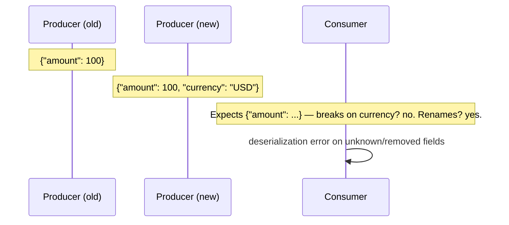
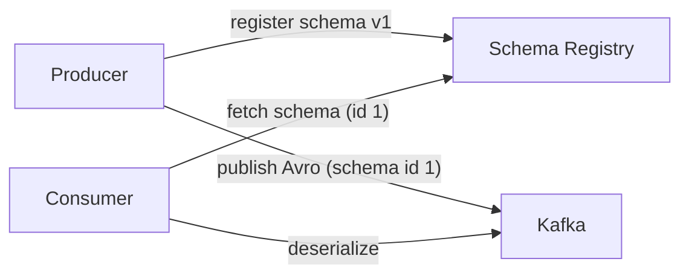

# Schema Evolution & the Schema Registry

Kafka records are just bytes. The moment two services share a topic, **the payload
contract IS the integration** — and contracts change. Producers ship new fields,
rename them, deprecate them. Without a schema strategy, "the consumer broke" becomes
a weekly joyride.

## The evolution problem



Two hard facts:

1. **Producers and consumers deploy independently** in an event-driven system.
   At any moment, mixed versions exist.
2. **Events outlive code** (retention, replay, DLQ repair). Old records must stay
   readable by new code.

## Schema Registry 101

A **Schema Registry** is the central authority: producers declare the schema before
publishing, consumers fetch the schema to deserialize. Data (in Avro, Protobuf, or
JSON Schema) carries **its schema version**, and the registry enforces
**compatibility rules** between versions.



### Why Avro in the Kafka world

- Binary: compact (~40% smaller than JSON), fast
- Schema-embedded records (`schema id` in the first 4 bytes) — self-describing
- Strong, explicit evolution rules; first-class citizen in Kafka tooling
- Compared: JSON Schema is human-readable but slower+bulkier; Protobuf needs
  googling for the id-based embedding; Avro is the Kafka default

## Compatibility types (interview precision)

| Type | Rule | Typical move |
|------|------|--------------|
| **Backward** | Old consumers can read new data | Add optional field with default |
| **Forward** | New consumers can read old data | New fields must have defaults / be removable |
| **Full** | Both directions | Removals are deletions that additions never re-use |
| **None** | Anyone may break everyone | Nothing (that's "no governance") |

Operational default wisdom:

- **Full/Backward** for streaming in production; many orgs use Backward+Forward
  automation to avoid "who deploys first" deadlocks between producer/consumer teams.
- Renaming a field breaks **backward** (old consumer can't find it) unless you add
  a temporary duplicate field path.
- Deleting a field breaks **forward** unless defaulted.
- Changing an existing field's *type* is a breaking change (add a new field instead).

Confluent Registry CLI makes this a command:

```bash
# register & validate
curl -X POST http://localhost:8081/subjects/orders-value/versions \
  -H 'Content-Type: application/vnd.schemaregistry.v1+json' \
  -d '{"schema": "{...avro json...}"}'

# test compatibility for a candidate v2
curl -X POST http://localhost:8081/compatibility/subjects/orders-value/versions \
  -d '{"schema": "{...v2..."}'

# list versions
curl http://localhost:8081/subjects/orders-value/versions
```

## Subject naming convention (get this right)

Subject `<topic>-<key|value>` (default) → one schema per topic side:

```
orders-value  ← order event payload
orders-key    ← partition keys (often a wrapper around aggregate_id)
orders-value.dead  ← DLQ variant (3-pattern topic suffix -value strategies exist)
```

**Never reuse a subject across topics** unless you intend sharing the contract;
mis-typing a subject is a classic "silent incompatible producer" accident because it
creates a *split second* of schemas diverging.

## In code (confluent_kafka + Avro serde)

```python
from confluent_kafka.schema_registry import SchemaRegistryClient
from confluent_kafka.schema_registry.avro import AvroSerializer, AvroDeserializer

schema_registry = SchemaRegistryClient({"url": "http://localhost:8081"})
schema_str = open("order.avsc").read()

serializer = AvroSerializer(schema_registry, schema_str)
deserializer = AvroDeserializer(schema_registry, schema_str)

producer.produce(
    "orders",
    key=key_serializer("order-123"),
    value=serializer({"order_id": "order-123", "amount": 100}),
    on_delivery=delivery_cb,       # never skip error callbacks!
)
```

## Writing backwards-compatible schemas — the practical playbook

```json title="order.avsc — v1 → v2 evolution"
{"type": "record", "name": "OrderPlaced", "fields": [
  {"name": "order_id", "type": "string"},
  {"name": "amount",   "type": "long"},
  {"name": "currency", "type": "string", "default": "USD"}   // v2: added with default ✔ backward-safe
]}
```

Rules that never break you:

1. **Add** new fields with defaults.
2. Field **deletion** = remove after all consumers stopped reading it
   (check consumer schemas first!), never while mixed.
3. **Never change type** of an existing field.
4. Rename = add new field, deprecate old, migrate readers, then drop
   (three-stage release dance).
5. Unions with null (`["null", "long"]`) for possibly-empty values — not empty strings.
6. Version your *semantics* too: an event with the same schema but different meaning
   should be a **new event type** (topic or event_name field), not a schema change.

## The registry in your failure ladder

- Deserialization failures in a consumer → record is a **schema-contract breach** →
  DLQ with `x-error-type=invalid` and page the producer owner (p.
  [failure-handling](failure-handling.md)). This is *not* a retry signal.
- **Registry downtime** → consumers hold a small cache; ensure the registry is
  HA (typical `--mode=replica` setups) and waits/deadline in bootstrap code.

## Interview reflex answers

- **"How do you handle a breaking schema change in Kafka?"** → Versioned schema in
  the registry + backwards/forward compat policy; add-with-default, deprecate, drop;
  new topic or new event type as the nuclear escape hatch; DLQ for contract breaches.
- **"Avro vs JSON vs Protobuf for event payloads?"** → Decide on tooling, size,
  portability; Avro: binary, compact, self-describing, registry-native; JSON: debuggable
  but schema-less at-rest; Protobuf: excellent for gRPC-heavy ecosystems but sends
  schema metadata with wire-format you own. Kafka + Avro + registry is the
  default pairing.
- **"When would you pick JSON over Avro?"** → Interactive debugging, small teams,
  or when clients are web browsers directly reading topics (rare), payloads small.

## Checkpoint

??? question "1. Backward, forward, full: give one change each that *violates* it."
    - **Violates backward** (old consumers can't read new data): *removing* an
      existing field without a default, or *changing its type* (e.g. `long` →
      `string`) — old code can't parse the new record.
    - **Violates forward** (new consumers can't read old data): *adding* a
      required field without a default — new code reads old records and finds the
      field missing (validation error).
    - **Violates full** (both): *deleting* a field that still has readers while
      also adding a required one — any transition breaks one of the two directions.
    Mental model: backward = "old can read new", forward = "new can read old",
    full = both — every schema change is a step in a matrix.

??? question "2. Why does an added-with-default field preserve backward compat but break forward?"
    **Backward** (old consumers read new data): the field *exists* in the new
    records, and old consumers simply ignore fields they don't know → compatible.
    **Forward** (new consumers read old data): old records lack the field; the new
    consumer must *deserialize* it — without a `default` the field is required and
    missing → a validation error. With a `"default"` declared, the reader fills it
    in → forward-safe too. That's why the universal rule is "**add with a
    default**": it's the only add that's safe in both directions.

??? question "3. Your `amount` is a `long`; a bad producer writes `string`. Where does this actually break, and what's the fastest way to find it?"
    It breaks **at deserialization in the consumer** — Avro validation rejects the
    record (wrong type for the field) *before* your handler runs. Symptoms:
    consumer errors like `Error deserializing Avro message for id ...`, the record
    hitting your error path → DLQ with `x-error-type=invalid` (never a retry).
    Fastest path: (1) consumer DLQ/logs name the producer's serialized schema/type;
    (2) query the Schema Registry for `amount` field type (subject versions);
    (3) look at the *producing* service — its serializer registered/misconfigured,
    or `auto.register.schemas` was on and it silently registered a wrong variant
    (subject split!). One command to find it: 
    `curl localhost:8081/subjects/orders-value/versions | jq` and diff the
    offending version's type against `long`.

??? question "4. Who owns breaking-change deprecations when four teams consume your topic?"
    **You (the producer/owner) do** — the registry makes compatibility *enforced*,
    but ownership is *organizational*. A workable model:
    - a **contract review** (registry subject + consumer list) for any removal or
      type change — you can't delete fields until *all* consumers' latest schemas
      stop referencing them (registry compat tests + consumer cohort review).
    - the **three-phase dance**: add-with-default → populate+document deprecation →
      remove (after all consumers migrated), with a deprecation schedule in the
      changelog.
    - **push the cost upstream**: consumers failing compatibility checks block
      their own deploys (fail-fast CI), so migrations are visible and scheduled,
      not silent.
    - if you can't coordinate: new topic/new event type, old one retired on a
      deadline — registry "soft delete" + retention.

## Learn more

- **Docs** — [Confluent Schema Registry — Key Concepts (video course)](https://developer.confluent.io/courses/schema-registry/key-concepts) — serdes, compatibility levels and client integration in ~6 short modules.
- **Docs** — [Schema Registry serdes — Avro/Protobuf/JSON 101](https://docs.confluent.io/platform/current/schema-registry/fundamentals/serdes-develop/index.html) — what `value.schema` actually does on the wire vs. in the registry.
- **Read** — [Multiple Event Types in the Same Kafka Topic](https://www.confluent.io/blog/multiple-event-types-in-the-same-kafka-topic/) — schema-evolution-adjacent topic design for evolving events.
- **Docs** — [Debezium — Outbox Event Router](https://debezium.io/documentation/reference/stable/transformations/outbox-event-router.html) — a production source of evolving schemas worth studying alongside this page.

Next: [Exactly-Once Semantics](exactly-once.md)