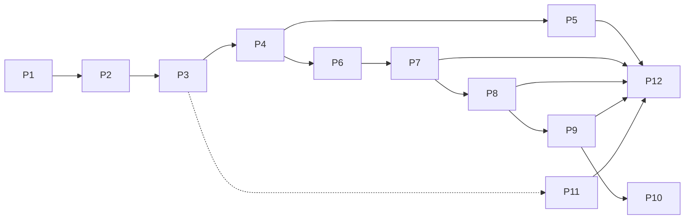

# The Project Ladder

12 projects. Each adds exactly one hard problem on top of the previous one. If a
project feels easy, you've skipped the "break it" section — that's the part that
counts.

## How to work this ladder

1. **Read the concept page** linked at the top of each project.
2. **Build the happy path** — get the happy flow working end-to-end.
3. **Break it, then prove it heals** — kill processes mid-flight, duplicate events,
   restart brokers. The break-it experiments are the actual curriculum.
4. **Answer the checkpoint questions** — write the answers down. These map 1:1 to
   interview questions later.
5. Keep every service **boringly small** (one file, one concern). The patterns are
   the point, not the code.

## The ladder at a glance

| # | Project | Hard problem added | Concepts exercised |
|---|---------|--------------------|--------------------|
| [P1](p01-hello-kafka.md) | Hello Kafka | Broker basics | Topics, partitions, offsets, keys |
| [P2](p02-consumer-groups.md) | Consumer groups & scaling | Group semantics, lag, ordering | Rebalance, parallelism, keys |
| [P3](p03-idempotency.md) | Idempotent payment API | Duplicate absorption | Idempotency keys, dedup, unique constraints |
| [P4](p04-outbox-polling.md) | Transactional outbox (polling) | Atomic DB↔broker | Outbox, relay, at-least-once |
| [P5](p05-outbox-cdc.md) | Outbox via Debezium CDC | The relay you don't build | WAL tailing, Kafka Connect, outbox router |
| [P6](p06-saga-choreography.md) | Saga by choreography | Multi-service failure + compensation | Event-driven state, compensating txns |
| [P7](p07-saga-orchestration.md) | Saga by orchestration | Durable central workflow | State machine, orchestrator, timeouts |
| [P8](p08-reliability-dlq.md) | Retries, backoff, DLQ | Failure ladder | Retry topics, poison pills, replays |
| [P9](p09-schema-registry.md) | Schema registry & evolution | Contract governance | Avro, compatibility, registry ops |
| [P10](p10-exactly-once.md) | EOS & Kafka transactions | Atomic produce+consume | Transactions, read_committed, fencing |
| [P11](p11-event-sourcing.md) | Event-sourced bank | State as a fold of events | Event sourcing, CQRS, projections |
| [P12](p12-capstone.md) | Capstone: e-commerce | Everything, together | Outbox+saga+DLQ+registry+tracing |

## Prerequisite map

Why this order:

- **P1–P3** are "know your broker and absorb duplicates".
- **P4–P5** are the foundation of every reliable pipeline (outbox) — P6/P7 need it.
- **P6–P7** are the distributed-transaction *business* view.
- **P8–P10** harden and formalize (DLQ, schemas, EOS).
- **P11** diverges to a different topic-paradigm (event sourcing) that also benefits
  from P3's dedup.
- **P12** wires a subset of everything into one deployable system, plus tracing.

## Time budget per project

| Kind of day | P1–P5 | P6–P8 | P9–P11 | P12 |
|-------------|-------|-------|--------|-----|
| Focused weekend | 1.5 days | 1.5 days | 1 day | 2 days |
| Stretched evenings | 4–6 days | 3–5 days | 2–3 days | 5 days |

The real multiplier is the break-it time. Never skip it.

!!! quote "If you only remember one sentence from this guide"
    Every pattern in this book exists because **a network call can fail after the
    effect happened**. Idempotency, outbox, sagas, DLQs — all answers to that one
    sentence. Build P4 with your own relay and you will *feel* why.