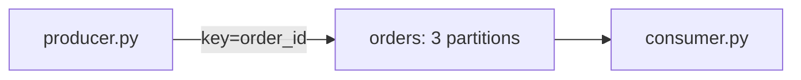

# P1 · Hello Kafka

**Read first:** [Messaging basics](../01-fundamentals/messaging-basics.md) →
[Kafka architecture](../01-fundamentals/kafka-architecture.md) →
[Setup](../01-fundamentals/setup.md)

A single topic, a keyed producer, and a consumer you can watch move records
between partitions and offsets.

## What you build



## Shared files and setup

Copy the shared `compose.yaml` and `common.py` unchanged from
[Setup](../01-fundamentals/setup.md). The project files are:

```text
compose.yaml
requirements.txt
common.py
producer.py
consumer.py
```

Start the shared stack and create the topic explicitly:

```bash
docker compose up -d --wait --wait-timeout 180
docker compose ps
docker compose exec kafka /opt/kafka/bin/kafka-topics.sh \
  --bootstrap-server kafka:29092 \
  --create --if-not-exists \
  --topic orders --partitions 3 --replication-factor 1 \
  --config min.insync.replicas=1
docker compose exec kafka /opt/kafka/bin/kafka-topics.sh \
  --bootstrap-server kafka:29092 --describe --topic orders
```

The producer uses the shared envelope, stable event ID, keyed delivery callback,
and `flush()` in `common.publish`. Start it from this project root:

```bash
python producer.py
```

## 1. `producer.py`

```python title="producer.py"
import common

TOPIC = "orders"


def main() -> None:
    producer = common.new_producer("p01-order-producer")
    for number in range(20):
        order_id = f"ord-{number:03d}"
        event = common.make_event(
            event_id=f"order-{order_id}-placed",
            event_type="OrderPlaced",
            aggregate_type="order",
            aggregate_id=order_id,
            data={"order_id": order_id, "amount": 100 + number},
        )
        common.publish(producer, TOPIC, event)


if __name__ == "__main__":
    main()
```

Each `produce` waits for its delivery callback to report success. The callback
receives the broker-assigned partition and offset; a timeout or delivery error
raises instead of being silently ignored.

## 2. `consumer.py`

Start it with `python consumer.py` in another terminal. Run this:

```python title="consumer.py"
from confluent_kafka import Consumer

TOPIC = "orders"
GROUP = "orders-console-group"


def main() -> None:
    consumer = Consumer(
        {
            "bootstrap.servers": "localhost:9092",
            "group.id": GROUP,
            "auto.offset.reset": "earliest",
            "enable.auto.offset.commit": False,
        }
    )
    consumer.subscribe([TOPIC])
    try:
        while True:
            message = consumer.poll(1.0)
            if message is None:
                continue
            error = message.error()
            if error is not None:
                raise RuntimeError(str(error))
            key = (message.key() or b"").decode("utf-8")
            value = (message.value() or b"").decode("utf-8")
            print(
                f"p{message.partition()} o{message.offset()} "
                f"key={key} value={value}"
            )
            consumer.commit(message=message, asynchronous=False)
    finally:
        consumer.close()


if __name__ == "__main__":
    main()
```

The consumer commits only after its local processing step, which here is the
print. A crash between the side effect and the commit can replay a record.

## 3. Consume without the Python loop

Use this when you want to see keys and partitions directly:

```bash
docker compose exec -it kafka /opt/kafka/bin/kafka-console-consumer.sh \
  --bootstrap-server kafka:29092 \
  --topic orders --from-beginning \
  --property print.key=true \
  --property print.partition=true \
  --property print.offset=true
```

While the Python consumer is stopped or running, inspect the group and its lag:

```bash
docker compose exec kafka /opt/kafka/bin/kafka-consumer-groups.sh \
  --bootstrap-server kafka:29092 \
  --describe --group orders-console-group
```

The command shows the current assignment, committed offset, log end offset, and
lag for each assigned partition. Produce more records, then run the command again
to watch lag rise or fall.

## Ordering lesson

With a fixed topic partition count and partitioner, the same non-null key maps
deterministically to the same partition. Records appended to one partition keep
their partition order, so events for one order are ordered relative to one
another. This is **per-key ordering**, not a total order across the topic: records
with different keys can be interleaved across partitions. Changing partition
count or partitioner can remap a key, and a null key does not provide entity
ordering.

The offset in a delivery callback is the broker position assigned to the record
after acknowledgment. The consumer's offset identifies the record it read; the
group's committed offset is the restart checkpoint and advances only after the
local processing step.

## Break it

1. Stop the consumer after it reads a record but before it commits, produce more
   records, and restart it. Which records replay, and why can a late commit cause
   duplicates?
2. Run `docker compose restart kafka`, then produce and consume again. Which data
   survives in this single-broker lab?
3. Change a copy of the producer to use a null key. Compare partitions and explain
   why two events for one logical entity can now be observed out of order.
4. Create two records with the same key and two with different keys. Record each
   partition and offset, then restate the ordering guarantee without saying that
   Kafka orders the whole topic.

## Checkpoints

??? question "What does the delivery callback prove?"
    A broker acknowledged the record and assigned its partition and offset. It
    does not prove that a consumer committed its local processing.

??? question "What does a group commit do?"
    It stores the next position from which the group can resume. Manual commit
    after processing provides at-least-once behavior: a crash before commit can
    replay, but a successful commit is not an early side-effect checkpoint.

??? question "Does a key provide global ordering?"
    No. It provides deterministic routing and per-partition order for that key
    while the topic mapping is stable. Different partitions have independent logs.

??? question "What is lag?"
    For each assigned partition it is the difference between the log end offset and
    the group's committed position. More consumers help only when idle partitions
    exist and their processing is faster than the producer.

## Done when

- [ ] You produced keyed records and observed partitions and offsets.
- [ ] You inspected a group assignment and measured lag.
- [ ] You can explain the difference between acknowledgment and commit.
- [ ] You can state the per-key ordering rule and its limits.

Next: **[P2 · Consumer groups & scaling](p02-consumer-groups.md)**.
