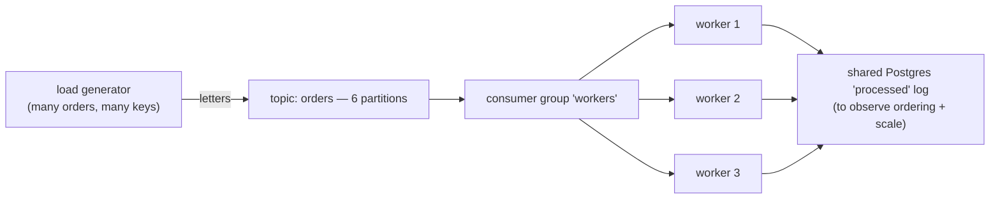

# P2 · Consumer Groups & Scaling

**Read first:** [Scaling consumers & backpressure](../02-concepts/scaling-consumer-groups.md) →
[Event ordering](../02-concepts/ordering.md)

Now the group dances: add consumers, watch partitions get reassigned, create
rebalance storms, and see per-key ordering survive (or not).

## What you build



| Skill | Learned by |
|-------|-----------|
| Group membership & partition assignment | `--describe` while adding workers |
| Balancing / idle workers | workers > partitions |
| Rebalance mechanics | kill one worker, watch others pause |
| Per-key ordering under load | keyed producer + gap-free check |
| Lag measurement & growth | backlog math with `kafka-consumer-groups.sh` |
| Multi-instance idempotent-ish processing | two workers same message? find out |

## Steps

### 1. Load generator

Produces N orders per second, each with a **stable key** — use `customer_id` plus a
per-order suffix so each order's events stay ordered but load spreads across
partitions.

```python title="load_gen.py"
import random, time, json
from confluent_kafka import Producer

p = Producer({"bootstrap.servers": "localhost:9092", "acks": "all",
              "enable.idempotence": True})

while True:
    customer = random.randint(0, 99)                     # 100 customers
    order_id = f"ord-{customer}-{int(time.time()*1000)}"
    # key = customer_id → all events of one customer to one partition
    p.produce("orders", key=str(customer),
              value=json.dumps({"order_id": order_id, "customer_id": customer,
                                "event": "OrderPlaced", "ts": time.time()}))
    p.poll(0)
    time.sleep(0.05)                                     # ~20 msg/s
```

### 2. Workers

Each worker: same group id, poll, log every processed record with its own `worker`
name, partition, offset, and a **processed-timestamp** into a small Postgres table
(fastest way to *see* scale and ordering afterwards via SQL).

```python title="worker.py"
name = argv[1]
consumer = Consumer({"bootstrap.servers": "localhost:9092",
                     "group.id": "workers",
                     "auto.offset.reset": "earliest",
                     "enable.auto.offset.commit": False,
                     "max.poll.interval.ms": 60000})
consumer.subscribe(["orders"])
while True:
    msg = consumer.poll(0.1)
    if msg:
        # simulate work proportional to id hash (keeps partitions uneven)
        time.sleep(hash(msg.key()) % 4 * 0.01)
        insert_processed(worker=name, key=msg.key(), partition=msg.partition(),
                         offset=msg.offset(), value=msg.value())
        consumer.commit(asynchronous=False)
```

### 3. Watch the dance

```bash
# terminal A: start worker-1, watch --describe as you start worker-2, -3, -4:
watch -n1 'docker exec kafka /opt/kafka/bin/kafka-consumer-groups.sh {
  --bootstrap-server localhost:9092 --describe --group workers}'
```

| State | What you should see |
|-------|--------------------|
| 1 worker, 6 partitions | Workerd 1 owns all 6; lag starts growing |
| 2 workers | Cage split 3/3; lag per worker halves |
| 6 workers | 1 partition each — parallelism == partitions |
| 9 workers | 3 workers **idle** (no partitions assigned) |
| Kill worker-3 | Rebalance → other workers pick up its partitions; a hop of `pause → resume` |

### 4. Prove ordering survived

Query Postgres: for one `key`, list `(partition, offset, ts)` rows. If work is
sequential per partition, per-key order is preserved **as long as each worker is
synchronous**. Note: with `key=hash()%4` sleeps, different customers per partition
interleave — that's fine; same key must still be strictly ordered.

```sql
SELECT key, partition, offset, ts
FROM processed
WHERE key = '42'
ORDER BY offset;           -- strictly increasing ⇒ ordering held
```

### 5. Measure lag as the science

With the load generator at 20 msg/s and one worker, watch lag climb `~20/s`.
Add workers and watch it drain. This exact graph (lag vs workers) is the mental
model for autoscaling.

## Break it

1. **Not a burst: a storm.** Set `max.poll.interval.ms=1000` in a worker whose
   handler sleeps 1.5s per record. Watch the group shed it, reassign, shed the
   replacement... Write the word "rebalance-storm" in your notes with symptoms.
2. **Kill the broker and restart it.** `--describe` group state, offsets preserved?
   That's the offset topic talking.
3. **Produce with `key=None`** and (run the same consumer group). Now order is a
   wheel of fortune: same customer may appear on two partitions and out of order.
   Feel the difference — this is why keys are a *design decision*, not a default.
4. **Two workers, one record, two side effects.** With `enable.auto.offset.commit
   = True` + sleep-after-commit, you can induce a duplicate processing of the same
   record by the same worker after a rebalance. Note exactly what config combination
   made it possible — then fix it with manual commit discipline. (Yes: this is the
   one gap to P3.)

## Checkpoints

??? question "1. 6 consumers, 6 partitions, a poison message on your partition. Who eats it?"
    The **one consumer that owns that partition** — and it eats it forever.
    Partition assignment gives each partition exactly one consumer: the poison
    message sits at the partition's head, the owner's poll loop fetches, fails,
    and (with manual-commit discipline — the default here) never advances the
    offset past it → **lag = the entire remainder of the partition**; every
    *other* partition keeps flowing, but this one is stuck and its whole queue
    (including healthy messages behind the poison) is blocked.
    That's the failure *nothing else* can fix: not more consumers (that partition
    is owned), not the DLQ (P8). The fix is a failure ladder — recognize, route,
    move past.

??? question "2. Why do extra consumers *cost* you (hint: rebalance storm)?"
    Because every consumer **join/leave triggers a full group rebalance** — and
    during a rebalance *no one consumes*: partitions get revoked, reassigned,
    offsets re-fetched; consumers pause. Add 3 extra consumers over the partition
    count and you bought: (a) 3 idle workers (no parallelism gained), (b) a
    rebalance pause on every join/leave, and (c) with flaky members, a **storm** —
    repeated rebalances where the group *never* stabilizes, lag *grows* while
    nobody is processing, and the members keep getting evicted and re-joining
    (P2 break-it #1). Match consumers to partitions; scale partitions instead.

??? question "3. Name two ways to add parallelism when you've hit the 1-partition-per-consumer ceiling (hint: more partitions... and what else?)."
    1. **More partitions** (the direct lever): more partitions = more assignable
       work = parallelism. Cost: re-keying considerations, more per-key
       ordering must stay key-consistent (ordering per key preserved), offset
       topic size grows. This is a *capacity decision you make early* — growing
       partitions later is cheap, but never *shrinking*.
    2. **More work per record inside the consumer**: a **worker pool** — poll
       fast (many records), hand them to N threads/processes that process
       concurrently, commit per completed record. Per-key ordering is only
       preserved if you add k threads per key; if ordering doesn't matter per
       key, full concurrency. (Enterprise trick: partition-consistent hashing —
       `worker = hash(key) % n` — keeps *logical* ordering while scaling beyond
       partitions.)
    Real answer set: partitions up, workers inside the consumer, and (P8) a
    retry/DLQ ladder so poison can't monopolize a partition.

??? question "4. `max.poll.interval.ms` exceeded → worker is kicked *without* committing. Which records will be reprocessed, and by whom?"
    Reprocessing = the records **since the last committed offset** — i.e. up to
    and including the window the kicked worker had already fetched/processed but
    never committed (plus whatever it was mid-way through). The **rebalancer** of
    the member list hands those partitions to a *surviving* consumer, and that
    consumer **re-reads from the old committed offset**: overlap records are
    applied *again* (at-least-once → P3's dedup is the absorber), the never-read
    tail is processed for the first time. Note: the *kicked worker itself* is no
    longer a member — it doesn't "resume"; it rejoins as a new member, and the
    same-partition overlap applies to it too. Nobody skips, nobody loses — the
    only things you must never do are auto-commit-early or side-effect-then-
    crash without the P3 marker.

## Done when

- [ ] You drew the assignment table for 1/2/6/9 consumers and it matched `--describe`
- [ ] `SELECT ... GROUP BY worker` shows real parallelism gains, not artifacts
- [ ] You produced a rebalance storm and can describe it from logs
- [ ] You can explain why lag + rebalance looks the way it does in `--describe`

## Learn more

- **Docs** — [Confluent — Consumer group rebalancing](https://www.confluent.io/learn/kafka-rebalancing) — rebalance triggers, static membership, `max.poll.interval`.
- **Watch** — [Everything you wanted to know about a Kafka consumer group, but were afraid to ask](https://www.confluent.io/kafka-summit-lon19/everything-you-wanted-to-know-kafka-afraid/) (Matthias J. Sax) — the protocol details behind the "5 consumers for 4 partitions" trap.
- **Watch** — [Apache Kafka 101 — Consumers module](https://developer.confluent.io/courses/apache-kafka/events/) — consumer groups and offsets, gently.

Next: **[P3 · Idempotent payment API](p03-idempotency.md)** — absorb duplicates so
at-least-once stops being a piazza rehearsal.