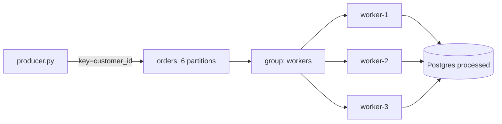

# P2 · Consumer Groups & Scaling

**Read first:** [Scaling consumers & backpressure](../02-concepts/scaling-consumer-groups.md) →
[Event ordering](../02-concepts/ordering.md)

Add consumers, watch partitions get reassigned, and see why extra members do not
create extra parallelism.

## What you build



## Shared files and topic

Copy the shared `compose.yaml` and `common.py` unchanged from
[Setup](../01-fundamentals/setup.md). Add these project files:

```text
compose.yaml
requirements.txt
common.py
schema.sql
producer.py
worker.py
```

P2 uses exactly six partitions. If P1's `orders` topic already exists, reset the
lab first because `--if-not-exists` does not change an existing partition count:

```bash
docker compose up -d --wait --wait-timeout 180
docker compose down -v
docker compose up -d --wait --wait-timeout 180
docker compose exec kafka /opt/kafka/bin/kafka-topics.sh \
  --bootstrap-server kafka:29092 \
  --create --if-not-exists \
  --topic orders --partitions 6 --replication-factor 1 \
  --config min.insync.replicas=1
docker compose exec kafka /opt/kafka/bin/kafka-topics.sh \
  --bootstrap-server kafka:29092 --describe --topic orders
```

Apply the complete worker schema:

```bash
docker compose exec -T postgres psql -v ON_ERROR_STOP=1 -U app -d app < schema.sql
```

Start the load generator in another terminal with `python producer.py`.

## 1. `schema.sql`

```sql title="schema.sql"
CREATE TABLE IF NOT EXISTS processed (
  id             BIGSERIAL PRIMARY KEY,
  record_key     TEXT NOT NULL,
  partition_id   INTEGER NOT NULL,
  record_offset  BIGINT NOT NULL,
  worker         TEXT NOT NULL,
  payload        JSONB NOT NULL,
  processed_at   TIMESTAMPTZ NOT NULL DEFAULT now(),
  UNIQUE (partition_id, record_offset)
);

CREATE INDEX IF NOT EXISTS processed_key_order_idx
  ON processed (record_key, partition_id, record_offset);
```

The unique key makes the observation log safe when a worker crashes after its
insert but before its Kafka commit. A retry does not create a second observation.

## 2. `producer.py`

This producer uses the shared envelope and a stable event ID for every order:

```python title="producer.py"
import random
import time

import common

TOPIC = "orders"


def main() -> None:
    producer = common.new_producer("p02-load-generator")
    while True:
        customer_id = random.randint(0, 99)
        order_id = f"ord-{customer_id}-{int(time.time() * 1000)}"
        event = common.make_event(
            event_id=f"order-{order_id}-placed",
            event_type="OrderPlaced",
            aggregate_type="customer",
            aggregate_id=str(customer_id),
            data={
                "order_id": order_id,
                "customer_id": customer_id,
                "amount": 100,
            },
        )
        common.publish(producer, TOPIC, event)
        time.sleep(0.05)


if __name__ == "__main__":
    main()
```

The key is the customer ID, so events for one customer stay on one partition
when the topic mapping is stable. Different customers can be processed in
parallel, but the topic has no global order across their partitions.

## 3. `worker.py`

Start one command per terminal, changing only the worker name:

```bash
python worker.py worker-1
python worker.py worker-2
python worker.py worker-3
```

```python title="worker.py"
import argparse
import json
import time

from confluent_kafka import Consumer

import common

TOPIC = "orders"
GROUP = "workers"


def main() -> None:
    parser = argparse.ArgumentParser()
    parser.add_argument("worker_name")
    args = parser.parse_args()
    consumer = Consumer(
        {
            "bootstrap.servers": "localhost:9092",
            "group.id": GROUP,
            "auto.offset.reset": "earliest",
            "enable.auto.offset.commit": False,
            "max.poll.interval.ms": 60000,
        }
    )
    consumer.subscribe([TOPIC])
    try:
        while True:
            message = consumer.poll(0.5)
            if message is None:
                continue
            error = message.error()
            if error is not None:
                raise RuntimeError(str(error))
            record_key = message.key().decode("utf-8")
            payload = json.loads(message.value())
            time.sleep(0.01)
            with common.connect() as connection:
                with connection.transaction():
                    connection.execute(
                        """
                        INSERT INTO processed
                            (record_key, partition_id, record_offset, worker, payload)
                        VALUES (%s, %s, %s, %s, %s)
                        ON CONFLICT (partition_id, record_offset) DO NOTHING
                        """,
                        (
                            record_key,
                            message.partition(),
                            message.offset(),
                            args.worker_name,
                            common.jsonb(payload),
                        ),
                    )
            consumer.commit(message=message, asynchronous=False)
    finally:
        consumer.close()


if __name__ == "__main__":
    main()
```

Each member owns complete partitions. A member can process only its assigned
records, and a rebalance revokes assignments before giving them to another
member. The database insert is the local processing step; the offset commit is
kept after that transaction.

## 4. Watch the group

Keep this command running while workers join and leave:

```bash
watch -n1 "docker compose exec -T kafka /opt/kafka/bin/kafka-consumer-groups.sh --bootstrap-server kafka:29092 --describe --group workers"
```

| Members | Expected assignment |
|---------|---------------------|
| 1 | One member owns all six partitions. |
| 2 | The six partitions are split between the two members. |
| 6 | One partition per member. |
| 9 | Six members work; three members are idle. |
| Kill one | A rebalance moves its partitions to surviving members. |

The exact split can differ, but the total number of assigned partitions stays
six. A ninth member cannot receive a seventh partition.

Measure lag with the same command. For a selected customer, the observation
query is:

```sql
SELECT record_key, partition_id, record_offset, processed_at
FROM processed
WHERE record_key = '42'
ORDER BY partition_id, record_offset;
```

Offsets for one key should increase in its partition. Rows for different keys
may be processed at different times, so compare only the key being studied.

## Break it

1. Set `max.poll.interval.ms` to 1000 in a copy of the worker and make its local
   processing take 1.5 seconds. Observe eviction, reassignment, and repeated
   rebalances.
2. Stop the broker and restart it. Check whether the group metadata and committed
   offsets survive this single-node lab.
3. Change the producer key to null. Compare the partition history for one
   customer and explain which ordering guarantee disappeared.
4. Kill a worker after its database transaction but before its commit. Restart
   it and use the unique observation key to show that the retry is harmless.

## Checkpoints

??? question "Why do extra consumers cost anything?"
    A join or departure triggers a rebalance, during which assignments pause and
    move. More members than partitions buy no additional records; the idle
    members still join the group and can increase rebalance work.

??? question "What does a six-partition group support?"
    At most six active partition consumers. A seventh worker is idle for this
    topic. Increasing partitions changes capacity, but existing keys can be
    remapped when the partition count changes.

??? question "What does `max.poll.interval.ms` protect?"
    It bounds how long a member may go without polling. A slow local step can
    exceed the interval, causing eviction and redelivery from the last committed
    offset. Manual commit plus a database uniqueness rule makes that overlap
    safe for this observation log.

??? question "Is one event per key globally ordered?"
    No. A key routes to one partition while the mapping is stable, and that
    partition preserves append order. Other partitions can advance independently.

## Done when

- [ ] You observed one, two, six, and nine group members.
- [ ] You matched an assignment table to the group command.
- [ ] You measured lag while changing the number of members.
- [ ] You explained per-key order without claiming topic-wide order.

Next: **[P3 · Idempotent Payment API](p03-idempotency.md)**.
