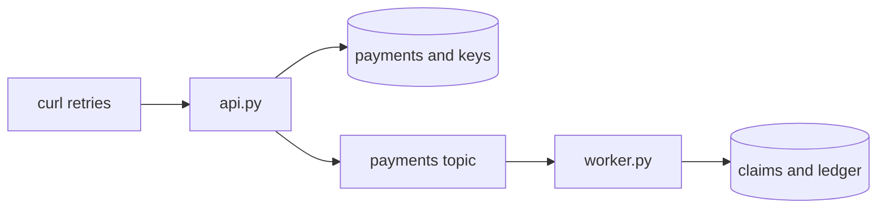

# P3 · Idempotent Payment API

**Read first:** [Idempotency](../02-concepts/idempotency.md) →
[Delivery semantics](../02-concepts/delivery-semantics.md)

Make HTTP retries replay one payment and Kafka redelivery write one ledger row.

## What you build



## Shared files and setup

Copy the shared `compose.yaml` and `common.py` unchanged from
[Setup](../01-fundamentals/setup.md). Add:

```text
compose.yaml
common.py
requirements.txt
schema.sql
events.py
api.py
worker.py
```

```bash
docker compose up -d --wait --wait-timeout 180
docker compose exec kafka /opt/kafka/bin/kafka-topics.sh \
  --bootstrap-server kafka:29092 --create --if-not-exists \
  --topic payments --partitions 3 --replication-factor 1 \
  --config min.insync.replicas=1
docker compose exec -T postgres psql -v ON_ERROR_STOP=1 -U app -d app < schema.sql
```

Run `python -m uvicorn api:app --host 127.0.0.1 --port 8000` and
`python worker.py` in separate terminals.

## 1. `schema.sql`

```sql title="schema.sql"
CREATE TABLE IF NOT EXISTS payments (
  payment_id UUID PRIMARY KEY,
  order_id TEXT NOT NULL,
  amount NUMERIC(12,2) NOT NULL CHECK (amount > 0),
  status TEXT NOT NULL CHECK (status IN ('pending', 'captured', 'failed')),
  created_at TIMESTAMPTZ NOT NULL DEFAULT now()
);
CREATE TABLE IF NOT EXISTS idempotency_keys (
  key TEXT PRIMARY KEY,
  request_hash TEXT NOT NULL,
  status TEXT NOT NULL CHECK (status IN ('in_progress', 'completed')),
  response JSONB,
  created_at TIMESTAMPTZ NOT NULL DEFAULT now()
);
CREATE TABLE IF NOT EXISTS processed_events (
  consumer_group TEXT NOT NULL,
  event_id TEXT NOT NULL,
  claimed_at TIMESTAMPTZ NOT NULL DEFAULT now(),
  PRIMARY KEY (consumer_group, event_id)
);
CREATE TABLE IF NOT EXISTS payment_ledger (
  ledger_id BIGSERIAL PRIMARY KEY,
  payment_id UUID NOT NULL REFERENCES payments(payment_id),
  consumer_group TEXT NOT NULL,
  event_id TEXT NOT NULL,
  amount NUMERIC(12,2) NOT NULL,
  created_at TIMESTAMPTZ NOT NULL DEFAULT now(),
  UNIQUE (consumer_group, event_id)
);
```

The composite key scopes a consumer claim to one group and one event.

## 2. `events.py`

This is the missing event-generation path. The builder calls
`common.make_event`; its event ID is stable because it is derived from the payment ID.

```python title="events.py"
from typing import Any
import common

def build_payment_captured(payment_id: str, order_id: str, amount: str) -> dict[str, Any]:
    return common.make_event(
        event_id=f"payment-{payment_id}",
        event_type="PaymentCaptured",
        aggregate_type="payment",
        aggregate_id=payment_id,
        data={"payment_id": payment_id, "order_id": order_id, "amount": amount},
    )
```

## 3. `api.py`

The payment and idempotency response commit together. `publish_payment` runs
after that transaction, and a replay republishes the same stable event.

```python title="api.py"
import hashlib
import json
from decimal import Decimal
from typing import Any
from uuid import uuid4
from fastapi import FastAPI, Header, HTTPException
from fastapi.responses import JSONResponse
from pydantic import BaseModel, Field
import common
import events

app = FastAPI()
TOPIC = "payments"

class PaymentRequest(BaseModel):
    order_id: str
    amount: Decimal = Field(gt=0)

def request_hash(request: PaymentRequest) -> str:
    body = json.dumps({"order_id": request.order_id, "amount": str(request.amount)},
                      sort_keys=True, separators=(",", ":"))
    return hashlib.sha256(body.encode("utf-8")).hexdigest()

def publish_payment(response: dict[str, Any]) -> None:
    event = events.build_payment_captured(
        response["payment_id"], response["order_id"], response["amount"]
    )
    common.publish(common.new_producer("p03-payment-api"), TOPIC, event)

@app.post("/v1/payments")
def create_payment(request: PaymentRequest, idempotency_key: str = Header()) -> JSONResponse:
    body_hash = request_hash(request)
    created = False
    with common.connect() as connection:
        with connection.transaction():
            inserted = connection.execute(
                "INSERT INTO idempotency_keys (key, request_hash, status) "
                "VALUES (%s, %s, 'in_progress') ON CONFLICT (key) DO NOTHING RETURNING key",
                (idempotency_key, body_hash),
            ).fetchone()
            if inserted is None:
                existing = connection.execute(
                    "SELECT request_hash, status, response FROM idempotency_keys "
                    "WHERE key = %s FOR UPDATE", (idempotency_key,)
                ).fetchone()
                if existing is None:
                    raise HTTPException(status_code=409, detail="request is in progress")
                if existing["request_hash"] != body_hash:
                    raise HTTPException(status_code=422, detail="same key, different body")
                if existing["status"] != "completed":
                    raise HTTPException(status_code=409, detail="request is in progress")
                response = existing["response"]
            else:
                payment_id = str(uuid4())
                response = {"payment_id": payment_id, "order_id": request.order_id,
                            "amount": str(request.amount), "status": "captured"}
                connection.execute(
                    "INSERT INTO payments (payment_id, order_id, amount, status) "
                    "VALUES (%s, %s, %s, 'captured')",
                    (payment_id, request.order_id, request.amount),
                )
                connection.execute(
                    "UPDATE idempotency_keys SET status = 'completed', response = %s "
                    "WHERE key = %s", (common.jsonb(response), idempotency_key)
                )
                created = True
    publish_payment(response)
    return JSONResponse(response, status_code=201 if created else 200)
```

`ON CONFLICT` is the concurrency guard. A database-to-Kafka dual-write window
still exists: a process can die after the database commit and before
`common.publish`, leaving a payment without an event. A retry repairs it, but
independent systems are not atomic. P4 stores the event in the same transaction
and publishes it later.

## 4. `worker.py`

The worker claims `(consumer_group, event_id)` and writes a real ledger row in
that same transaction before committing the Kafka offset.

```python title="worker.py"
import json
from confluent_kafka import Consumer
import common

TOPIC = "payments"
GROUP = "payment-ledger"

def main() -> None:
    consumer = Consumer({"bootstrap.servers": "localhost:9092", "group.id": GROUP,
                         "auto.offset.reset": "earliest",
                         "enable.auto.offset.commit": False})
    consumer.subscribe([TOPIC])
    try:
        while True:
            message = consumer.poll(1.0)
            if message is None:
                continue
            error = message.error()
            if error is not None:
                raise RuntimeError(str(error))
            event = json.loads(message.value())
            event_id = event["event_id"]
            data = event["data"]
            with common.connect() as connection:
                with connection.transaction():
                    claimed = connection.execute(
                        "INSERT INTO processed_events (consumer_group, event_id) "
                        "VALUES (%s, %s) ON CONFLICT (consumer_group, event_id) "
                        "DO NOTHING RETURNING event_id", (GROUP, event_id)
                    ).fetchone()
                    if claimed is not None:
                        connection.execute(
                            "INSERT INTO payment_ledger "
                            "(payment_id, consumer_group, event_id, amount) "
                            "VALUES (%s, %s, %s, %s)",
                            (data["payment_id"], GROUP, event_id, data["amount"]),
                        )
                        connection.execute(
                            "UPDATE payments SET status = 'captured' WHERE payment_id = %s",
                            (data["payment_id"],),
                        )
            consumer.commit(message=message, asynchronous=False)
    finally:
        consumer.close()

if __name__ == "__main__":
    main()
```

A crash after the transaction but before the Kafka commit causes a safe replay;
a failed transaction leaves neither claim nor ledger row.

## 5. Curl and SQL checks

```bash
export KEY="$(python -c 'import uuid; print(uuid.uuid4())')"
curl -i -X POST http://127.0.0.1:8000/v1/payments \
  -H "Idempotency-Key: $KEY" -H 'Content-Type: application/json' \
  -d '{"order_id":"o1","amount":"100.00"}'
curl -i -X POST http://127.0.0.1:8000/v1/payments \
  -H "Idempotency-Key: $KEY" -H 'Content-Type: application/json' \
  -d '{"order_id":"o1","amount":"100.00"}'
curl -i -X POST http://127.0.0.1:8000/v1/payments \
  -H "Idempotency-Key: $KEY" -H 'Content-Type: application/json' \
  -d '{"order_id":"o1","amount":"999.00"}'
for number in $(seq 1 20); do
  curl -s -X POST http://127.0.0.1:8000/v1/payments \
    -H "Idempotency-Key: $KEY" -H 'Content-Type: application/json' \
    -d '{"order_id":"o1","amount":"100.00"}' &
done
wait
docker compose exec -T postgres psql -v ON_ERROR_STOP=1 -U app -d app \
  -c "SELECT count(*) AS payment_rows FROM payments WHERE order_id = 'o1';"
docker compose exec -T postgres psql -v ON_ERROR_STOP=1 -U app -d app \
  -c "SELECT key, status, response FROM idempotency_keys WHERE key = '$KEY';"
docker compose exec -T postgres psql -v ON_ERROR_STOP=1 -U app -d app \
  -c "SELECT event_id, count(*) AS ledger_rows FROM payment_ledger GROUP BY event_id;"
docker compose exec -T postgres psql -v ON_ERROR_STOP=1 -U app -d app \
  -c "SELECT consumer_group, event_id, count(*) FROM payment_ledger GROUP BY consumer_group, event_id HAVING count(*) > 1;"
```

The payment count is one. The second request republishes the same event ID, but
the ledger duplicate query returns no rows.

## Break it

1. Kill the API after commit and before publish, then retry the same key.
2. Delete a claim, republish its event, and verify the ledger constraint.
3. Run another group and explain its independent claim scope.
4. Reuse the key with a changed body and verify the request hash.

## Checkpoints
??? question "What does the key identify?"
    One client attempt. Same key and body replay; a new intent needs a new key.
    Expire old keys according to the client retry horizon.
??? question "Why publish after the transaction?"
    The database commit is not held open by Kafka, but the commit-to-publish gap
    remains. P4 removes that gap by storing the event in the same transaction.
??? question "What does the claim protect?"
    The pair `(consumer_group, event_id)` protects one group's side effect;
    separate groups intentionally have separate scopes.
??? question "Why `ON CONFLICT`?"
    A unique constraint resolves racing inserts atomically; a prior check has a
    race between check and write.

## Done when

- [ ] Concurrent retries create one payment, and replay creates one ledger row.
- [ ] You can name the direct dual-write window and hand it to P4.

Next: **[P4 · Transactional Outbox](p04-outbox-polling.md)**.
