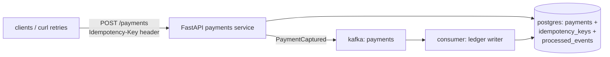

# P3 · Idempotent Payment API

**Read first:** [Idempotency](../02-concepts/idempotency.md) →
[Delivery semantics](../02-concepts/delivery-semantics.md)

Your first *real* business system: payments. Money must never be charged twice —
neither when the HTTP layer retries, nor when Kafka redelivers.

## What you build



| Skill | Learned by |
|-------|-----------|
| Idempotency-Key flow, racing retries | concurrent curl + UNIQUE constraint |
| Response replay | same key → same stored response |
| Same key / different body | 422 path |
| At-least-once consumer dedup | `processed_events` unique table |
| Crash between effect and ack | break-it experiment |

## Steps

### 1. Schema

```sql
CREATE TABLE payments (
  payment_id    UUID PRIMARY KEY,
  order_id      TEXT NOT NULL,
  amount        NUMERIC(12,2) NOT NULL,
  status        TEXT NOT NULL CHECK (status IN ('pending','captured','failed')),
  created_at    TIMESTAMPTZ DEFAULT now()
);

CREATE TABLE idempotency_keys (
  key            TEXT PRIMARY KEY,
  request_hash   TEXT NOT NULL,
  status         TEXT NOT NULL,             -- 'in_progress' | 'completed'
  response       JSONB,
  created_at     TIMESTAMPTZ DEFAULT now()
);

CREATE TABLE processed_events (             -- consumer-side dedup
  event_id       TEXT PRIMARY KEY,
  consumer_group TEXT NOT NULL,
  processed_at   TIMESTAMPTZ DEFAULT now(),
  UNIQUE (event_id, consumer_group)
);
```

### 2. The write path (one transaction, one constraint)

```python
@app.post("/v1/payments")
async def create_payment(req: PaymentRequest, idempotency_key: str = Header(...)):
    body_hash = sha256(json.dumps(req.model_dump()).encode()).hexdigest()
    async with db.transaction():
        inserted = await db.fetchrow(
            "INSERT INTO idempotency_keys (key, request_hash, status) "
            "VALUES ($1, $2, 'in_progress') "
            "ON CONFLICT (key) DO NOTHING RETURNING key", idempotency_key, body_hash)
        if inserted is None:                          # replay of an existing key
            existing = await db.fetchrow(
                "SELECT * FROM idempotency_keys WHERE key = $1", idempotency_key)
            if existing["request_hash"] != body_hash:
                raise HTTPException(422, "same key but different body")
            return JSONResponse(existing["response"], status_code=200)
        payment_id = str(uuid4())
        await db.execute("INSERT INTO payments (payment_id, order_id, amount, status)"
                         " VALUES ($1,$2,$3,'captured')",
                         payment_id, req.order_id, req.amount)
        response = {"payment_id": payment_id, "status": "captured"}
        await db.execute(
            "UPDATE idempotency_keys SET status='completed', response=$1 "
            "WHERE key = $2", response, idempotency_key)
        return response
```

**Why this is correct:** the charge (`payments` row) and the idempotency contract
commit atomically. A crash *after* commit → client retries → we read the stored
response and return it. A crash *before* commit → nothing happened → clean retry.

### 3. Produce the event, dedup the event

After payment is captured, publish `PaymentCaptured` with a stable event id
(`f"payment-{payment_id}"`). Consumer:

```python
def on_message(msg):
    evt = json.loads(msg.value())
    event_id = evt["event_id"]                # 'payment-<id>'
    with db.transaction():
        row = await db.fetchrow(
            "INSERT INTO processed_events (event_id, consumer_group) "
            "VALUES ($1, $2) ON CONFLICT DO NOTHING RETURNING event_id",
            event_id, GROUP)
        if row:                               # first time → apply side effect
            await db.execute(
                "UPDATE payments SET status='captured' WHERE payment_id=$1",
                evt["payment_id"])
    consumer.commit(asynchronous=False)
```

*Parallelism note:* same `event_id` can never arrive twice simultaneously to one
group (one partition owns it); different groups share nothing. The constraint
protects the replay path and rebalances.

### 4. Test harness

```bash
KEY=$(uuidgen)
curl -s -X POST localhost:8000/v1/payments -H "Idempotency-Key: $KEY" \
  -d '{"order_id":"o1","amount":100}'
curl -s -X POST localhost:8000/v1/payments -H "Idempotency-Key: $KEY" \
  -d '{"order_id":"o1","amount":100}'     # same response, same payment_id
curl -s -X POST localhost:8000/v1/payments -H "Idempotency-Key: $KEY" \
  -d '{"order_id":"o1","amount":999}'     # → 422
```

```bash
# concurrency: 20 parallel identical retries — how many payments rows exist?
for i in $(seq 1 20); do curl -s -X POST localhost:8000/v1/payments \
  -H "Idempotency-Key: $KEY" -d '{"order_id":"o1","amount":100}' & done; wait
psql -c "SELECT count(*) FROM payments WHERE order_id='o1';"   # must be 1
```

## Break it

1. **Crash between capture and response?** Kill the API process (SIGKILL) at the
   point after DB commit, before return. Restart, retry with the same key → returned
   response refers to the *same* payment row. Prove it with SQL.
2. **Delete the `processed_events` row** for an event and let it redeliver —
   replication of a side effect may happen once; prove your constraint is the hero.
3. **Cross-group storm:** run two consumers in *different* groups on `payments`
   topic writing to the same `payments` table. Concurrency duplication attempt —
   now the DB constraint is the only thing saving you. Soak it in.
4. **Replay:** produce the same event manually with `kcat`, verify idempotent skip.

## Checkpoints

??? question "1. Same key, same body, *different* time (yesterday, today) — acceptable? Under your TTL policy, explain."
    **Not acceptable without a TTL.** The idempotency contract is "same request,
    repeated" — "same request yesterday and today" is not the client retrying, it's
    the client *re-issuing a new intent with a reused key*. If you blindly replay
    the stored response you'd silently *drop a legitimate second payment* for the
    same order (a second charge, a renewal, a resend).
    Policy: the key table carries `created_at`; a replay is honored only within
    the TTL window (commonly 15–60 min, at least longer than any client timeout +
    network retry horizon). Outside TTL → treat it as a **new request**: delete
    the stale row (or mint a new key mechanically) and process fresh — with a
    documented rule that key reuse across business intents is a client bug.

??? question "2. Your idempotency key table grows forever. Design the TTL + cleanup policy."
    Two layers:
    - **Row-level TTL/expiry**: mark the key with `expires_at = now() + TTL`
      (e.g. 24 h). Cleanup options: a *lazy purge* (DELETE on replay — the
      `ON CONFLICT` path checks `expires_at`), a **periodic sweep**
      (`DELETE FROM idempotency_keys WHERE expires_at < now()` with LIMIT, on a
      cron), or Postgres partition-per-day + drop old partitions.
    - **Cardinality guard**: cap key table growth *rate* (per-client keys/hour
      alert) — runaway key churn (a bug minting `uuid4()` per attempt) should
      page you.
    Keep "replayable history" only as long as your retry horizon demands — after
    that, reuse is a fresh payment, not a replay (Q1).

??? question "3. The client generates keys with `uuid4()`. Why not `hash(order_id)`?"
    Because `hash(order_id)` is **derived from a single intent**: if the same
    order legitimately needs *two* payments (split payment, split payment
    attempt with different card, refund-then-recharge), the hash collides and
    the second request is answered with the *first* stored response → a **real
    payment silently dropped**. `uuid4()` gives *per-attempt identity*: every
    retry of the *same attempt* reuses the same UUID (gets the replay), while a
    *new attempt* on the same order gets a new key (gets new processing).
    Rule: the idempotency key identifies the **attempt**, not the business
    entity — and clients must coordinate retries *around* that attempt key.

??? question "4. `payment_id` is in the response — but the client only sees the request. What if the same logical payment (same order) legitimately happens twice (refunds, recharges)? Key choices matter: when would you key on `order_id`?"
    Two distinct idempotency *scopes*:
    - **Attempt scope** (`uuid4()` per attempt): default choice. Doubles the
      request → replay; a second *intent* (recharge) → distinct key → distinct
      payment. Right for "one order, multiple payment intents".
    - **Intent scope** (`key = order_id`): correct when the business invariant is
      *"this order pays exactly once"* — the API *must not* allow a second charge
      for the same order even if the client blunders (single-shot onboarding
      fee, subscription first payment). The stored response then becomes the
      source of truth for "paid" and re-keys naturally.
    Extra guard for intent-scope keys: `request_hash` mismatch (same key, other
    body) → 422 — the client must not change body mid-retry. The PPP: choose the
    key to make the *duplicate* map to the *same* row — scope follows the
    invariant you're protecting.

## Done when

- [ ] 20 parallel identical requests → exactly 1 payment row (SQL-proof)
- [ ] Retry after mid-crash returns identical payload, status 200
- [ ] A redelivered Kafka event is skipped by the `processed_events` table
- [ ] You can explain why "INSERT ... ON CONFLICT" is the guard, not a SELECT check

Next: **[P4 · Transactional Outbox (polling publisher)](p04-outbox-polling.md)** —
the moment DB writes and Kafka become one story.