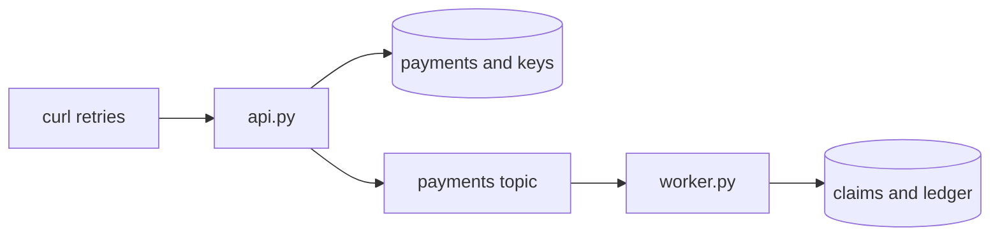

# P3 · Idempotent Payment API

**Read first:** [Idempotency](../02-concepts/idempotency.md) →
[Delivery semantics](../02-concepts/delivery-semantics.md)

Make HTTP retries replay one payment and Kafka redelivery write one ledger row.

## What you build


```mermaid
flowchart LR
    C["curl retries"] --> A["api.py"]
    A --> D[("payments and keys")]
    A --> K["payments topic"]
    K --> W["worker.py"]
    W --> L[("claims and ledger")]
```

### How the flow works

Walk one payment end to end — every ID and table below exists to answer "what if this step runs twice?"

1. **Client retries `POST /v1/payments`.** `curl` sends `order_id = o1` (the shop's intent: "charge for this order") plus `amount`. It also sends `Idempotency-Key: $KEY` — a client-generated UUID for *this attempt*. Same key + same body means "retry of the same intent"; same key + different body means "client bug" and is rejected with 422.
2. **`api.py` claims the key first.** `INSERT INTO idempotency_keys … ON CONFLICT DO NOTHING` is the race resolver: 20 parallel retries hit this line, exactly one wins the insert. The winner creates the payment; the 19 losers read the stored `response` and replay it. `request_hash = sha256(order_id + amount)` is what catches the changed-body case.
3. **Why `payment_id` is server-generated.** `order_id` comes from the caller and can be reused or retried ambiguously. `payment_id = uuid4()` is minted once, inside the winning transaction, and becomes the authoritative identity of the money movement. Everything downstream keys off it.
4. **`payments` is the intent, `payment_ledger` is the applied effect.** `payments(payment_id, order_id, amount, status)` records "we accepted this charge". It is written in the API transaction. `payment_ledger(payment_id, event_id, amount)` is written later by the worker when the event is actually applied. Splitting them matters: the API can succeed while the event is still in flight, and a replay must not double-count money. The ledger's `UNIQUE (consumer_group, event_id)` is the money guard.
5. **The event bridges the two.** `event_id = payment-{payment_id}` is derived — not random — so republishing the same payment yields the same event ID. `aggregate_id = payment_id` is both the Kafka key (one payment → one partition, in order) and the dedup scope. `publish_payment()` runs *after* the DB commit: at-least-once by design. A crash between commit and publish leaves a payment with no event; the client's retry republishes the identical event and heals it.
6. **`worker.py` claims before it charges.** `INSERT INTO processed_events (consumer_group, event_id) … ON CONFLICT DO NOTHING` is the consumer-side twin of the idempotency key. First delivery wins the claim and writes the ledger row + flips `payments.status`; a redelivery (crash before commit, relay retry, CDC replay) loses the claim and skips the insert, but still commits the Kafka offset so the partition keeps moving.
7. **Why the claim is scoped by `(consumer_group, event_id)`.** Two different groups (e.g. ledger vs. notifications) must each apply the same event once. A global `UNIQUE(event_id)` would let the first group starve the second. Scoping gives each group its own once-only guarantee.

## Files and setup

Every file below is self-contained — no shared helper module. Copy `compose.yaml`
from [Setup](../01-fundamentals/setup.md). Add:

```text
compose.yaml
requirements.txt
schema.sql
events.py
api.py
worker.py
```

```bash
docker compose up -d --wait --wait-timeout 180
docker compose exec kafka /opt/kafka/bin/kafka-topics.sh \
  --bootstrap-server kafka:29092 --create --if-not-exists \
  --topic payments --partitions 3 --replication-factor 1 \
  --config min.insync.replicas=1
docker compose exec -T postgres psql -v ON_ERROR_STOP=1 -U app -d app < schema.sql
```

Run `python -m uvicorn api:app --host 127.0.0.1 --port 8000` and
`python worker.py` in separate terminals.

## 1. `schema.sql`

```sql title="schema.sql"
-- Business row: one per payment intent.
CREATE TABLE IF NOT EXISTS payments (
  payment_id UUID PRIMARY KEY,
  order_id TEXT NOT NULL,
  amount NUMERIC(12,2) NOT NULL CHECK (amount > 0),
  status TEXT NOT NULL CHECK (status IN ('pending', 'captured', 'failed')),
  created_at TIMESTAMPTZ NOT NULL DEFAULT now()
);
-- HTTP dedup: one row per client Idempotency-Key.
CREATE TABLE IF NOT EXISTS idempotency_keys (
  key TEXT PRIMARY KEY,  -- client-supplied; concurrent inserts race here
  request_hash TEXT NOT NULL,  -- body fingerprint; rejects key reuse with new body
  status TEXT NOT NULL CHECK (status IN ('in_progress', 'completed')),
  response JSONB,  -- stored reply for replays
  created_at TIMESTAMPTZ NOT NULL DEFAULT now()
);
-- Consumer dedup: one claim per group + event.
CREATE TABLE IF NOT EXISTS processed_events (
  consumer_group TEXT NOT NULL,
  event_id TEXT NOT NULL,
  claimed_at TIMESTAMPTZ NOT NULL DEFAULT now(),
  PRIMARY KEY (consumer_group, event_id)
);
-- Real side effect: exactly one ledger row per claimed event.
CREATE TABLE IF NOT EXISTS payment_ledger (
  ledger_id BIGSERIAL PRIMARY KEY,
  payment_id UUID NOT NULL REFERENCES payments(payment_id),
  consumer_group TEXT NOT NULL,
  event_id TEXT NOT NULL,
  amount NUMERIC(12,2) NOT NULL,
  created_at TIMESTAMPTZ NOT NULL DEFAULT now(),
  UNIQUE (consumer_group, event_id)  -- second line of defense behind claim
);
```

The composite key scopes a consumer claim to one group and one event.

## 2. `events.py`

The builder derives a stable event ID from the payment ID, so republishing
the same payment yields the same event.

```python title="events.py"
import os
from datetime import datetime, timezone
from typing import Any


def make_event(event_id, event_type, aggregate_type, aggregate_id, data):
    # Canonical envelope; stable event_id is the dedup key.
    return {
        "event_id": event_id,
        "event_type": event_type,
        "aggregate_type": aggregate_type,
        "aggregate_id": aggregate_id,
        "schema_version": 1,
        "occurred_at": datetime.now(timezone.utc).isoformat(),
        "data": data,
    }


def build_payment_captured(payment_id: str, order_id: str, amount: str) -> dict[str, Any]:
    # Event ID derived from payment_id: replaying the payment replays same event.
    return make_event(
        event_id=f"payment-{payment_id}",  # stable, not random
        event_type="PaymentCaptured",
        aggregate_type="payment",
        aggregate_id=payment_id,  # Kafka key: one payment -> one partition
        data={"payment_id": payment_id, "order_id": order_id, "amount": amount},
    )
```

## 3. `api.py`

The payment and idempotency response commit together. Publishing runs
after that transaction, and a replay republishes the same stable event.

```python title="api.py"
import hashlib
import json
import os
from datetime import datetime, timezone
from decimal import Decimal
from typing import Any
from uuid import uuid4

import psycopg
from confluent_kafka import Producer
from fastapi import FastAPI, Header, HTTPException
from fastapi.responses import JSONResponse
from psycopg.rows import dict_row
from psycopg.types.json import Jsonb
from pydantic import BaseModel, Field

import events

app = FastAPI()
TOPIC = "payments"


class PaymentRequest(BaseModel):
    order_id: str
    amount: Decimal = Field(gt=0)  # validated before any DB work


def connect_db():
    # Fresh Postgres connection per request; dict rows for readability.
    return psycopg.connect(os.environ["DATABASE_URL"], row_factory=dict_row)


def new_producer(client_id: str) -> Producer:
    # Idempotent producer: safe to retry publish after DB commit.
    return Producer(
        {
            "bootstrap.servers": os.environ["KAFKA_BOOTSTRAP_SERVERS"],
            "client.id": client_id,
            "acks": "all",
            "enable.idempotence": True,
            "delivery.timeout.ms": 30000,
        }
    )


def publish_event(producer: Producer, topic: str, event: dict[str, Any]) -> None:
    # Keyed produce + flush; raises if broker rejects the write.
    errors: list[str] = []

    def delivered(error: object, message: object) -> None:
        if error is not None:
            errors.append(str(error))

    producer.produce(
        topic,
        key=str(event["aggregate_id"]).encode("utf-8"),
        value=json.dumps(event, sort_keys=True, separators=(",", ":")).encode("utf-8"),
        callback=delivered,
    )
    remaining = producer.flush(15.0)
    if remaining != 0:
        raise TimeoutError(f"{remaining} record(s) undelivered")
    if errors:
        raise RuntimeError(errors[0])
    producer.poll(0)


def request_hash(request: PaymentRequest) -> str:
    # Fingerprint body; same key + different body must be rejected (422).
    body = json.dumps({"order_id": request.order_id, "amount": str(request.amount)},
                      sort_keys=True, separators=(",", ":"))
    return hashlib.sha256(body.encode("utf-8")).hexdigest()


def publish_payment(response: dict[str, Any]) -> None:
    # Rebuild stable event from stored response; replay-safe by construction.
    event = events.build_payment_captured(
        response["payment_id"], response["order_id"], response["amount"]
    )
    publish_event(new_producer("p03-payment-api"), TOPIC, event)


@app.post("/v1/payments")
def create_payment(request: PaymentRequest, idempotency_key: str = Header()) -> JSONResponse:
    # Idempotent handler: claim key -> insert payment -> store response, atomically.
    body_hash = request_hash(request)
    created = False
    with connect_db() as connection:
        with connection.transaction():  # key claim + payment + response = one unit
            inserted = connection.execute(
                "INSERT INTO idempotency_keys (key, request_hash, status) "
                "VALUES (%s, %s, 'in_progress') ON CONFLICT (key) DO NOTHING RETURNING key",
                (idempotency_key, body_hash),
            ).fetchone()
            if inserted is None:
                # Key seen before: lock row, verify body, replay stored response.
                existing = connection.execute(
                    "SELECT request_hash, status, response FROM idempotency_keys "
                    "WHERE key = %s FOR UPDATE", (idempotency_key,)
                ).fetchone()
                if existing is None:
                    raise HTTPException(status_code=409, detail="request is in progress")
                if existing["request_hash"] != body_hash:
                    raise HTTPException(status_code=422, detail="same key, different body")
                if existing["status"] != "completed":
                    raise HTTPException(status_code=409, detail="request is in progress")
                response = existing["response"]
            else:
                # First sight of key: create payment + mark completed with response.
                payment_id = str(uuid4())
                response = {"payment_id": payment_id, "order_id": request.order_id,
                            "amount": str(request.amount), "status": "captured"}
                connection.execute(
                    "INSERT INTO payments (payment_id, order_id, amount, status) "
                    "VALUES (%s, %s, %s, 'captured')",
                    (payment_id, request.order_id, request.amount),
                )
                connection.execute(
                    "UPDATE idempotency_keys SET status = 'completed', response = %s "
                    "WHERE key = %s", (Jsonb(response), idempotency_key)
                )
                created = True
    # Outside the transaction: Kafka has no part in the DB commit.
    publish_payment(response)
    return JSONResponse(response, status_code=201 if created else 200)
```

`ON CONFLICT` is the concurrency guard. A database-to-Kafka dual-write window
still exists: a process can die after the database commit and before
publish, leaving a payment without an event. A retry repairs it, but
independent systems are not atomic. P4 stores the event in the same transaction
and publishes it later.

## 4. `worker.py`

The worker claims `(consumer_group, event_id)` and writes a real ledger row in
that same transaction before committing the Kafka offset.

```python title="worker.py"
import json
import os

import psycopg
from confluent_kafka import Consumer
from psycopg.rows import dict_row

TOPIC = "payments"
GROUP = "payment-ledger"


def connect_db():
    # Per-message connection; dict rows simplify field access.
    return psycopg.connect(os.environ["DATABASE_URL"], row_factory=dict_row)


def new_consumer(group_id: str) -> Consumer:
    # Manual-commit consumer: offset follows the ledger transaction.
    return Consumer({"bootstrap.servers": os.environ["KAFKA_BOOTSTRAP_SERVERS"],
                     "group.id": group_id,
                     "auto.offset.reset": "earliest",
                     "enable.auto.offset.commit": False})


def main() -> None:
    consumer = new_consumer(GROUP)
    consumer.subscribe([TOPIC])
    try:
        while True:
            message = consumer.poll(1.0)
            if message is None:
                continue
            error = message.error()
            if error is not None:
                raise RuntimeError(str(error))
            event = json.loads(message.value())  # decode envelope
            event_id = event["event_id"]  # dedup key
            data = event["data"]  # payment payload
            with connect_db() as connection:
                with connection.transaction():  # claim + ledger = atomic
                    claimed = connection.execute(
                        "INSERT INTO processed_events (consumer_group, event_id) "
                        "VALUES (%s, %s) ON CONFLICT (consumer_group, event_id) "
                        "DO NOTHING RETURNING event_id", (GROUP, event_id)
                    ).fetchone()
                    if claimed is not None:  # first sight: write side effect
                        connection.execute(
                            "INSERT INTO payment_ledger "
                            "(payment_id, consumer_group, event_id, amount) "
                            "VALUES (%s, %s, %s, %s)",
                            (data["payment_id"], GROUP, event_id, data["amount"]),
                        )
                        connection.execute(
                            "UPDATE payments SET status = 'captured' WHERE payment_id = %s",
                            (data["payment_id"],),
                        )
                    # Duplicate: claim lost the race -> skip, still commit offset.
            consumer.commit(message=message, asynchronous=False)  # checkpoint
    finally:
        consumer.close()


if __name__ == "__main__":
    main()
```

A crash after the transaction but before the Kafka commit causes a safe replay;
a failed transaction leaves neither claim nor ledger row.

## 5. Curl and SQL checks

```bash
export KEY="$(python -c 'import uuid; print(uuid.uuid4())')"
curl -i -X POST http://127.0.0.1:8000/v1/payments \
  -H "Idempotency-Key: $KEY" -H 'Content-Type: application/json' \
  -d '{"order_id":"o1","amount":"100.00"}'
curl -i -X POST http://127.0.0.1:8000/v1/payments \
  -H "Idempotency-Key: $KEY" -H 'Content-Type: application/json' \
  -d '{"order_id":"o1","amount":"100.00"}'
curl -i -X POST http://127.0.0.1:8000/v1/payments \
  -H "Idempotency-Key: $KEY" -H 'Content-Type: application/json' \
  -d '{"order_id":"o1","amount":"999.00"}'
for number in $(seq 1 20); do
  curl -s -X POST http://127.0.0.1:8000/v1/payments \
    -H "Idempotency-Key: $KEY" -H 'Content-Type: application/json' \
    -d '{"order_id":"o1","amount":"100.00"}' &
done
wait
docker compose exec -T postgres psql -v ON_ERROR_STOP=1 -U app -d app \
  -c "SELECT count(*) AS payment_rows FROM payments WHERE order_id = 'o1';"
docker compose exec -T postgres psql -v ON_ERROR_STOP=1 -U app -d app \
  -c "SELECT key, status, response FROM idempotency_keys WHERE key = '$KEY';"
docker compose exec -T postgres psql -v ON_ERROR_STOP=1 -U app -d app \
  -c "SELECT event_id, count(*) AS ledger_rows FROM payment_ledger GROUP BY event_id;"
docker compose exec -T postgres psql -v ON_ERROR_STOP=1 -U app -d app \
  -c "SELECT consumer_group, event_id, count(*) FROM payment_ledger GROUP BY consumer_group, event_id HAVING count(*) > 1;"
```

The payment count is one. The second request republishes the same event ID, but
the ledger duplicate query returns no rows.

## Break it

1. Kill the API after commit and before publish, then retry the same key.
2. Delete a claim, republish its event, and verify the ledger constraint.
3. Run another group and explain its independent claim scope.
4. Reuse the key with a changed body and verify the request hash.

## Checkpoints
??? question "What does the key identify?"
    One client attempt. Same key and body replay; a new intent needs a new key.
    Expire old keys according to the client retry horizon.
??? question "Why publish after the transaction?"
    The database commit is not held open by Kafka, but the commit-to-publish gap
    remains. P4 removes that gap by storing the event in the same transaction.
??? question "What does the claim protect?"
    The pair `(consumer_group, event_id)` protects one group's side effect;
    separate groups intentionally have separate scopes.
??? question "Why `ON CONFLICT`?"
    A unique constraint resolves racing inserts atomically; a prior check has a
    race between check and write.

## Done when

- [ ] Concurrent retries create one payment, and replay creates one ledger row.
- [ ] You can name the direct dual-write window and hand it to P4.

Next: **[P4 · Transactional Outbox](p04-outbox-polling.md)**.
