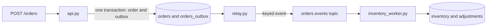

# P4 · Transactional Outbox (Polling Publisher)

**Read first:** [The Transactional Outbox Pattern](../02-concepts/outbox.md)

Store the business row and its event in one PostgreSQL transaction. A polling
relay publishes the stored event and marks it only after Kafka acknowledges it.

## What you build



## Shared files and setup

Copy the shared `compose.yaml` and `common.py` unchanged from
[Setup](../01-fundamentals/setup.md). Add these exact files:

```text
compose.yaml
common.py
requirements.txt
schema.sql
api.py
relay.py
inventory_worker.py
```

Start the shared stack, create the topic, and apply the schema:

```bash
docker compose up -d --wait --wait-timeout 180
docker compose exec kafka /opt/kafka/bin/kafka-topics.sh \
  --bootstrap-server kafka:29092 \
  --create --if-not-exists \
  --topic orders.events --partitions 3 --replication-factor 1 \
  --config min.insync.replicas=1
docker compose exec -T postgres psql -v ON_ERROR_STOP=1 -U app -d app < schema.sql
```

The inventory seed is part of `schema.sql`, so the curl example has stock
available.

## 1. `schema.sql`

```sql title="schema.sql"
CREATE TABLE IF NOT EXISTS orders (
  order_id          TEXT PRIMARY KEY,
  customer_id       TEXT NOT NULL,
  sku               TEXT NOT NULL,
  quantity          INTEGER NOT NULL CHECK (quantity > 0),
  amount            NUMERIC(12,2) NOT NULL CHECK (amount > 0),
  status            TEXT NOT NULL DEFAULT 'new',
  aggregate_version BIGINT NOT NULL CHECK (aggregate_version > 0),
  created_at        TIMESTAMPTZ NOT NULL DEFAULT now()
);

CREATE TABLE IF NOT EXISTS orders_outbox (
  id                BIGSERIAL PRIMARY KEY,
  aggregate_id      TEXT NOT NULL,
  aggregate_version BIGINT NOT NULL CHECK (aggregate_version > 0),
  event_type        TEXT NOT NULL,
  event_id          TEXT NOT NULL UNIQUE,
  payload           JSONB NOT NULL,
  published         BOOLEAN NOT NULL DEFAULT FALSE,
  created_at        TIMESTAMPTZ NOT NULL DEFAULT now(),
  UNIQUE (aggregate_id, aggregate_version)
);

CREATE INDEX IF NOT EXISTS orders_outbox_pending_idx
  ON orders_outbox (published, aggregate_id, aggregate_version)
  WHERE published = FALSE;

CREATE TABLE IF NOT EXISTS inventory (
  sku        TEXT PRIMARY KEY,
  available  INTEGER NOT NULL CHECK (available >= 0),
  updated_at TIMESTAMPTZ NOT NULL DEFAULT now()
);

CREATE TABLE IF NOT EXISTS processed_events (
  consumer_group TEXT NOT NULL,
  event_id       TEXT NOT NULL,
  claimed_at     TIMESTAMPTZ NOT NULL DEFAULT now(),
  PRIMARY KEY (consumer_group, event_id)
);

CREATE TABLE IF NOT EXISTS inventory_adjustments (
  adjustment_id  BIGSERIAL PRIMARY KEY,
  consumer_group TEXT NOT NULL,
  event_id       TEXT NOT NULL,
  sku            TEXT NOT NULL REFERENCES inventory(sku),
  quantity_delta INTEGER NOT NULL,
  created_at     TIMESTAMPTZ NOT NULL DEFAULT now(),
  UNIQUE (consumer_group, event_id)
);

INSERT INTO inventory (sku, available)
VALUES ('sku-1', 100)
ON CONFLICT (sku) DO NOTHING;
```

`aggregate_version` is the order's business sequence. The shown create path
writes version 1; a later order transition must lock that order, increment the
version, and insert its outbox row in the same transaction.

## 2. `api.py`: one transaction

The event envelope is built before the transaction and inserted as JSONB beside
the order. Nothing in this request publishes directly to Kafka.

```python title="api.py"
from decimal import Decimal
from uuid import uuid4

from fastapi import FastAPI
from pydantic import BaseModel, Field

import common

app = FastAPI()


class CreateOrderRequest(BaseModel):
    customer_id: str
    sku: str
    quantity: int = Field(gt=0)
    amount: Decimal = Field(gt=0)


@app.post("/orders")
def create_order(request: CreateOrderRequest) -> dict[str, str | int]:
    order_id = str(uuid4())
    aggregate_version = 1
    event = common.make_event(
        event_id=f"order-{order_id}-placed",
        event_type="OrderPlaced",
        aggregate_type="order",
        aggregate_id=order_id,
        data={
            "order_id": order_id,
            "customer_id": request.customer_id,
            "sku": request.sku,
            "quantity": request.quantity,
            "amount": str(request.amount),
            "aggregate_version": aggregate_version,
        },
    )
    with common.connect() as connection:
        with connection.transaction():
            connection.execute(
                """
                INSERT INTO orders
                    (order_id, customer_id, sku, quantity, amount, aggregate_version)
                VALUES (%s, %s, %s, %s, %s, %s)
                """,
                (
                    order_id,
                    request.customer_id,
                    request.sku,
                    request.quantity,
                    request.amount,
                    aggregate_version,
                ),
            )
            connection.execute(
                """
                INSERT INTO orders_outbox
                    (aggregate_id, aggregate_version, event_type, event_id, payload)
                VALUES (%s, %s, %s, %s, %s)
                """,
                (
                    order_id,
                    aggregate_version,
                    event["event_type"],
                    event["event_id"],
                    common.jsonb(event),
                ),
            )
    return {"order_id": order_id, "aggregate_version": aggregate_version}
```

If the process dies before commit, neither row exists. If it dies after commit,
the pending outbox row remains available to the relay. That is the improvement
over P3's separate database commit and Kafka publish.

## 3. `relay.py`: lock, publish, acknowledge, mark

Start the API and relay in separate terminals:

```bash
python -m uvicorn api:app --host 127.0.0.1 --port 8000
python relay.py
```

The relay uses the shared producer settings, but keeps the delivery callback and
`flush()` visible because the mark must follow an acknowledged produce.

```python title="relay.py"
import json
import time
from typing import Any

import common

TOPIC = "orders.events"


def publish_row(producer: Any, row: dict[str, Any]) -> None:
    errors: list[str] = []

    def delivered(error: object, message: object) -> None:
        if error is not None:
            errors.append(str(error))

    producer.produce(
        TOPIC,
        key=str(row["aggregate_id"]).encode("utf-8"),
        value=json.dumps(
            row["payload"], sort_keys=True, separators=(",", ":")
        ).encode("utf-8"),
        callback=delivered,
    )
    remaining = producer.flush(15.0)
    if remaining != 0:
        raise TimeoutError(f"{remaining} Kafka record(s) remain undelivered")
    if errors:
        raise RuntimeError(errors[0])
    producer.poll(0)


def relay_once(connection: Any, producer: Any) -> int:
    with connection.transaction():
        rows = connection.execute(
            """
            SELECT id, aggregate_id, aggregate_version, payload
            FROM orders_outbox
            WHERE published = FALSE
            ORDER BY aggregate_id, aggregate_version, id
            LIMIT 100
            FOR UPDATE SKIP LOCKED
            """
        ).fetchall()
        for row in rows:
            publish_row(producer, row)
        if rows:
            connection.execute(
                "UPDATE orders_outbox SET published = TRUE WHERE id = ANY(%s)",
                ([row["id"] for row in rows],),
            )
    return len(rows)


def main() -> None:
    producer = common.new_producer("p04-outbox-relay")
    with common.connect() as connection:
        while True:
            try:
                count = relay_once(connection, producer)
            except Exception as error:
                print(f"relay failed: {error}")
                time.sleep(1)
            else:
                if count == 0:
                    time.sleep(0.1)


if __name__ == "__main__":
    main()
```

`FOR UPDATE SKIP LOCKED` lets another relay instance claim different pending
rows instead of publishing the same selected row. A crash after Kafka
acknowledgment and before the database commit leaves the row pending, so the
event is delivered again. The consumer-side claim makes that duplicate harmless.
A delivery error or timeout raises before the update and leaves every selected
row pending.

`ORDER BY aggregate_id, aggregate_version` is the per-order ordering rule. A
`BIGSERIAL` value is allocated from a sequence when a row is inserted; it is not
proof of transaction commit order, because a transaction can receive a value
before another transaction commits. `created_at` is also a clock value, not a
commit sequence. Use the order row's locked, incremented `aggregate_version` for
order history. With multiple relay replicas, keep one owner for a given order if
strict contiguous versions are required; row locks alone do not stop a replica
from taking a later version while an earlier version is locked.

## 4. `inventory_worker.py`

Start the worker in another terminal:

```bash
python inventory_worker.py
```

The worker claims the event, decrements stock, and writes a real adjustment row
in one database transaction. The Kafka commit follows that transaction.

```python title="inventory_worker.py"
import json

from confluent_kafka import Consumer

import common

TOPIC = "orders.events"
GROUP = "inventory-workers"


def main() -> None:
    consumer = Consumer(
        {
            "bootstrap.servers": "localhost:9092",
            "group.id": GROUP,
            "auto.offset.reset": "earliest",
            "enable.auto.offset.commit": False,
        }
    )
    consumer.subscribe([TOPIC])
    try:
        while True:
            message = consumer.poll(1.0)
            if message is None:
                continue
            error = message.error()
            if error is not None:
                raise RuntimeError(str(error))
            event = json.loads(message.value())
            if event["event_type"] != "OrderPlaced":
                raise ValueError(f"unexpected event type: {event['event_type']}")
            event_id = event["event_id"]
            data = event["data"]
            with common.connect() as connection:
                with connection.transaction():
                    claimed = connection.execute(
                        """
                        INSERT INTO processed_events (consumer_group, event_id)
                        VALUES (%s, %s)
                        ON CONFLICT (consumer_group, event_id) DO NOTHING
                        RETURNING event_id
                        """,
                        (GROUP, event_id),
                    ).fetchone()
                    if claimed is not None:
                        updated = connection.execute(
                            """
                            UPDATE inventory
                            SET available = available - %s, updated_at = now()
                            WHERE sku = %s AND available >= %s
                            RETURNING sku
                            """,
                            (data["quantity"], data["sku"], data["quantity"]),
                        ).fetchone()
                        if updated is None:
                            raise RuntimeError(f"insufficient inventory for {data['sku']}")
                        connection.execute(
                            """
                            INSERT INTO inventory_adjustments
                                (consumer_group, event_id, sku, quantity_delta)
                            VALUES (%s, %s, %s, %s)
                            """,
                            (GROUP, event_id, data["sku"], -data["quantity"]),
                        )
            consumer.commit(message=message, asynchronous=False)
    finally:
        consumer.close()


if __name__ == "__main__":
    main()
```

A redelivered event loses the insert race in `processed_events`, so it writes no
second stock adjustment. Insufficient inventory raises before the Kafka commit;
the operational policy for that failure belongs to a later retry and dead-letter
project.

## 5. Run and verify

Place an order and inspect the database and inventory:

```bash
curl -i -X POST http://127.0.0.1:8000/orders \
  -H 'Content-Type: application/json' \
  -d '{"customer_id":"c-1","sku":"sku-1","quantity":2,"amount":"25.00"}'
docker compose exec -T postgres psql -v ON_ERROR_STOP=1 -U app -d app \
  -c "SELECT order_id, aggregate_version FROM orders ORDER BY created_at;"
docker compose exec -T postgres psql -v ON_ERROR_STOP=1 -U app -d app \
  -c "SELECT id, aggregate_id, aggregate_version, published FROM orders_outbox ORDER BY id;"
docker compose exec -T postgres psql -v ON_ERROR_STOP=1 -U app -d app \
  -c "SELECT sku, available FROM inventory WHERE sku = 'sku-1';"
docker compose exec -T postgres psql -v ON_ERROR_STOP=1 -U app -d app \
  -c "SELECT consumer_group, event_id, count(*) FROM inventory_adjustments GROUP BY consumer_group, event_id;"
```

A successful run has one `OrderPlaced` adjustment and one inventory deduction.
To test a replay, set an already published row back to `FALSE`, run the relay,
and compare the adjustment count before and after; the count must stay one for
that consumer group.

## Break it

1. Implement the old order insert followed by a direct publish in a disposable
   branch. Kill the process between commit and publish. The order exists with no
   event, which is the dual-write hole the outbox closes.
2. Kill the relay while 20 orders are pending. Restart it and confirm every
   pending row is eventually published and marked.
3. Force a row back to `FALSE` after its event was delivered. The relay publishes
   it again; the inventory worker must skip the second adjustment.
4. Add a second order event using version 2 and make the relay replicas compete.
   Observe why `aggregate_version`, not the outbox sequence value, expresses the
   order's history.

## Checkpoints

??? question "What is the atomic boundary?"
    The order row and its outbox row commit together. Kafka is outside that
    transaction, but an unpublished row remains durable work for the relay.

??? question "Why flush before marking?"
    `flush()` waits for delivery callbacks. Marking first could lose the event if
    the broker rejects it. Marking after an acknowledgment can duplicate it, and
    the consumer claim absorbs that duplicate.

??? question "What does `SKIP LOCKED` prevent?"
    Two relay replicas select different pending rows rather than both selecting
    the same rows. It does not remove the acknowledgment-to-mark duplicate
    window, and it does not by itself serialize different versions of one order.

??? question "Does `BIGSERIAL` equal commit order?"
    No. Sequence allocation and transaction commit are different timelines. Use
    `aggregate_version` under the order row's transaction to define per-order
    order; Kafka then preserves that order for the keyed stream.

## Done when

- [ ] An order and its event are committed in one database transaction.
- [ ] A relay restart loses no pending event and marks only after acknowledgment.
- [ ] A replayed event leaves inventory unchanged.
- [ ] You can explain sequence allocation versus commit order.

Next: **[P5 · Outbox with Debezium CDC](p05-outbox-cdc.md)**.
