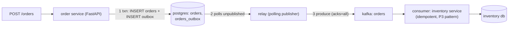

# P4 · Transactional Outbox (Polling Publisher)

**Read first:** [The Transactional Outbox Pattern](../02-concepts/outbox.md)

The heart of the course. One database, one transaction, zero lost events. You build
the polling relay yourself — and then you break it.

## What you build



| Skill | Learned by |
|-------|-----------|
| Dual-write avoidance | compare: old "insert then publish" in break-it |
| Outbox schema + partial index | SQL + query plans |
| Relay: poll → publish → mark order | the exact crash windows |
| Ordering via `ORDER BY id` | multi-event sequences |
| Idempotent ingestion | P3 dedup table reused |
| Alerts on stuck outbox | `published=FALSE` age query |

## Steps

### 1. Tables

```sql
CREATE TABLE orders (
  order_id    TEXT PRIMARY KEY,
  customer_id TEXT NOT NULL,
  amount      NUMERIC(12,2) NOT NULL,
  status      TEXT NOT NULL DEFAULT 'new',
  created_at  TIMESTAMPTZ DEFAULT now()
);

CREATE TABLE orders_outbox (
  id           BIGSERIAL PRIMARY KEY,
  aggregate_id TEXT NOT NULL,             -- order_id → partition key
  event_type   TEXT NOT NULL,
  payload      JSONB NOT NULL,
  published    BOOLEAN NOT NULL DEFAULT FALSE,
  created_at   TIMESTAMPTZ DEFAULT now()
);
CREATE INDEX idx_outbox_unpublished
  ON orders_outbox (published, id) WHERE published = FALSE;
```

### 2. The atomic write

```python
@app.post("/orders")
async def create_order(req: CreateOrderReq):
    order_id = str(uuid4())
    async with db.transaction():
        await db.execute(
            "INSERT INTO orders (order_id, customer_id, amount) VALUES ($1,$2,$3)",
            order_id, req.customer_id, req.amount)
        await db.execute(
            "INSERT INTO orders_outbox (aggregate_id, event_type, payload) "
            "VALUES ($1, 'OrderPlaced', $2)",
            order_id, json.dumps({"order_id": order_id,
                                  "customer_id": req.customer_id,
                                  "amount": req.amount,
                                  "event_id": f"order-{order_id}-placed"}))
    return {"order_id": order_id}
```

### 3. The relay (this bit is the whole project)

```python
def relay_loop():
    producer = Producer({"bootstrap.servers": "localhost:9092",
                         "acks": "all", "enable.idempotence": True})
    while True:
        rows = db.fetchall("""
            SELECT id, aggregate_id, event_type, payload
              FROM orders_outbox WHERE published = FALSE
             ORDER BY id LIMIT 100""")
        for row in rows:
            producer.produce("orders", key=row.aggregate_id,
                             value=json.dumps(row.payload))
        producer.flush()                          # ← broker acked BEFORE marking
        for row in rows:
            db.execute("UPDATE orders_outbox SET published = TRUE WHERE id = :id",
                       {"id": row.id})
        time.sleep(0.1)
```

**The contract:** mark-after-ack. `flush()` throwing? → no mark, rows retry later.
Crash between ack and mark → row re-published → duplicate *delivery*, which P3
dedup made harmless. Never reorder: `ORDER BY id` is what preserves commit order.

### 4. Idempotent consumer (reuse P3 muscle memory)

Inventory consumer: `INSERT INTO processed_events ... ON CONFLICT DO NOTHING`
then `UPDATE sku SET qty = qty - amount ...` in the same txn. Ship it, wire it,
verify stock drops exactly once.

### 5. Observable outbox

A tiny endpoint + alert query (`docker exec` cron is fine):

```sql
SELECT count(*) FROM orders_outbox WHERE published = FALSE AND created_at < now() - interval '1 minute';
```

Stale unpublished rows = relay dead. This query is your "pipeline is alive" probe.

## Break it

1. **The old way first.** Implement "INSERT order → COMMIT → produce" in a branch.
   Kill the process between commit and produce. Consume the topic: **the event never
   arrives** and nothing in the DB says different. That's the hole this pattern
   closes — you've now *felt* the dual-write problem.
2. **Kill the relay** mid-loop, place 20 orders, restart the relay. All 20 arrive;
   `published` flips to TRUE; none lost. Explain why `flush()` before marking made
   this true.
3. **Duplicate delivery on purpose:** with `published=FALSE` still in a row, run the
   relay again after the topic already has the record. Consumers see it twice —
   then prove the dedup table swallowed the second copy.
4. **Backfill test:** set `published=FALSE` for a historical row. Relay re-sends.
   Replay is a feature, not a bug — note it.

## Checkpoints

??? question "1. Where exactly can duplicates come from in this design?"
    Exactly one window, spelled out:
    **Relay published → broker acked → crash before `published=TRUE`** — the row
    is still `FALSE` at restart → relay re-publishes the *same* event. (Break-it
    #3 does this on purpose.)
    Everything else is safe by construction:
    - crash *before* produce → nothing published; re-published once, no dup.
    - produce fails (no ack) → no mark → retried; no dup.
    - mark succeeds but produce happened twice — same as above, only window.
    Second-order sources: (a) a *second relay replica* polling without
    `SKIP LOCKED` (break-it #3's research point) → both publish the same row →
    same dup; (b) consumer-side misbehavior — auto-commit with side effects
    (P3's `processed_events`) is the *consumer's* duplicate absorber. Net: the
    design guarantees **at-least-once to the broker, duplicates possible only in
    the ack→mark window**, and P3 dedup converts them into no-ops.

??? question "2. Why `ORDER BY id` and not `created_at`?"
    Because **commit-order and wall-clock order are not the same thing**.
    - `id` (BIGSERIAL) is assigned and increases in *transaction commit order* —
      polling by ascending `id` replays events exactly in the order the business
      committed them (the deliverable ordering, P2 law).
    - `created_at` is set *at insert time* — within the same commit burst two
      rows can share a timestamp (tie → nondeterministic pickup), and with any
      clock skew (NTP jitter, multi-node app) a *later-committed* event can carry
      an *earlier* timestamp → the relay publishes it first → consumers see the
      story out of order (`OrderCancelled` before `OrderPlaced`). Ordering is a
      factual guarantee — never derive it from a clock.

??? question "3. Two relay replicas poll the same table with `SKIP LOCKED` — what breaks if you forget it? (Research `FOR UPDATE SKIP LOCKED` and implement it.)"
    Without `SKIP LOCKED`: both replicas run `SELECT ... WHERE published=FALSE
    ORDER BY id LIMIT 100` → both see the same 100 rows → both produce the same
    100 events → then both mark → **every row delivered twice**. (Worse: with
    `FOR UPDATE` alone they'd *block each other* — serialized, inefficient, and
    with a third replica a livelock risk.)
    The fix: `SELECT ... FOR UPDATE SKIP LOCKED` — atomically takes a row lock,
    skipping rows the other replica holds. Then each row has exactly one
    "owned" poller; the other replica never sees it (blocked rows are skipped).
    Residual reality: crash of the *owned* replica mid-publish-and-commit →
    same ack→mark window → the *duplicate*, which dedup absorbs. `SKIP LOCKED`
    doesn't remove the ack→mark dup; it removes the *both-publish* dup.

??? question "4. Your order events and stock events now travel in different topics. What single event could fix their consistency view — where does it live?"
    The **saga-style completion event** — the one fact that says "both
    succeeded for this order": e.g. `OrderConfirmed` (or the correlating
    `StockReserved`+`PaymentCaptured` join point). It lives in the **order
    service's outbox** (orders side of truth), emitted *after* its local
    consumers observed both sides — that's the P6 "shipping service waits for
    both" pattern (its `order_pipeline` table).
    Put differently: the consistency *view* you want ("shipping-ready") can't be
    derived from either topic alone — it's a third event that the business
    state machine creates once both facts exist, and it must itself go through
    an outbox (P4) to be *guaranteed*. One event, boringly placed: orders
    outbox → `OrderConfirmed` topic → shipping consumer.

## Done when

- [ ] Placed orders appear in Kafka *after* a relay crash/restart, none lost
- [ ] `published` flips only post-ack (log the timing, see the gap)
- [ ] Duplicate deliveries produce zero duplicate stock effects (SQL-proof)
- [ ] You can explain "the outbox made the broker optional" in one sentence

## Learn more

- **Read** — [microservices.io — Transactional outbox](https://microservices.io/patterns/data/transactional-outbox.html) — the pattern this project is built on.
- **Read** — [The Dual-Write Problem](https://www.confluent.io/blog/dual-write-problem/) — the failure modes the outbox eliminates (or moves).
- **Watch** — [Ins and Outs of the Outbox Pattern](https://www.youtube.com/watch?v=PkrzOR_tIQI) (Gunnar Morling) — the polling-publisher design's edge cases, in video.

Next: **[P5 · Outbox with Debezium CDC](p05-outbox-cdc.md)** — the relay you never
write.