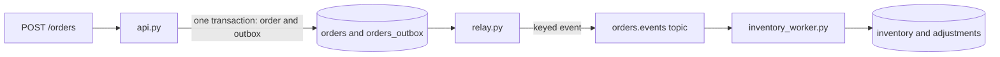

# P4 · Transactional Outbox (Polling Publisher)

**Read first:** [The Transactional Outbox Pattern](../02-concepts/outbox.md)

Store the business row and its event in one PostgreSQL transaction. A polling
relay publishes the stored event and marks it only after Kafka acknowledges it.

## What you build


```mermaid
flowchart LR
    C["POST /orders"] --> A["api.py"]
    A -->|"one transaction: order and outbox"| D[("orders and orders_outbox")]
    D --> R["relay.py"]
    R -->|"keyed event"| K["orders.events topic"]
    K --> W["inventory_worker.py"]
    W --> I[("inventory and adjustments")]
```

### How the flow works

This is the fix for P3's commit-then-publish gap: the event is stored in the same transaction as the business row, so a crash can never leave an order with no event.

1. **`POST /orders` carries `customer_id, sku, quantity, amount`.** The API mints `order_id = uuid4()` — the order's identity — and sets `aggregate_version = 1` (the first entry in that order's history; later transitions lock the row and bump it).
2. **One transaction writes two rows.** `INSERT INTO orders` is the business fact; `INSERT INTO orders_outbox (aggregate_id, aggregate_version, event_id, payload)` is the durable copy of the event. `event_id = order-{order_id}-placed` is derived so a retried relay publishes the identical event. `aggregate_id = order_id` is the Kafka key and the per-order ordering scope. If the process dies before commit, neither row exists; after commit, the pending outbox row guarantees delivery.
3. **Why `UNIQUE (aggregate_id, aggregate_version)` + `UNIQUE(event_id)`.** The first says "one event per order version" — version 2 cannot be inserted twice. The second makes relay retries dedup-safe. The partial index `WHERE published = FALSE` keeps the relay's poll fast as history grows.
4. **`relay.py` polls, publishes, then marks.** `SELECT … WHERE published = FALSE ORDER BY aggregate_id, aggregate_version LIMIT 100 FOR UPDATE SKIP LOCKED` claims a batch (a second relay takes different rows, not the same ones). Each row is `produce + flush`; only after every ack does `UPDATE … SET published = TRUE` commit. Crash after ack but before mark → row stays pending → duplicate publish, which the worker absorbs.
5. **`inventory_worker.py` turns the event into stock movement.** It claims `(inventory-workers, event_id)`, then `UPDATE inventory SET available = available - qty WHERE available >= qty` (the `CHECK (available >= 0)` plus the `>= qty` guard is what prevents oversell in SQL), then `INSERT INTO inventory_adjustments`. `inventory` is the current level; `inventory_adjustments` is the audit trail proving exactly one deduction per event. Offset commits only after that transaction.

## Files and setup

Every file below is self-contained — no shared helper module. Copy `compose.yaml`
from [Setup](../01-fundamentals/setup.md). Add these exact files:

```text
compose.yaml
requirements.txt
schema.sql
api.py
relay.py
inventory_worker.py
```

Start the stack, create the topic, and apply the schema:

```bash
docker compose up -d --wait --wait-timeout 180
docker compose exec kafka /opt/kafka/bin/kafka-topics.sh \
  --bootstrap-server kafka:29092 \
  --create --if-not-exists \
  --topic orders.events --partitions 3 --replication-factor 1 \
  --config min.insync.replicas=1
docker compose exec -T postgres psql -v ON_ERROR_STOP=1 -U app -d app < schema.sql
```

The inventory seed is part of `schema.sql`, so the curl example has stock
available.

## 1. `schema.sql`

```sql title="schema.sql"
-- Business row: order header with optimistic version for later transitions.
CREATE TABLE IF NOT EXISTS orders (
  order_id          TEXT PRIMARY KEY,
  customer_id       TEXT NOT NULL,
  sku               TEXT NOT NULL,
  quantity          INTEGER NOT NULL CHECK (quantity > 0),
  amount            NUMERIC(12,2) NOT NULL CHECK (amount > 0),
  status            TEXT NOT NULL DEFAULT 'new',
  aggregate_version BIGINT NOT NULL CHECK (aggregate_version > 0),
  created_at        TIMESTAMPTZ NOT NULL DEFAULT now()
);

-- Outbox: durable copy of each event; relay publishes then marks published.
CREATE TABLE IF NOT EXISTS orders_outbox (
  id                BIGSERIAL PRIMARY KEY,
  aggregate_id      TEXT NOT NULL,  -- Kafka key + ordering scope
  aggregate_version BIGINT NOT NULL CHECK (aggregate_version > 0),
  event_type        TEXT NOT NULL,
  event_id          TEXT NOT NULL UNIQUE,  -- dedup key for relay retries
  payload           JSONB NOT NULL,  -- full event envelope
  published         BOOLEAN NOT NULL DEFAULT FALSE,
  created_at        TIMESTAMPTZ NOT NULL DEFAULT now(),
  UNIQUE (aggregate_id, aggregate_version)  -- one event per order version
);

-- Fast poll for pending rows; partial index skips already-published rows.
CREATE INDEX IF NOT EXISTS orders_outbox_pending_idx
  ON orders_outbox (published, aggregate_id, aggregate_version)
  WHERE published = FALSE;

-- Stock level guarded by CHECK so oversell fails in SQL.
CREATE TABLE IF NOT EXISTS inventory (
  sku        TEXT PRIMARY KEY,
  available  INTEGER NOT NULL CHECK (available >= 0),
  updated_at TIMESTAMPTZ NOT NULL DEFAULT now()
);

-- Consumer dedup: one claim per group + event.
CREATE TABLE IF NOT EXISTS processed_events (
  consumer_group TEXT NOT NULL,
  event_id       TEXT NOT NULL,
  claimed_at     TIMESTAMPTZ NOT NULL DEFAULT now(),
  PRIMARY KEY (consumer_group, event_id)
);

-- Real side effect: one adjustment per claimed event.
CREATE TABLE IF NOT EXISTS inventory_adjustments (
  adjustment_id  BIGSERIAL PRIMARY KEY,
  consumer_group TEXT NOT NULL,
  event_id       TEXT NOT NULL,
  sku            TEXT NOT NULL REFERENCES inventory(sku),
  quantity_delta INTEGER NOT NULL,
  created_at     TIMESTAMPTZ NOT NULL DEFAULT now(),
  UNIQUE (consumer_group, event_id)
);

-- Seed so the demo has stock without a separate setup step.
INSERT INTO inventory (sku, available)
VALUES ('sku-1', 100)
ON CONFLICT (sku) DO NOTHING;
```

`aggregate_version` is the order's business sequence. The shown create path
writes version 1; a later order transition must lock that order, increment the
version, and insert its outbox row in the same transaction.

## 2. `api.py`: one transaction

The event envelope is built before the transaction and inserted as JSONB beside
the order. Nothing in this request publishes directly to Kafka.

```python title="api.py"
import os
from datetime import datetime, timezone
from decimal import Decimal
from typing import Any
from uuid import uuid4

import psycopg
from fastapi import FastAPI
from psycopg.rows import dict_row
from psycopg.types.json import Jsonb
from pydantic import BaseModel, Field

app = FastAPI()


class CreateOrderRequest(BaseModel):
    customer_id: str
    sku: str
    quantity: int = Field(gt=0)
    amount: Decimal = Field(gt=0)


def connect_db():
    # Postgres with dict rows; one connection per request.
    return psycopg.connect(os.environ["DATABASE_URL"], row_factory=dict_row)


def make_event(event_id, event_type, aggregate_type, aggregate_id, data):
    # Canonical envelope; event_id must be stable for relay retries.
    return {
        "event_id": event_id,
        "event_type": event_type,
        "aggregate_type": aggregate_type,
        "aggregate_id": aggregate_id,
        "schema_version": 1,
        "occurred_at": datetime.now(timezone.utc).isoformat(),
        "data": data,
    }


@app.post("/orders")
def create_order(request: CreateOrderRequest) -> dict[str, str | int]:
    # Atomic dual-write: order row + outbox row commit together.
    order_id = str(uuid4())  # new business id per request
    aggregate_version = 1  # first version; later transitions increment under lock
    event = make_event(
        event_id=f"order-{order_id}-placed",  # stable id derived from order_id
        event_type="OrderPlaced",
        aggregate_type="order",
        aggregate_id=order_id,  # Kafka key + outbox ordering scope
        data={
            "order_id": order_id,
            "customer_id": request.customer_id,
            "sku": request.sku,
            "quantity": request.quantity,
            "amount": str(request.amount),
            "aggregate_version": aggregate_version,
        },
    )
    with connect_db() as connection:
        with connection.transaction():  # both inserts succeed or both roll back
            connection.execute(
                """
                INSERT INTO orders
                    (order_id, customer_id, sku, quantity, amount, aggregate_version)
                VALUES (%s, %s, %s, %s, %s, %s)
                """,
                (
                    order_id,
                    request.customer_id,
                    request.sku,
                    request.quantity,
                    request.amount,
                    aggregate_version,
                ),
            )
            connection.execute(
                """
                INSERT INTO orders_outbox
                    (aggregate_id, aggregate_version, event_type, event_id, payload)
                VALUES (%s, %s, %s, %s, %s)
                """,
                (
                    order_id,
                    aggregate_version,
                    event["event_type"],
                    event["event_id"],
                    Jsonb(event),  # store full envelope for the relay
                ),
            )
    # No Kafka publish here: relay will find the pending outbox row.
    return {"order_id": order_id, "aggregate_version": aggregate_version}
```

If the process dies before commit, neither row exists. If it dies after commit,
the pending outbox row remains available to the relay. That is the improvement
over P3's separate database commit and Kafka publish.

## 3. `relay.py`: lock, publish, acknowledge, mark

Start the API and relay in separate terminals:

```bash
python -m uvicorn api:app --host 127.0.0.1 --port 8000
python relay.py
```

```python title="relay.py"
import json
import os
import time
from typing import Any

import psycopg
from confluent_kafka import Producer
from psycopg.rows import dict_row

TOPIC = "orders.events"


def connect_db():
    # Long-lived connection for the polling loop below.
    return psycopg.connect(os.environ["DATABASE_URL"], row_factory=dict_row)


def new_producer(client_id: str) -> Producer:
    # Idempotent producer: relay restarts can safely republish pending rows.
    return Producer(
        {
            "bootstrap.servers": os.environ["KAFKA_BOOTSTRAP_SERVERS"],
            "client.id": client_id,
            "acks": "all",
            "enable.idempotence": True,
            "delivery.timeout.ms": 30000,
        }
    )


def publish_row(producer: Producer, row: dict[str, Any]) -> None:
    # Publish one stored outbox row; flush proves broker ack before marking.
    errors: list[str] = []

    def delivered(error: object, message: object) -> None:
        if error is not None:
            errors.append(str(error))

    producer.produce(
        TOPIC,
        key=str(row["aggregate_id"]).encode("utf-8"),  # preserve per-order order
        value=json.dumps(
            row["payload"], sort_keys=True, separators=(",", ":")
        ).encode("utf-8"),
        callback=delivered,
    )
    remaining = producer.flush(15.0)
    if remaining != 0:
        raise TimeoutError(f"{remaining} record(s) undelivered")
    if errors:
        raise RuntimeError(errors[0])
    producer.poll(0)


def relay_once(connection: Any, producer: Any) -> int:
    # One poll batch: claim pending rows, publish each, then mark published.
    with connection.transaction():
        # SKIP LOCKED lets a second relay take different rows, not the same ones.
        rows = connection.execute(
            """
            SELECT id, aggregate_id, aggregate_version, payload
            FROM orders_outbox
            WHERE published = FALSE
            ORDER BY aggregate_id, aggregate_version, id
            LIMIT 100
            FOR UPDATE SKIP LOCKED
            """
        ).fetchall()
        for row in rows:
            publish_row(producer, row)  # raises on failure -> nothing marked
        if rows:
            # Mark only after every ack: crash before commit means safe replay.
            connection.execute(
                "UPDATE orders_outbox SET published = TRUE WHERE id = ANY(%s)",
                ([row["id"] for row in rows],),
            )
    return len(rows)


def main() -> None:
    producer = new_producer("p04-outbox-relay")
    with connect_db() as connection:
        while True:
            try:
                count = relay_once(connection, producer)
            except Exception as error:
                print(f"relay failed: {error}")  # batch stays pending, retried
                time.sleep(1)
            else:
                if count == 0:
                    time.sleep(0.1)  # idle poll interval


if __name__ == "__main__":
    main()
```

`FOR UPDATE SKIP LOCKED` lets another relay instance claim different pending
rows instead of publishing the same selected row. A crash after Kafka
acknowledgment and before the database commit leaves the row pending, so the
event is delivered again. The consumer-side claim makes that duplicate harmless.
A delivery error or timeout raises before the update and leaves every selected
row pending.

`ORDER BY aggregate_id, aggregate_version` is the per-order ordering rule. A
`BIGSERIAL` value is allocated from a sequence when a row is inserted; it is not
proof of transaction commit order, because a transaction can receive a value
before another transaction commits. `created_at` is also a clock value, not a
commit sequence. Use the order row's locked, incremented `aggregate_version` for
order history. With multiple relay replicas, keep one owner for a given order if
strict contiguous versions are required; row locks alone do not stop a replica
from taking a later version while an earlier version is locked.

## 4. `inventory_worker.py`

Start the worker in another terminal:

```bash
python inventory_worker.py
```

The worker claims the event, decrements stock, and writes a real adjustment row
in one database transaction. The Kafka commit follows that transaction.

```python title="inventory_worker.py"
import json
import os

import psycopg
from confluent_kafka import Consumer
from psycopg.rows import dict_row

TOPIC = "orders.events"
GROUP = "inventory-workers"


def connect_db():
    # Per-message connection for the claim + stock update transaction.
    return psycopg.connect(os.environ["DATABASE_URL"], row_factory=dict_row)


def new_consumer(group_id: str) -> Consumer:
    # Manual-commit consumer: offset follows the inventory transaction.
    return Consumer(
        {
            "bootstrap.servers": os.environ["KAFKA_BOOTSTRAP_SERVERS"],
            "group.id": group_id,
            "auto.offset.reset": "earliest",
            "enable.auto.offset.commit": False,
        }
    )


def main() -> None:
    consumer = new_consumer(GROUP)
    consumer.subscribe([TOPIC])
    try:
        while True:
            message = consumer.poll(1.0)
            if message is None:
                continue
            error = message.error()
            if error is not None:
                raise RuntimeError(str(error))
            event = json.loads(message.value())  # outbox envelope from relay
            if event["event_type"] != "OrderPlaced":  # guard: only handle known type
                raise ValueError(f"unexpected event type: {event['event_type']}")
            event_id = event["event_id"]  # dedup key
            data = event["data"]  # sku, quantity live here
            with connect_db() as connection:
                with connection.transaction():  # claim + stock + log = atomic
                    claimed = connection.execute(
                        """
                        INSERT INTO processed_events (consumer_group, event_id)
                        VALUES (%s, %s)
                        ON CONFLICT (consumer_group, event_id) DO NOTHING
                        RETURNING event_id
                        """,
                        (GROUP, event_id),
                    ).fetchone()
                    if claimed is not None:  # first delivery: apply side effect
                        updated = connection.execute(
                            """
                            UPDATE inventory
                            SET available = available - %s, updated_at = now()
                            WHERE sku = %s AND available >= %s
                            RETURNING sku
                            """,
                            (data["quantity"], data["sku"], data["quantity"]),
                        ).fetchone()
                        if updated is None:
                            raise RuntimeError(f"insufficient inventory for {data['sku']}")
                        connection.execute(
                            """
                            INSERT INTO inventory_adjustments
                                (consumer_group, event_id, sku, quantity_delta)
                            VALUES (%s, %s, %s, %s)
                            """,
                            (GROUP, event_id, data["sku"], -data["quantity"]),
                        )
                    # Duplicate: claim lost race -> no second stock move.
            consumer.commit(message=message, asynchronous=False)  # checkpoint
    finally:
        consumer.close()


if __name__ == "__main__":
    main()
```

A redelivered event loses the insert race in `processed_events`, so it writes no
second stock adjustment. Insufficient inventory raises before the Kafka commit;
the operational policy for that failure belongs to a later retry and dead-letter
project.

## 5. Run and verify

Place an order and inspect the database and inventory:

```bash
curl -i -X POST http://127.0.0.1:8000/orders \
  -H 'Content-Type: application/json' \
  -d '{"customer_id":"c-1","sku":"sku-1","quantity":2,"amount":"25.00"}'
docker compose exec -T postgres psql -v ON_ERROR_STOP=1 -U app -d app \
  -c "SELECT order_id, aggregate_version FROM orders ORDER BY created_at;"
docker compose exec -T postgres psql -v ON_ERROR_STOP=1 -U app -d app \
  -c "SELECT id, aggregate_id, aggregate_version, published FROM orders_outbox ORDER BY id;"
docker compose exec -T postgres psql -v ON_ERROR_STOP=1 -U app -d app \
  -c "SELECT sku, available FROM inventory WHERE sku = 'sku-1';"
docker compose exec -T postgres psql -v ON_ERROR_STOP=1 -U app -d app \
  -c "SELECT consumer_group, event_id, count(*) FROM inventory_adjustments GROUP BY consumer_group, event_id;"
```

A successful run has one `OrderPlaced` adjustment and one inventory deduction.
To test a replay, set an already published row back to `FALSE`, run the relay,
and compare the adjustment count before and after; the count must stay one for
that consumer group.

## Break it

1. Implement the old order insert followed by a direct publish in a disposable
   branch. Kill the process between commit and publish. The order exists with no
   event, which is the dual-write hole the outbox closes.
2. Kill the relay while 20 orders are pending. Restart it and confirm every
   pending row is eventually published and marked.
3. Force a row back to `FALSE` after its event was delivered. The relay publishes
   it again; the inventory worker must skip the second adjustment.
4. Add a second order event using version 2 and make the relay replicas compete.
   Observe why `aggregate_version`, not the outbox sequence value, expresses the
   order's history.

## Checkpoints

??? question "What is the atomic boundary?"
    The order row and its outbox row commit together. Kafka is outside that
    transaction, but an unpublished row remains durable work for the relay.

??? question "Why flush before marking?"
    `flush()` waits for delivery callbacks. Marking first could lose the event if
    the broker rejects it. Marking after an acknowledgment can duplicate it, and
    the consumer claim absorbs that duplicate.

??? question "What does `SKIP LOCKED` prevent?"
    Two relay replicas select different pending rows rather than both selecting
    the same rows. It does not remove the acknowledgment-to-mark duplicate
    window, and it does not by itself serialize different versions of one order.

??? question "Does `BIGSERIAL` equal commit order?"
    No. Sequence allocation and transaction commit are different timelines. Use
    `aggregate_version` under the order row's transaction to define per-order
    order; Kafka then preserves that order for the keyed stream.

## Done when

- [ ] An order and its event are committed in one database transaction.
- [ ] A relay restart loses no pending event and marks only after acknowledgment.
- [ ] A replayed event leaves inventory unchanged.
- [ ] You can explain sequence allocation versus commit order.

Next: **[P5 · Outbox with Debezium CDC](p05-outbox-cdc.md)**.
