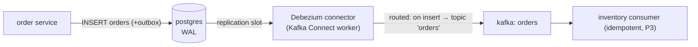

# P5 · Outbox with Debezium CDC

**Read first:** [The Transactional Outbox Pattern](../02-concepts/outbox.md) →
[schema-evolution](../02-concepts/schema-evolution.md) context if you use Avro later

Same guarantee as P4 — DB commit == event guaranteed — but the relay is now
**Debezium tailing the Postgres WAL**. No polling code, millisecond freshness, and
an extra production component to care for. Build it, measure it, and compare.

## What you build



| Skill | Learned by |
|-------|-----------|
| Kafka Connect worker + Debezium container | docker compose, logs |
| Replication slots & WAL | `pg_replication_slots`, slot churn |
| Outbox event router (topic routing, `aggregate_id` as key) | small_message_size routing config |
| Ordering across the CDC topic | partition + key behavior vs P4 |
| Initial snapshot vs streaming | connector snapshot phase |
| Connector failure behavior | break-it: stop connector, pending events pile |

## Steps

### 1. docker-compose additions

```yaml
  connect:
    image: debezium/connect:3.0
    depends_on: [kafka, postgres]
    ports: ["8083:8083"]
    environment:
      BOOTSTRAP_SERVERS: kafka:9092
      GROUP_ID: 1
      CONFIG_STORAGE_TOPIC: connect_configs
      OFFSET_STORAGE_TOPIC: connect_offsets
      STATUS_STORAGE_TOPIC: connect_statuses
    volumes:
      - ./connect-plugins:/kafka/connect
```

Requires Postgres `wal_level=logical` (add to compose or run `ALTER SYSTEM` +
restart).

### 2. Same outbox table (P4's stays unchanged — that's the point)

```sql
CREATE TABLE orders_outbox (/* identical to P4 */);
```

Insert the P4 rows as usual; the *only* diff is what reads them.

### 3. Register the connector (one curl)

```bash
curl -X POST http://localhost:8083/connectors -H 'Content-Type: application/json' -d '{
  "name": "outbox-orders",
  "config": {
    "connector.class": "io.debezium.connector.postgresql.PostgresConnector",
    "database.hostname": "postgres", "database.port": "5432",
    "database.user": "app", "database.password": "app",
    "database.dbname": "app", "database.server.name": "dbserver",
    "table.include.list": "public.orders_outbox",
    "topic.prefix": "dbserver",
    "publication.name": "dbz_publication",
    "slot.name": "dbz_outbox",
    "transforms": "outbox",
    "transforms.outbox.type": "io.debezium.transforms.outbox.EventRouter",
    "transforms.outbox.table.fields.additional.placement": "type:envelope:event_type",
    "transforms.outbox.route.topic": "orders",
    "transforms.outbox.route.by.field": "aggregate_id",
    "transforms.outbox.table.field.event.key": "aggregate_id",
    "transforms.outbox.table.field.event.id": "id",
    "transforms.outbox.table.field.event.payload": "payload",
    "skipped.operation": "delete"
  }}'
```

The **EventRouter** turns each outbox row into a Kafka event: topic `orders`,
key = `aggregate_id`, value = the JSON `payload` verbatim. One connector, zero
application code. Check health:

```bash
curl http://localhost:8083/connectors/outbox-orders/status
# "state": "RUNNING", tasks: [{"state": "RUNNING"}]
```

### 4. Observe the magic

Place an order → event appears in `orders` within milliseconds (not 100ms polling).

```bash
kcat -b localhost:9092 -t orders -C -f 'key=%k value=%s\n'
```

Watch the connector's snapshot phase in logs when the topic first starts flowing
(`docker compose logs connect | grep -i snapshot`).

### 5. Compare against P4 — the honest report

| Criterion | P4 polling | P5 CDC |
|-----------|-----------|--------|
| End-to-end latency | ~poll interval (1–10 Hz > 100ms) | ~ms |
| Components to run | relay code (yours) | Connect worker + Debezium + slot |
| Failure modes you own | relay bugs | slots, connector config, schema changes |
| Ordering | `ORDER BY id` (insert order) | per-partition, key-derived; outbox `id` not exposed after routing — think! |
| Debugging | `published` column | connector status + `dbserver.public.orders_outbox` source topic |

## Break it

1. **Stop the Connect worker,** place 20 orders. Restart worker. Events flush.
   What state did you lose? None — the slot held the position. *Who* lost the
   position if you `DELETE` the slot instead? (Run `SELECT * FROM pg_replication_slots`.)
2. **Abandoned slots:** create a connector with a typo'd slot name, then delete the
   connector. Check WAL growth (slot prevented cleanup). Deleting a connector does
   **not** drop the slot — do it by hand and observe the WAL release.
3. **Payload mutation:** add a column to `orders_outbox` (e.g. `z`). Debezium tolerates
   some, errors on others; watch the connector state and connector restart with a
   schema update path you choose.
4. **Duplicate consistency:** while a connector is paused, P4' style re-publish —
   consumers dedup (P3) so nothing double-applies. Verify.

## Checkpoints

??? question "1. What exactly does the `aggregate_id` field in the EventRouter do to ordering? (Revisit [ordering](../02-concepts/ordering.md).)"
    It becomes the **partition key of the routed event** — `route.by.field:
    aggregate_id` makes the source of the key the outbox row's `aggregate_id`,
    and in the same breath `table.field.event.key: aggregate_id` says "use that
    row field as the Kafka message key". Result: all events *of the same
    aggregate* land on the **same partition, in outbox-`id` (insert) order** —
    the per-entity ordering law survives the CDC hop even though the
    connector batches records across many aggregates into the topic.
    The P4-comparison wrinkle (step 5 table): P4's relay guaranteed
    aggregate-order by `ORDER BY id`; CDC guarantees **per-aggregate order by
    key routing**, and *global* cross-aggregate order is meaningless anyway
    (Kafka never guarantees it) — so they're equivalent for every consumer that
    cares about entity history. If you want a second dimension (e.g. time-ordered
    reads per aggregate for projections), that's a *projection* concern, not the
    topic's.

??? question "2. A connector emits the *same* outbox row twice after a node restart. Where's the dedup again? (It shouldn't be your DB's fault.)"
    Same place it always is: the **consumer's `processed_events` table** (P3)
    — *event_id* is the key. The connector's restart (re-boot, offset revisit)
    can re-emit a row; the *consumer* records `event_id` (P4's `event_id`
    payload field) and applies the side effect only on first sight, so the
    double-emission is a no-op for every consumer with the P3 guard.
    What an *unprotected* consumer would experience: double stock deduction.
    That's exactly why P5's own table says "consumer idempotency is not
    optional here" — CDC is *less* controlled than your own relay, so dedup
    isn't a belt-and-braces, it's the plan.
    (Fun detail: the connector's own offset — in `connect_offsets` — is its
    dedup against the WAL, but that protects the *connector*, not the *consumer*;
    those are different contracts.)

??? question "3. Which config keys decide 'topic per outbox row' vs 'one topic for everything'?"
    The `outbox` transform's routing trio, all in the connector config:
    - **`transforms.outbox.route.topic`** — the *base topic* (or template) a row
      targets; with a template like `orders.%s` you route by a field's value.
    - **`transforms.outbox.route.by.field`** — which row field selects the
      *destination* (`event_type` → per-event-type topics; `aggregate_id` is
      usually used with the *key* config, not the route).
    - **`transforms.outbox.route.topic.regex` / `route.topic.replacement`** —
      regular-expression rewriting of the routed topic name (e.g.
      `(.*)_outbox` → `$1` to strip the suffix).
    So: one topic for everything = a **static `route.topic`** value (P5's
    `orders`); topic-per-event-type = `route.by.field: event_type` with topic
    template; hybrid custom mappings use the regex pair. Default EventRouter
    behavior without `route.by.field`: reserves `type` as the routing field.

??? question "4. Slot vs offset: which one is Kafka's birthright, which one is Postgres' entry management? When do they drift?"
    **Slot** = Postgres' contract: a named, durable bookmark in the *WAL*
    (`pg_replication_slots`) — it tells Postgres "don't discard WAL older than
    this". If a connector dies, Postgres *keeps the WAL* → nothing lost, but WAL
    grows (break-it #2 measured that). Deleting the connector **does not delete
    the slot** — the row must be dropped by hand, then Postgres reclaims the
    WAL.
    **Offset** = Kafka's contract: Connect consumers check their start position
    in `connect_offsets` *before* consulting the slot. If the offset lags the
    slot, the connector resumes from the offset (not from the slot's head) —
    those events were already *emitted*, so it works.
    **Drift**: the two represent different resume points — slot = "WAL position
    a connector will re-read if its offsets are gone"; offset = "topic position
    it actually resumed from". They drift when: offsets get deleted (restart
    from slot → full re-emit), or the slot lags far behind the offsets (WAL
    bloat while nothing consumes). The hygiene rule: **keep the slot alive only
    while a live connector owns it; drop it the moment the connector retires** —
    and never let the slot outrun your offsets (that's the "abandoned slot/pile
    of WAL" failure).

## Done when

- [ ] Orders appear in `orders` topic < 50ms after POST with zero relay code
- [ ] You can explain the EventRouter config line by line
- [ ] You have seen and cleaned up an abandoned replication slot
- [ ] You wrote a one-paragraph "polling vs CDC" decision note for your team

## Learn more

- **Docs** — [Debezium — Outbox Event Router](https://debezium.io/documentation/reference/stable/transformations/outbox-event-router.html) — the transformation at the heart of this project, reference form.
- **Read** — [Reliable Microservices Data Exchange with the Outbox Pattern](https://debezium.io/blog/2019/02/19/reliable-microservices-data-exchange-with-the-outbox-pattern/) — a production walkthrough of exactly this architecture.
- **Watch** — [Ins and Outs of the Outbox Pattern](https://www.youtube.com/watch?v=PkrzOR_tIQI) (Gunnar Morling) — Debezium outbox live, with the failure analysis.

Next: **[P6 · Saga by Choreography](p06-saga-choreography.md)** — multi-service
workflow, first decentralized.