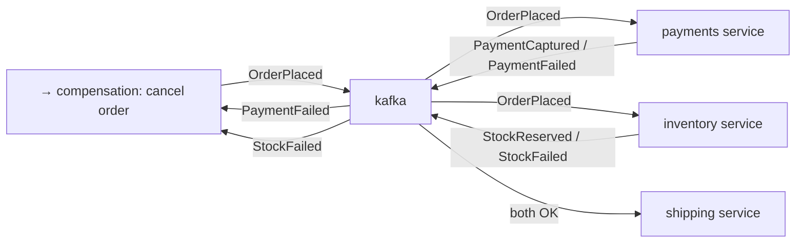

# P6 · Saga by Choreography

**Read first:** [The Saga Pattern](../02-concepts/saga.md)

Three services, one order lifecycle, no coordinator. Each service commits locally
and reacts to events — and on failure, **compensations walk the saga backward**.
This is where "distributed transactions" stop being theory.

## What you build



| Service | Command | Event out | Compensation |
|---------|---------|-----------|--------------|
| orders | checkout | `OrderPlaced` | `OrderCancelled` |
| payments | `PaymentCaptured` on balance | `PaymentCaptured \| PaymentFailed` | `PaymentRefunded` |
| inventory | `StockReserved` on stock | `StockReserved \| StockFailed` | `StockReleased` |
| shipping | reserve slot | `ShipmentScheduled \| NoShippingSlot` | — |

Rules you must obey while building:

1. **Every consumer is idempotent** (P3 table). Redelivery is the default.
2. **Every service writes its own DB** (`saga state` columns) in a local txn
   alongside its outbox insert (P4) — zero direct DB sharing.
3. **Events are self-contained** (no "GET /orders/:id" from consumers) — decision
   facts carry everything.

## Steps

### 1. Order flow (choreography happy path)

1. `POST /checkout` → orders service: insert order + `OrderPlaced` outbox → relay
   publishes.
2. Payments consumer: `PaymentCaptured` (payments ledger row) + outbox `PaymentCaptured`.
3. Inventory consumer: `StockReserved` (deduct sku) + outbox `StockReserved`.
4. Shipping consumer: on **both** `PaymentCaptured` + `StockReserved` for order_id
   → `ShipmentScheduled`.

The shipping rule is the first time you face **event correlation**: two events, one
order, possibly out of order. Implement a small `order_pipeline` state table in each
service:

```sql
CREATE TABLE order_pipeline (
  order_id  TEXT PRIMARY KEY,
  step      TEXT NOT NULL,     -- 'payment_captured' | 'stock_reserved' | 'done'
  payloads  JSONB
);
-- consumer on PaymentCaptured:
--   upsert step |= 'payment'; if both steps present → emit ShipmentScheduled
```

### 2. Failure path: `PaymentFailed` or `StockFailed`

Payments fails (balance check): publish `PaymentFailed` with reason.
Inventory consumer on `PaymentFailed` → **compensation** `StockReleased` for the
reserved sku (if it reserved).
Orders consumer on `StockFailed` or `PaymentFailed` → `OrderCancelled`.

:warning: In choreography, **compensations are also events**. Ensure every step
that can succeed has a compensation subscription *on the same topic* where its
downstream failure events land. Missing one = a stuck order, and nobody owns the
escalation. Write the compensation matrix (above table) before the code.

### 3. The demo script

```bash
scripts/demo.sh            # happy path: place → payment → stock → shipping
scripts/fail_payment.sh    # make payment fail (balance < amount) → observe all three compensations
scripts/fail_stock.sh      # oversell an sku → observe the other compensation
```

Every script ends by asserting final `order.status` in SQL:
`new → (completed | cancelled)` — plus a posted `StockReleased` repeat-count check
inventory: **released exactly as many units as reserved**.

## Break it

1. **Kill payments mid-payment**, order placed. Restart. Choreography resumes —
   where does the story continue from? (Committed offset + outbox, not a centers.)
2. **Kill the inventory consumer** and oversell: order A reserves, order B fails,
   A's compensation must release **A's** units — verify release only after both
   events observed. (This will teach you "compensate only what you did".)
3. **Duplicate `PaymentCaptured`** (replay from topic) → capture effect once,
   `ShipmentScheduled` once — dedup table proves it.
4. **Race:** send `StockFailed` and `StockReserved` for the same order ~simultaneously
   (reproduce with sleep tweaks + duplicate replay). Which consumer wins the
   correlation table — and is your "both OK → ship" logic dependent on arrival order?
   Fix any unhandled state (this is the choreography smell).

## Checkpoints

??? question "1. In a failure, who publishes `OrderCancelled`? What if *that* publisher is down?"
    The **orders service's consumer** — it subscribes to the failure events
    (`PaymentFailed`, `StockFailed`) and emits `OrderCancelled` via its own
    outbox (P4), so cancellation is *its* decision with *its* guarantee. If that
    publisher is down, nothing else emits it — that's the choreography smell:
    **nobody owns the escalation**. In practice:
    1. the *event still arrives* (broker keeps it), so a restart alone recovers
       the flow — but "down" can mean minutes/hours;
    2. you need a **watchdog** (P7's timeout idea, P8's runbook): an
       order-pipeline scan (P6's `order_pipeline` table) flags
       `running`-too-long → re-emits or escalates to a human/on-call;
    3. production choreography without such a watchdog is how "stuck order"
       tickets are born. Answer in one sentence for the interview: *the failing
       step's compensating publisher is the orders service, and the safety net
       is a re-emission watchdog + alerting, because choreography has no central
       brain.*

??? question "2. Correlation: `StockReserved` arrives before `PaymentCaptured` always? Design for 'either order' in the pipeline table."
    **No** — they are two independent producers on two topics; arrival order is
    not guaranteed (each topic has its own partition clock; producers race).
    Design for "either order" by making the pipeline table **commutative**:
    - `order_pipeline(order_id, step, payloads)` with **upsert semantics**:
      `INSERT ... ON CONFLICT (order_id) DO UPDATE SET step = step | $1` — the
      step-flag is a **set**, not a sequence; arrival order doesn't change the
      set.
    - "ship" fires when `step` contains *both* bits — as a **side effect of any
      update that completes the set** (each event handler re-checks after its
      own upsert, so whichever arrives second triggers shipping).
    - every update inside the same local txn as the consumer's P3 marker.
    Corollary: never write handlers that assume "I go second" — write "I add my
    fact, then evaluate the set". If ordering actually mattered (e.g. refund
    after capture), that's a *state machine* — P7's table, not a flag set.

??? question "3. You have 2 instances of the inventory consumer. Where does the reservation happen — and how do you keep count correct? (Your dedup + local txn answers.)"
    The reservation happens in the **database**, not in the consumer instance —
    the instance is just a *driver*: it reads `ReserveStock` and issues
    `UPDATE sku SET reserved += X` (or `qty -= X`) in a local transaction, so
    concurrency is settled by Postgres row locks, never by instance count.
    Keeping count correct = the two P3/P4 laws:
    1. **Dedup in the same txn**: `processed_events` INSERT + stock UPDATE commit
       together; a rebalance-redelivered record hits the UNIQUE constraint and
       is a no-op — no double deduction even when the partition hops instances.
    2. **Check-then-act under lock**: `SELECT ... FOR UPDATE` on the sku row
       before the decrement (or `UPDATE ... WHERE qty >= x RETURNING`), so two
       parallel reservations can't oversell — the DB is the arbiter, not
       "which consumer won the race".
    Ordering note: per-key partition assignment (P2) means the *same order's*
    events only ever flow to one of the two instances at a time — but that's a
    convenience, not the correctness mechanism; the constraint is.

??? question "4. A poll of `order_pipeline` shows `payment_captured + stock_failed` — what's the final state and who gets there?"
    **Final state: order cancelled.** Path:
    1. stock failed → inventory consumer *already* emitted `StockFailed` and
       (per P6 rule) a compensation `StockReleased` for anything it reserved —
       the stock side self-heals.
    2. payment was captured → the money *must not* stay trapped: the orders
       service (or the payment consumer, per your compensation matrix) emits
       **`PaymentRefunded`** as the compensation for the captured half.
    3. orders consumer emits `OrderCancelled` (terminal state).
    Who gets there: **whichever consumer notices the terminal condition**
    (the `payment_captured + stock_failed` combination) and runs the
    compensation matrix — in choreography that's a *subscription*, so both the
    inventory consumer (on failure events) and the orders consumer (on failure
    events) participate, each compensating its own side. The invariant you must
    keep: **every successful step has exactly one compensating event in the
    matrix, and the matrix runs until terminal** — `StockReleased` for reserved
    units, `PaymentRefunded` for captured funds, `OrderCancelled` for the order.

## Done when

- [ ] Happy path completes, failure paths walk the full compensation matrix
- [ ] Inventory released == reserved in every failure scenario (SQL-prove it)
- [ ] You can draw the compensation graph on a whiteboard from memory
- [ ] You identified at least one correct-state gap from experiment 4 and fixed it

**Choreography verdict time:** write 3 sentences on when you'd *still* choose
choreography vs when you'd refuse it. Then go build the alternative.

Next: **[P7 · Saga by Orchestration](p07-saga-orchestration.md)** — the same saga,
with one durable brain.