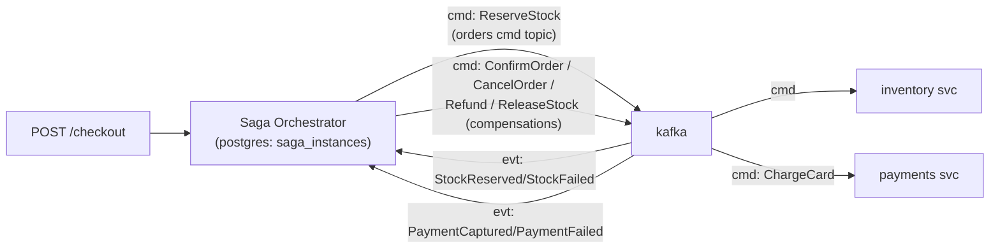

# P7 · Saga by Orchestration

**Read first:** [The Saga Pattern](../02-concepts/saga.md) →
[Distributed transactions](../02-concepts/distributed-transactions.md)

Same checkout story, one durable brain: an **orchestrator service** that owns the
workflow as a persisted state machine and fires step-commands, waits for
step-events, and drives compensations. The failure is now *findable*: one table
says exactly where the saga is.

## What you build



The orchestrator is a **state machine**, not an HTTP caller:

| Step | Command → | Wait for event | On failure |
|------|-----------|----------------|------------|
| `reserve_stock` | `ReserveStock` | `StockReserved \| StockFailed` | → abort |
| `charge_payment` | `ChargeCard` | `PaymentCaptured \| PaymentFailed` | → compensate: `ReleaseStock` → abort |
| `confirm` | `ConfirmOrder` | `OrderConfirmed` | → compensate: refund + release + abort |

## Steps

### 1. Orchestrator state table (its whole superpower)

```sql
CREATE TABLE saga_instances (
  saga_id      UUID PRIMARY KEY,
  order_id     TEXT NOT NULL,
  status       TEXT NOT NULL,          -- running | succeeded | compensating | aborted
  current_step TEXT NOT NULL DEFAULT 'reserve_stock',
  payload      JSONB NOT NULL,         -- self-contained order snapshot
  step_state   JSONB,                  -- results of completed steps
  created_at   TIMESTAMPTZ DEFAULT now(),
  updated_at   TIMESTAMPTZ DEFAULT now()
);
```

**State before event rule** (the P7 commandment): mutate `saga_instances` **and**
publish the step command in one local transaction — reuse the **outbox from P4**
for the commands. Crash anywhere → orchestrator rehydrates from DB and continues.
*This is the P6 pain point that orchestration exists to remove.*

```python
async def advance(saga_id):
    async with db.transaction():
        saga = await db.fetchrow("SELECT * FROM saga_instances WHERE saga_id=$1 FOR UPDATE", saga_id)
        if saga["status"] != "running": return
        step, cmd, topic = NEXT_STEP[saga["current_step"]]
        await db.execute("UPDATE saga_instances SET current_step=$1 WHERE saga_id=$2", step, saga_id)
        await db.execute("INSERT INTO commands_outbox (aggregate_id, command, payload) VALUES ($1,$2,$3)",
                         saga["order_id"], cmd, saga["payload"])
    # relay (P4) publishes the command
```

### 2. Step endpoints (services get dumber)

Without the orchestrator logic inside them, services need **command topics** +
event topics + idempotency. Inventory service:

```
consume orders.cmd.ReserveStock → reserve in local txn → outbox StockReserved
consume orders.cmd.ReleaseStock (compensation cmd) → release → outbox StockReleased
consume orders.cmd.RecoverCheckout → re-emit current state
```

### 3. The event router inside the orchestrator

```python
@consumer.on("orders.evt")
def on_event(msg):
    evt = json.loads(msg.value())
    saga = db.fetchrow("SELECT * FROM saga_instances WHERE order_id=$1 FOR UPDATE", evt["order_id"])
    if saga["status"] != "running": return          # compensations already fired
    if HANDLERS[saga["current_step"]](evt):          # success predicate
        advance(saga)                                # → next step
    else:
        compensate(saga)                             # walk backward
```

`advance` / `compensate` each persist state *then* publish commands (outbox). A
crash inside them → restart → `advance` re-runs idempotently (step names stored
make this safe; commands dedupe via `event_id`).

### 4. Timeouts — what P6 never had

Orchestrator rows in `running` with `updated_at` older than X → a **watchdog**
routine (cron/loop) that:

1. re-emits the pending command (idempotent at the service),
2. after N re-emits → transition to `compensating`.

```sql
SELECT saga_id FROM saga_instances
 WHERE status='running' AND updated_at < now() - interval '30 seconds';
```

Timeout = a *first-class state*, never an excuse for stuck orders. Expose
`saga_instances` to a dashboard (`status=running` age) — the “is it stuck” answer
now lives in one table.

## Break it

1. **Kill the orchestrator between state update and command publish** (or between
   publish and state update — reproduce with sleeps). Restart. The read from the
   DB is the only truth; replay any duplicate command (dedup). Understand why the
   outbox is the only correct place for command emission.
2. **Compensation at the wrong time:** craft a `StockFailed` *after* the saga
   already `succeeded` (replay an old event). The `status != running` guard must
   skip it. If it doesn't, you've found a real-world bug class.
3. **Orchestrator dies while compensating**: verify compensation commands are
   emitted via outbox and replay-safe (double-release == no double release).
4. **Watchdog fires** while a slow service is genuinely processing: ensure the
   re-emitted command doesn't double-apply. (It shouldn't — dedup.)
5. **Duplicate gateway POST** with the same idempotency key → one saga row.

## Checkpoints

??? question "1. Why must the orchestrator persist state *before* publishing the command? (Two sentences max — this is the whole pattern.)"
    Because a crash in the *gap* between "command published" and "state saved"
    makes the story unrecoverable: on restart you'd re-emit a command you've
    already sent (duplicate) or skip one you haven't (lost workflow). Persisting
    state **in the same local transaction** as the outbox insert (P4) makes
    "state + command" atomic — restart rehydrates the truth and re-emits
    idempotently (dedup at the service). That's the whole pattern: *the database
    is the memory, the outbox is the hand*.

??? question "2. How does the orchestrator distinguish 'retry the step' from 'compensate'?"
    By **failure classification, not by error text** — the same ladder as P8:
    - **Retry** when the failure is *transient* (timeout, 5xx, dependency down)
      and the step is *idempotent-safe*: watchdog re-emits the same command;
      the service's dedup makes repeats no-ops. Budget: N re-emits (timeout
      window) — exceeded → classify as failed.
    - **Compensate** when the failure is *terminal* (a permanent business
      rejection: insufficient funds, out of stock) — no retry helps, so walk
      the compensation matrix backward from the last *succeeded* step.
    The decision is a **policy in the orchestrator's state machine** (transient
    vs terminal per step), recorded per saga in `step_state` — never derived
    ad-hoc from the error message at runtime.

??? question "3. If `current_step=charge_payment` and the DB row is `running`, what do you actually *know* about whether the card was charged?"
    **Nothing certain** — and you must not guess. `running` means "the saga
    believes the command was emitted", but the *fact* of charging lives in the
    payment service's own ledger (`PaymentCaptured` event), which the
    orchestrator has *not* recorded yet (`step_state` empty for the step). It
    may be: not yet charged (command in flight), charged and event lost on the
    wire, or charged and the event unprocessed. The orchestrator's job is
    **reconciliation, not assumption**: re-emit the command (idempotent — the
    payment service's `saga_id` key answers "already charged?" by returning the
    stored outcome) and wait for the *event* to decide. Never proceed from
    "probably", never compensate from "maybe" — state says what *was decided*,
    events say what *happened*; only the event is evidence.

??? question "4. Orchestration vs choreography for *this* saga: give the decided answer and one quantitative reason (searchability, state, failure isolation)."
    **Orchestration** — the deciding numbers:
    - **State & searchability**: one `saga_instances` row tells you every live
      saga's exact step in one SQL query; choreography's truth is scattered
      across N `order_pipeline` tables you must join by `order_id` across
      services. For an order (high business value, multi-service, money+stock),
      "where is it stuck" must be *one query*, not a cross-service investigation.
    - **Failure isolation**: a choreography failure leaves *no single owner* to
      escalate; the orchestrator row + watchdog makes the failure a *recorded
      state* that any operator can resume from.
    - Cost honesty: choreography wins when steps are *independent* (no strict
      ordering, low blast radius) or when you must not have a central component
      (availability edge). For a checkout saga with money and inventory, those
      don't apply — so orchestrator. (P6's verdict-time note asks you to write
      this with *measured* experience — the measurable part: search stuck
      orders in 1 SQL vs N joins.)

## Done when

- [ ] `saga_instances` table tells you every live saga's exact step at a glance
- [ ] Kill-orchestrator experiments leave zero stuck sagas (watchdog or replay fixes)
- [ ] Compensation matrix executes exactly once per failure
- [ ] One paragraph comparing P6 vs P7 written from *measured* experience

Next: **[P8 · Retries, Backoff & DLQ](p08-reliability-dlq.md)** — the failure
ladder that keeps sagas alive under dirty data.