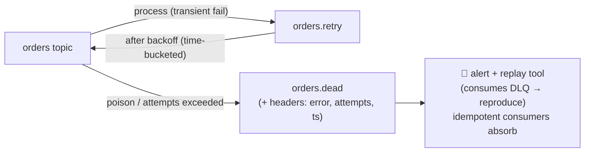

# P8 · Retries, Backoff & the Dead Letter Queue

**Read first:** [Failure handling: retries & DLQ](../02-concepts/failure-handling.md) →
[Idempotency](../02-concepts/idempotency.md)

A saga pipeline is only as good as its failure ladder. Now: bounded backoff,
poison messages that *leave* the hot path, a DLQ with forensics, and a replay
tool you can trust. No more stuck partitions.

## What you build



| Service you add | Behavior |
|-----------------|----------|
| `processing` consumer | tries `process()`; on failure → publish to retry topic with `attempt` header; commit main offset onward |
| `retry` consumer | delayed delivery by **time-bucketed keys** (next section); re-emits to main topic |
| replays | consume `*.dead` → (optionally filter) → reproduce to `orders` |

## Steps

### 1. Delivery count with headers (Kafka's honest "attempts" counter)

No counter exists in the broker — the pattern is headers + your own budget:

```python
attempts = int(msg.headers().get("x-attempts", 0)) + 1
```

Define the ladder in `process(msg) -> Retry | Dead | Done`:

| Case | Decision |
|------|----------|
| deserialize ok, business logic rejects permanently | → DLQ immediately (`x-error-type=invalid`) |
| downstream 5xx / DB down | → retry (if `x-attempts < 5`) else DLQ |
| unhandled exception | → retry with backoff; count; DLQ at 5 |

```python
def handle(msg):
    evt = json.loads(msg.value())
    attempts = int(dict(msg.headers()).get("x-attempts", 0)) + 1
    try:
        result = process(evt)                # business logic
        if isinstance(result, PermanentReject):
            dead_letter(msg, "permanent", attempts, str(result))
        consumer.commit()                    # success → checkpoint
    except TransientError as e:
        if attempts >= MAX_ATTEMPTS:
            dead_letter(msg, "exhausted", attempts, str(e))
            consumer.commit()                # move PAST the dead record
        else:
            retry_produce(msg, attempts)     # publish to orders.retry
            consumer.commit()                # and move past (retry owns it now)
```

Design note: after routing to retry/DLQ, **commit the main record** — otherwise the
poison message re-locks the entire partition forever. The retry topic keeps the
message alive; retrying inside `poll()` is the P2 storm trap.

### 2. Time-bucketed delayed retries (no timers)

Retry topic keyed by a **future time bucket**: `orders.retry` gets key
`f"{future_minute:05d}:{order_id}"` (or partition-relative bucket when strict
ordering matters). A `retry` consumer reads by partition scanning *active* buckets
and forwards when `bucket <= now`:

```python
def run_retry_worker():
    # consumes orders.retry with earliest, manual commit
    while True:
        msg = consumer.poll(1.0)
        if not msg: continue
        bucket = int(msg.key().split(":")[0])
        if bucket <= now_minute():
            produce_main(msg)               # re-emit to orders
        else:
            # park: re-seek to head of partition when the bucket arrives
            pass
        consumer.commit()
```

Backoff ladder: `attempt 1 → +1min, 2 → +5min, 3 → +10min, 4 → +30min, 5 → DLQ`.
Verify with `kcat -t orders.retry -C` — records visibly "sleep" in the bucket.

### 3. The DLQ capture

```python
def dead_letter(msg, error_type, attempts, detail):
    producer.produce(
        "orders.dead",
        key=msg.key(),
        value=msg.value(),
        headers=[*msg.headers(),
                 ("x-error-type", error_type),
                 ("x-attempts", str(attempts)),
                 ("x-error-detail", detail),
                 ("x-source-partition-offset", f"{msg.partition()}/{msg.offset()}")],
    )
```

Plus one alert query (kept from P4's style) — **DLQ non-empty for N minutes**,
and an age query: any DLQ row older than X minutes = someone must look.

```bash
kcat -b localhost:9092 -t orders.dead -C -f 'key=%k p=%p o=%o %s\n' -e
```

### 4. The replay tool (repair loop, not archaeology)

```python
def replay(topic="orders.dead", filter_fn=None, limit=1000):
    consumer = Consumer({"group.id": "dlq-replayer",
                         "auto.offset.reset": "earliest", "enable.auto.offset.commit": False})
    consumer.subscribe([topic])
    while (n := 0) < limit:
        msg = consumer.poll(1.0)
        if msg is None: break
        if filter_fn and not filter_fn(msg): continue
        produce_main(msg)          # same event_id → consumer dedup absorbs stragglers
        n += 1
        consumer.commit()
```

Replay to the main topic with **original event_id** — the consumer's
`processed_events` (P3) makes replays a no-op for already-applied events, and
applies the rest exactly once. This is the repair loop closing the at-least-once
loop.

## Break it

1. **Five 5xxs in a row** from a fake broken downstream → record lands in
   `orders.dead` with `x-attempts=5`. Sit in the DLQ, alert fires.
2. **Crash after retry_produce, before commit** → record appears twice (retry +
   redelivery). Dedup proves only one apply. *This* is why retry topics + commit
   discipline are the pair.
3. **Poison message** (malformed JSON) injected via kcat → it should jump to DLQ
   *immediately* (invalid type), never consume retry budget. Verify the ladder.
4. **Replay storm:** replay the DLQ *while* the consumer group also still sees old
   records — final state converges with no duplicates. Plant a duplicate race
   (purge `processed_events` row mid-replay) and watch the constraint hold.

## Checkpoints

??? question "1. Why must we commit the record *before* routing to retry (two reasons: name both — after that: which gap does step-2-replay close)?"
    Two reasons, both about **not blocking the partition**:
    1. **The poison doesn't re-lock the partition**: if you don't commit past it,
       the record is redelivered immediately, and your own consumer retries
       *inline* (inside `poll()`) → the P2 storm trap, other healthy records
       stuck behind it forever.
    2. **Ownership is explicit**: the *retry topic* now owns the message — the
       main consumer's job is "checkpoint the stream"; the retry worker's job is
       "re-emit on schedule". Commit-past = "handed off", not "applied".
    The gap step-2-replay closes: the **ack→retry-produce crash window**
    (committed main offset, but the retry publish was lost). Replay = a
    *repair loop*: re-consume the DLQ/retry topics and reproduce to main with
    the same `event_id` — idempotent consumers (P3) make the already-applied
    ones no-ops, and the missed ones finally apply. Commit-past + explicit
    handoff + replay = the at-least-once repair loop, complete.

??? question "2. Time-bucket: what breaks if two `orders.retry` consumers race the same bucket? (Design: partition key is the guard.)"
    Two consumers racing a bucket can both read a record whose `bucket <= now`,
    and **both re-emit it** → double delivery. The guard: the bucket key
    **partitions the work** — `orders.retry` must be keyed
    `f"{future_minute:05d}:{order_id}"` *including the order id*, so a given
    retry record lands on exactly one partition and only its owner consumer
    reads it (P2: one consumer per partition). With a key of just the bucket
    (`"1001"`), every retry of that minute collides on one partition — you lose
    parallelism and the race is back.
    Second layer: even with per-record keys, **the consumer commits after
    re-emitting** (manual commit); a crash between emit and commit → re-emit →
    duplicates — absorbed by the consumer's `event_id` dedup (P3). Order of
    defenses: key = partition guard, commit = delivery guard, dedup = last
    resort.

??? question "3. Is DLQ replay idempotent for a *non-idempotent* consumer? What's your policy — replay to main topic, or to a `repair` topic consumed with fresh logic?"
    **No — and never pretend otherwise.** Non-idempotent consumers apply every
    delivery; replaying to main just double-applies (exactly what P3 exists to
    prevent). Policy:
    - **Idempotent consumers** (the whole ladder's assumption): replay to main
      topic with original `event_id` — dedup absorbs stragglers; safe by design.
    - **Non-idempotent consumers**: replay to a **`repair` topic** consumed by a
      *fresh consumer with fixed logic* — either the fix makes the handler
      idempotent, or the repair consumer runs a *merge* operation (e.g.
      recompute-and-set state from the event) whose re-runs are harmless. The
      repair topic also carries its own headers (`x-repair-reason`,
      `x-original-offset`) for forensics.
    Rule: **replay is safe exactly when apply is idempotent**. If you cannot
    make apply idempotent, make replay *surgical* — never "point main topic at
    the DLQ".

??? question "4. `x-attempts` headers: who writes, who reads, who resets? (Across retry cycles!)"
    - **Writes**: the *retrying consumer* — each time it routes a record to
      `orders.retry` it stamps `x-attempts = prev + 1` (P8 step 1 code) and
      sets the `bucket` key accordingly.
    - **Reads**: the *same retrying consumer* on redelivery (reads the header
      to compute the next attempt), and the **DLQ sink** (reads `x-attempts` to
      label the record "exhausted at N") — also the replay tool (reads it to
      choose replay vs drop, P8's `filter_fn`).
    - **Resets**: at the **DLQ→replay boundary**. Replaying a record to main
      starts a *fresh cycle*: headers stripped, `x-attempts=0` re-stamped by the
      next retry hop. Never let a replayed record re-enter with its old count —
      you'd DLQ it after one bad re-delivery.
    Ownership map: one writer (retry router), two readers (self + DLQ sink),
    one reset point (replay). Any code that *doesn't* follow that map is the bug
    you'll chase in runbooks.

## Done when

- [ ] Failed → retry with visible bucket sleeps → DLQ at budget, all via headers
- [ ] Poison messages skip retries and hit DLQ instantly
- [ ] A replay converges a corrupted pipeline with zero duplicates (SQL-prove)
- [ ] You maintain a `runbook.md` per DLQ event type (3 rows minimum) — the art of
      the repair loop

## Learn more

- **Docs** — [Confluent — Introduction to Kafka dead letter queues](https://www.confluent.io/learn/kafka-dead-letter-queue) — retry topic, DLQ and alerting design in one guide.
- **Watch** — [Reliable Message Delivery with Apache Kafka (Kafka Summit SF 2018)](https://www.confluent.io/kafka-summit-sf18/reliable-message-delivery-with-apache-kafka/) — where duplicate/poison messages come from, end to end.
- **Docs** — [Kafka — consumer configs](https://kafka.apache.org/documentation/#consumerconfigs_max.poll.interval.ms) — `max.poll.interval.ms`, `delivery.timeout.ms` and retries as the knobs your [failure-handling](../02-concepts/failure-handling.md) design reasoned about.

Next: **[P9 · Schema Registry & Evolution](p09-schema-registry.md)** — contracts,
before they break you silently.