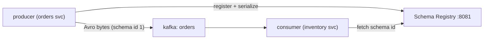

# P9 · Schema Registry & Evolution

**Read first:** [Schema evolution & registry](../02-concepts/schema-evolution.md)

Up to now your payloads are JSON blobs that break silently when fields change.
This project makes the payload **a contract**: Avro schemas, a registry with
compatibility rules, and the discipline that every produce/consume is
schema-checked. Then you evolve the schema without anyone noticing — and break it
on purpose to see the guard rails.

## What you build



| Skill | Learned by |
|-------|-----------|
| Registry + Avro serde in Python | `confluent_kafka.schema_registry` |
| Subjects & versions | `curl` the API |
| Backward/forward/full, and testing them | compatibility endpoint |
| Schema evolution in a running system | the field dance (add/deprecate/remove) |
| Failure forensics | invalid bytes hitting the consumer → DLQ with `x-error-type=invalid` |

## Steps

### 1. Registry in compose

```yaml
  schema-registry:
    image: confluentinc/cp-schema-registry:7.7.0
    depends_on: [kafka]
    environment:
      SCHEMA_REGISTRY_HOST_NAME: schema-registry
      SCHEMA_REGISTRY_KAFKASTORE_BOOTSTRAP_SERVERS: kafka:9092
      SCHEMA_REGISTRY_KAFKASTORE_TOPIC: _schemas
    ports: ["8081:8081"]
```

### 2. The schema (Avro IDL or JSON — use JSON form, `order.avsc`)

```json
{
  "type": "record", "name": "OrderPlaced", "namespace": "com.shop",
  "fields": [
    {"name": "order_id",   "type": "string"},
    {"name": "customer_id","type": "string"},
    {"name": "amount",     "type": "long"},
    {"name": "currency",   "type": "string", "default": "USD"}
  ]
}
```

### 3. Producer with serde

```python
from confluent_kafka.schema_registry import SchemaRegistryClient
from confluent_kafka.schema_registry.avro import AvroSerializer, AvroDeserializer

registry = SchemaRegistryClient({"url": "http://localhost:8081"})
ser = AvroSerializer(registry, open("order.avsc").read(),
                     conf={"auto.register.schemas": False,   # v2: manual governance
                           "use.latest.version": True})
p.produce("orders", key=str(order_id), value=ser({"order_id": ..., "amount": 100}),
          callback=delivery_cb)
```

Consumer mirrors it (`AvroDeserializer`); **errors count** as `x-error-type=invalid`
→ DLQ path directly (see P8 ladder — this is a contract breach, not a retry).

### 4. Evolution, properly staged — the field dance

Scenario: product wants `discount_cents` on orders.

| Stage | Schema change | Compatibility test result |
|-------|--------------|---------------------------|
| **A: add** | `{"name":"discount_cents","type":["null","long"],"default":null}` | backward ✔ forward ✔ full ✔ |
| **B: populate** | producers fill it; consumers read optionally | still compatible |
| **C: deprecate** | keep emitting, mark `doc:"deprecated"` | compatible |
| **D: remove** | only after every consumer migrated | full needs a re-grant cycle |

```bash
# verify a candidate schema against history BEFORE deploying:
curl -X POST http://localhost:8081/compatibility/subjects/orders-value/versions \
  -d '{"schema":"{\"type\":\"record\",\"name\":\"OrderPlaced\",\"fields\":[...]}"}'
# {"is_compatible": true}
```

### 5. Break it — registry guards + failure forensics

- Register **v2 with a removed field**, no default → registry returns
  `is_compatible: false`. Your `--resolve` blocks the deploy (the whole point).
- Register with default: backwards-compatible. Old consumers keep working while
  new data flows. Roll out consumers, then remove the field in v3 — observe the
  registry still allowing it, and a *new* clean contract enforced on the wire.
- **Emulate corruption:** write raw garbage JSON (via kcat) to `orders` — the
  consumer's `AvroDeserializer` raises → your P8 ladder sends it to `orders.dead`
  with `x-error-type=invalid`. See the DLQ + alert save the partition.

## Checkpoints

??? question "1. Backward vs forward vs full — one sentence each, with an example breaking each."
    - **Backward** = *old* consumers can read *new* data. Breaking example:
      removing a field old consumers read — `order_id` gone → old code
      deserializes garbage or errors.
    - **Forward** = *new* consumers can read *old* data. Breaking example:
      adding a *required* field without a default — new code reads 2024 records,
      field missing, validation error.
    - **Full** = both directions at once. Breaking example: any change that is
      neither (e.g. rename + no default) — one of the two directions always
      deserializes into a hole. The registry's `compatibility=full` grade is
      exactly "both old→new and new→old survive".

??? question "2. Which deployment can you do with backward compatibility but not forward — producer-first or consumer-first?"
    - **Backward (old consumer reads new data)** → **producer-first**: ship the
      new producer with the new schema while old consumers are still deployed —
      they must keep reading. (Added-with-default / removed-with-default are the
      safe shapes.)
    - **Forward (new consumer reads old data)** → **consumer-first**: deploy new
      consumers while the old producers still emit the old schema — they must
      read historical bytes.
    With **backward only**, you may go producer-first but *not* consumer-first
    (new consumer meeting old data breaks). With **forward only**, consumer-first
    but not producer-first. With **full**, either order works — which is why
    `FULL` is the production default for shared topics.

??? question "3. Where does `default` appear in Avro (and what does its absence turn a *new* field into)?"
    In the **field declaration**: `{"name": "discount_cents", "type": ["null",
    "long"], "default": null}`. Its roles:
    - **Reading old data**: when a new record lacks the field, the reader fills
      in `default` — that's the entire forward-compat mechanism.
    - **Missing default** = the field is *required*: a new consumer deserializing
      old records *fails validation* → forward-compat broken, records go to the
      DLQ as `x-error-type=invalid`.
    So "add a field" has two flavors: *add with default* (safe both directions)
    vs *add required* (only old→new survives). Avro also lets *you* be the
    default: `default: null` + `["null", ...]` union is the canonical "optional
    field" shape.

??? question "4. Schema id in first 4 bytes: how does a *replayed old* record from 2024 deserialize today? (Subject versions — go look at the registry API.)"
    The wire format embeds the **schema id** (`magic byte + 4-byte id`), not the
    schema. Today's `AvroDeserializer` fetches the *schema for that id* from the
    registry (`/subjects/<subject>/versions/<version>` where the id maps to a
    registered version under the subject). So:
    1. the 2024 record still carries *its* schema id → registry serves the
       *2024 schema* → deserialization succeeds against the schema it was
       written with;
    2. your *new* consumer code reads that record through its **own (new)
       schema**, and Avro applies the compatibility resolution (defaults fill
       missing fields, field order is by name) — old bytes, new view, no crash;
    3. failure modes: schema purged from registry (can't resolve id) or
       `auto.register.schemas` had written a *divergent* schema under the same
       subject (id mismatch hunt — the Q3 of the concept page).
    Moral: never delete registry subjects you might still replay — retention
    must outlive your replay window.

## Done when

- [ ] Producer + consumer exchange Avro over `orders` with zero JSON
- [ ] The field dance adds, populates, deprecates, removes — registry grades each step
- [ ] A violating schema is rejected at `compatibility/` before deploy
- [ ] Corrupt bytes reach the DLQ labeled `invalid`, partition keeps moving

Next: **[P10 · Exactly-Once & Kafka Transactions](p10-exactly-once.md)** — the
final word on duplicate-freedom, honestly stated.