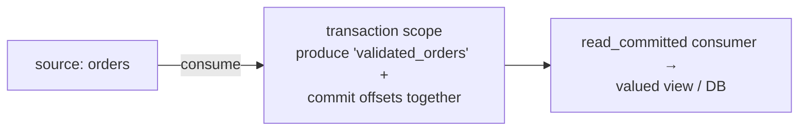

# P10 · Exactly-Once & Kafka Transactions

**Read first:** [Exactly-once semantics](../02-concepts/exactly-once.md) →
[Delivery semantics](../02-concepts/delivery-semantics.md)

The myth-debunking project. You will build:

1. An **idempotent producer** (duplicates impossible at the broker),
2. A **transactional producer + consumer** (produce + offsets commit atomically),
3. A `read_committed` consumer that never sees uncommitted or aborted output —
   and prove exactly what EOS does **and does not** guarantee.

## What you build



| Skill | Learned by |
|-------|-----------|
| Idempotent producer vs plain | duplicate provocation, broker-side dedupe |
| Transactions (`transactional.id`, init/begin/commit) | atomic produce+offset commit |
| `read_committed` vs `read_uncommitted` | aborted transactions invisible |
| Zombie fencing (why `transactional.id` matters) | two instances, one id |
| What EOS *can't* fix | calling an external API mid-transaction |

## Steps

### 1. Broker prerequisites

```bash
# offsets.topic.replication.factor, transaction.state.log.* already set in our compose
# needed: topic with multiple partitions to see aborted-produce behavior
kafka-topics.sh --create --topic source      --partitions 3
kafka-topics.sh --create --topic validated   --partitions 6
```

### 2. Idempotent producer (60 seconds, optional but `acks=all` default)

```python
p = Producer({
    "bootstrap.servers": "localhost:9092",
    "enable.idempotence": True,     # exactly-once per produce, always on
    "acks": "all",
})
```

**Provoke duplicates**: fire `produce` + `flush` in a tight loop with broker
transiently down — with idempotence on, the retried batch gets `sequence`-checked;
no duplicates land. (Without it: some retries double-write. Reproduce both, note
offsets.)

### 3. Transactional producer (atomic produce + commit)

```python
tp = Producer({
    "bootstrap.servers": "localhost:9092",
    "transactional.id": "validator-1",     # stable identity → fencing
    "enable.idempotence": True,
    "acks": "all",
})
tp.init_transactions()
```

The loop — the one true pattern:

```python
while True:
    msgs = c.consume(num_messages=50, timeout=2.0)     # c: plain consumer, no auto-commit
    if not msgs: continue
    tp.begin_transaction()
    processed = []
    for m in msgs:
        if validate(m):                               # business logic
            tp.produce("validated", key=m.key(), value=m.value())
            processed.append(m)
    try:
        tp.send_offsets_to_transaction(
            {TopicPartition(m.topic(), m.partition(), m.offset() + 1) for m in msgs},
            c.consumer_group_metadata())
        tp.commit_transaction()                        # output + offsets, atomically
    except KafkaException:
        tp.abort_transaction()                         # retry whole batch
```

Observer consumer:

```python
Consumer({... "isolation.level": "read_committed"})
```

### 4. Provoke and grade

| Experiment | Observable property |
|------------|---------------------|
| Kill consumer mid-batch | aborted batch never visible to `read_committed` |
| Two instances sharing `transactional.id` | zombie (elder) is fenced: its commits rejected/aborted — Kafka kills stale epochs |
| Consumer crashes before `commit_transaction` | batch aborted, offsets NOT advanced → reprocessed, nothing double-applied |
| `read_uncommitted` twin observer | sees pre-commit bytes (and aborts!) → why everyone sets read_committed |

## Break it — the “cost” table (budget the tax)

1. **Throughput A/B:** same 100k messages, idempotent-producer vs
   transactional-producer loops. Record msgs/s and p99 latency. The transaction tax
   is real — write the delta in your notes (typical 1.2–1.8×).
2. **The external-API truth test:** inside the transaction batch, call an external
   HTTP "email service" (a stub with a side effect counter) *before* commit. Abort
   the transaction → the email already sent. **Where** did "exactly-once" stop? —
   Answers: at the broker. The email needs its own idempotency key. This is the
   precise beginner misconception, now demonstrated.

## Checkpoints

??? question "1. If consumers of `validated` are `read_committed`, do they *still* see duplicates? (Hint: think consumer-group rebalances + offsets vs transactions.)"
    **Yes — duplicates survive.** `read_committed` hides *aborted* transactions,
    not *redeliveries*. The consumer group's own mechanics still produce them:
    - a **rebalance** re-reads from the last committed *group* offset — records
      processed but uncommitted get re-delivered to another member;
    - a **crash between side effect and commit** (in the *consumer*, not the
      producer) → same overlap;
    - the transactional producer guarantees atomic *produce+offset* commits,
      but the consumer's own commit timing is its own contract.
    Transactions give you **atomicity** (all-or-nothing batches visible to
    readers) and broker-side **no-dup produce** — the group's at-least-once
    redelivery is a *consumer-side* property. That's why the last line of the
    P10 "belt and braces" is still the **P3 idempotency table** — transactions
    moved the needle, they didn't remove the needle.

??? question "2. What exactly does `transactional.id` fence, and from what?"
    It fences **producer instances that share the same identity** — the *zombie
    problem*. `transactional.id` is a stable logical name (e.g. `validator-1`):
    when a new producer initializes with it, the broker **invalidates the
    previous epoch** for that id. Any commit from the stale/zombie session
    carries the old epoch → rejected by the broker. Result: only the current
    holder can commit; stale writes can't interleave, can't duplicate, can't
    "win". It fences *producers*, not the world — it says nothing about
    non-Kafka participants (Q3) and nothing about *consumers* of your topic
    (their own group rebalance is unfenced — Q1).

??? question "3. Which of these does EOS NOT give you: (a) no broker-level dupes ✔/✗, (b) atomic DB+broker change ✔/✗, (c) no duplicate side effects in a DB consumer ✔/✗ — justify each."
    - **(a) No broker-level dupes: ✔** — idempotent producer + fencing = the
      broker itself rejects duplicates; this is the layer transactions *do*
      own.
    - **(b) Atomic DB+broker change: ✗** — the transaction spans Kafka topics
      only; your DB write is outside it (you'd need the P4 outbox for that).
      A crash mid-flow can commit the DB row and not the produce (or vice
      versa).
    - **(c) No duplicate side effects in a DB consumer: ✗** — transactions say
      nothing about *your* consumer's apply loop: redelivery (rebalance,
      crash-between-effect-and-commit) still double-applies unless the DB
      constraint (P3's `processed_events`/unique key) is the guard. Exactly-once
      for the broker, at-least-once + idempotency for the world.

??? question "4. When would you *not* use transactions: list three real cases."
    1. **Simple produce-only pipelines** (P1/P4 relays): plain idempotent
       producer + `acks=all` gives broker-side no-dup at a fraction of the
       transaction tax; transactions add coordination cost for zero benefit
       when you have nothing atomic to group.
    2. **External effects inside the batch** (email/Stripe/webhook): transactions
       can't cover the external call (P10 break-it #2) — you *still* need the
       idempotency key; the transaction's atomicity is a lie about the part
       that matters → pay only for the P3 contract.
    3. **Throughput/latency-critical fan-out** (telemetry, metrics, DLQ
       routers): the P10-measured 1.2–1.8× tax and `read_committed` isolation
       semantics (readers see less of the stream) aren't worth it when the
       consumer is idempotent anyway — the DB constraint is cheaper and safer.
    General rule: **transactions where the atomicity is worth the tax; P3 + P4
    everywhere else** (which is "almost everywhere" in practice).

## Done when

- [ ] Aborted transactions invisible to your consumer (SQL/log-proof)
- [ ] Fencing experiment: zombie producer's writes rejected
- [ ] Throughput tax measured and honest number on your notes
- [ ] You can explain "exactly-once for the broker, at-least-once + idempotency
      for the world" in one sentence

For the belt-and-braces combo (transactions + outbox), revisit P4 with this new
eye — the pair is the strongest reliable-publish pattern in this book.

Next: **[P11 · Event-Sourced Bank](p11-event-sourcing.md)** — a different paradigm
where the event log becomes the truth.