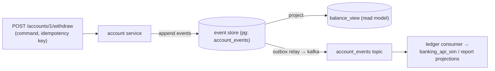

# P11 · Event-Sourced Bank

**Read first:** [Event sourcing & CQRS](../02-concepts/event-sourcing-cqrs.md) →
[Idempotency](../02-concepts/idempotency.md) (you'll need it)

Different paradigm, same muscles: a **bank ledger** where the *events themselves are
the source of truth*. `balance` is a projection. You'll implement commands,
event store, idempotent application, replay, and a CQRS read model — then push
through Kafka to a consumer.

## What you build



| Skill | Learned by |
|-------|-----------|
| Event store schema (aggregate_id, version, payload) | append-only + unique (agg, version) |
| Optimistic concurrency (version check) | two concurrent withdrawals on same account |
| Projections: balance view built by fold | SQL vs Python fold |
| Replay / rebuild view from log | `TRUNCATE balance_view; REPLAY;` |
| Idempotent command application | dedup via processed_events (P3) |
| CQRS read model in Kafka | consumer projects events into report tables |

## Steps

### 1. Event store

```sql
CREATE TABLE account_events (
  id            BIGSERIAL PRIMARY KEY,
  account_id    TEXT NOT NULL,
  version       INT  NOT NULL,
  event_type    TEXT NOT NULL,      -- AccountOpened | Deposited | Withdrawn | Closed
  payload       JSONB NOT NULL,
  created_at    TIMESTAMPTZ DEFAULT now(),
  UNIQUE (account_id, version)      -- ← the concurrency guard
);

CREATE TABLE balance_view (          -- pure projection, rebuilt anytime
  account_id   TEXT PRIMARY KEY,
  balance      NUMERIC(12,2) NOT NULL,
  version      INT  NOT NULL,
  updated_at   TIMESTAMPTZ
);
```

**The law**: writes only ever `INSERT INTO account_events`; the *balance* is never
stored transactionally — it's recomputed (or replayed into the view).

### 2. Command → event (with optimistic concurrency)

```python
async def withdraw(account_id, amount, idempotency_key):
    async with db.transaction():
        dup = await db.fetchrow(
            "SELECT 1 FROM processed_events WHERE event_id=$1",
            idempotency_key)
        if dup: return {"status": "already_applied"}       # idempotent replay

        version = await db.fetchval(
            "SELECT version FROM account_events WHERE account_id=$1 "
            "ORDER BY version DESC LIMIT 1 FOR UPDATE", account_id) or 0

        event = {"account_id": account_id, "event_type": "Withdrawn",
                 "payload": {"amount": amount, "at": now_iso()}, "version": version + 1}
        try:
            await db.execute(
                "INSERT INTO account_events (account_id, version, event_type, payload)"
                " VALUES ($1,$2,$3,$4)", account_id, version + 1, "Withdrawn", event["payload"])
            await db.execute("INSERT INTO processed_events(event_id) VALUES ($1)", idempotency_key)
        except UniqueViolation:
            raise Conflict("concurrent write — retry with fresh fold")   # optimistic retry

    project_balance(account_id, event)     # fold one event into balance_view
```

Concurrent withdrawal demo: two parallel withdraws → one hits
`UNIQUE (account_id, version)` → conflict → **retry loop folds the newest event
and re-applies** (classic optimistic concurrency; it's the same dance Kafka stream
processors do).

### 3. Projection: fold, yourself

```python
def project_balance(account_id):
    # simplest correct version: fold over the whole stream
    rows = db.fetchall("SELECT event_type, payload FROM account_events "
                       "WHERE account_id=$1 ORDER BY version", account_id)
    bal, v = Decimal(0), 0
    for r in rows:
        bal += r.payload["amount"] if r.event_type in ("Deposited", "Withdrawn-ish sign") else 0
        v = r.version
    db.execute("INSERT INTO balance_view VALUES ($1,$2,$3) "
               "ON CONFLICT (account_id) DO UPDATE SET balance=$2, version=$3", ...)
```

(Then optimize: replay only rows > stored `version` — that's what the `version`
column is for; explain the optimization in your notes.)

### 4. Events leave the house (outbox relay → Kafka)

Reuse P4's outbox: each committed event also inserts an outbox row →
`account_events` topic (key=`account_id`) → **ledger consumer** projects into a
`monthly_statements` report table (CQRS read model: statements computed from
events by a different team/consumer, not from `balance_view`). Also — audit trail
consumer: archives every event as JSON lines.

### 5. Replay is the superpower

```bash
scripts/replay.sh  # TRUNCATE balance_view;  replay all events;  compare to control
```

Bug found in projection logic → re-run replay → views fixed. *Nothing else
changes.* This is the pitch line of event sourcing — now you can promise it with a
straight face.

## Break it

1. **Concurrent withdraws** (same account, 10 parallel) → exactly one succeeds per
   version; losers retry and succeed *later*, total & final balance match SQL math.
2. **Replay race:** launch replay while a withdraw commits mid-flight → view
   converges or conflicts; design choice: replay under an account-level lock
   (accept it, implement it, note the tradeoff).
3. **Duplicate command with same idempotency key** → `already_applied`, zero side
   effects. (Replay P3 tautology: your constraint is the guard.)
4. **Corrupt an event**: hand-edit `payload` of an old row (or insert an
   `event_type='Earned'` you never defined) → consumer of the Kafka topic DLQs it
   (P8) while your *DB* replay just... fails loudly on an unknown type. What's
   your policy for "unknown event type, historic data"? (Schema registry P9 was
   supposed to be involved — note it.)

## Checkpoints

??? question "1. Why is `UNIQUE (account_id, version)` the heart of the whole store?"
    Because it is the **event store's exactly-once invariant**: the same
    aggregate can never contain two events with the same version. Consequences:
    - **Append-only integrity**: a retried append (crash between INSERT and
      commit) hits the constraint → the store refuses a duplicate version —
      history is *unique by construction*, no idempotent-writer needed.
    - **Optimistic concurrency**: two concurrent withdrawals on one account
      both read `version=5`; exactly one INSERT of `version=6` wins; the loser
      gets `UniqueViolation` → fold the newest events and retry (P11 step 2).
      The constraint *is* the CAS — the P3-style guard and the optimistic
      concurrency guard are the same row.
    - **Replay safety**: the view rebuild reads `(account_id, version)` as its
      order key — total order per aggregate that can't be corrupted by clocks.
    Without it you'd need a SELECT-check (racy), a distributed lock (complex),
    or a repair process — the constraint gives all three for the price of one
    index.

??? question "2. Balance is 9,000,000 events deep. Replay takes 3 minutes. What three optimizations (snapshot, partial replay, view rebuild targets) restore it?"
    1. **Periodic snapshots**: every N events (or every 24 h) write
       `account_snapshot(account_id, version, balance)` — replay starts from the
       newest snapshot ≤ target, folding only the tail. 9M events → maybe 5k.
    2. **Partial / targeted replay**: replay only the *affected* aggregates
       (the replay tool filters by `account_id`), and only rows with
       `version > stored_version` in the view (the version column's purpose —
       incremental fold).
    3. **Rebuild targets by consumer need**: `balance_view` for reads
       (snapshot-driven), `monthly_statements` rebuilt per-month from the log,
       audit archive untouched — you don't rebuild *all* projections on every
       bug; you rebuild the ones the bug touched, with snapshot baselines.
    Note the tradeoff honestly: snapshots are themselves state to keep
    consistent (write them from the same fold code, same `version`), but they
    buy the "replay in seconds, not minutes" property.

??? question "3. The ledger consumer and balance_view disagree by $5. Who's right, and which evidence does the event store give you?"
    **The event store is the arbiter — the ledger (a consumer projection) is a
    derived opinion.** Evidence to collect, in order:
    1. **Fold from the log, independently**: replay `account_events` for the
       account through a *fresh* projector (or the `replay.sh` path) — the
       authoritative balance. Compare against both `balance_view` and the
       ledger consumer's output.
    2. **Offsets vs versions**: which events did the ledger consumer actually
       apply? (Check its committed offsets against the topic's log end; a
       lagging/errored consumer explains "missing event".)
    3. **Duplicates/dedup**: `processed_events` tells you if a delivery was
       skipped (dedup marker present but projection row updated → applied
       twice?) — the constraint protects apply, not the projector's math.
    Verdict rule: **a mismatch is always a projection bug (yours), never a
    history bug** — until the fold itself disagrees with a *manual* accounting
    of the facts, in which case the event (a fact) was wrong, and you have
    exactly the corrupt-event policy question of break-it #4.

??? question "4. Where would you *put* the event store outside Postgres? (Kafka topic with infinite retention; name the two tradeoffs — queryability, transactional coupling with outbox.)"
    A Kafka topic (compact + infinite retention, key=`account_id`, value=event)
    as the event log. The two tradeoffs to name:
    1. **Queryability** — Kafka is a stream, not a database: you can replay in
       order (single partition per key) but you can't do SQL: no
       point-in-time balance queries, no `WHERE amount > x`, no ad-hoc
       analysis without *projecting first*. Every read becomes a fold + index
       (an analytics consumer) instead of a query.
    2. **Transactional coupling with the outbox** — the "write event + produce"
       atom has to span *two* stores: either the outbox (P4: DB txn → relay →
       Kafka, event effectively *eventual*), or Kafka transactions (P10:
       atomic within Kafka, but your command/read state then must live
       Kafka-side too — a different coupling). You can't have "DB txn
       commits + Kafka atomically" without one of the two bridges; both have
       failure modes (lost relay, zombie epochs).
    Bottom line: Postgres event store wins on queryability + single-txn
    atomics; Kafka-as-event-log wins on distribution/scale-out but pays in
    query power and bridge complexity. Real systems often do *both* — DB as the
    authoritative store, topic as the transport — which is exactly P11 step 4's
    design.

## Done when

- [ ] Ledger appended via events; nothing in the DB mutated state except the view
- [ ] Concurrent writes resolved by optimistic retry, math checks out
- [ ] `replay.sh` rebuilds balance_view and matches control values
- [ ] You can explain "events = truth, projections = opinions" to a non-CS friend

Next: **[P12 · Capstone: E-Commerce Platform](p12-capstone.md)** — every piece,
one system.