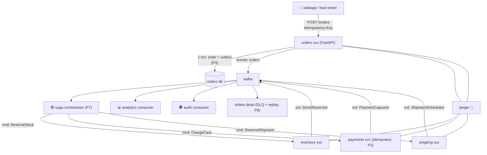

# P12 · Capstone: E-Commerce Platform

Everything, wired together, one weekend. Order placement through the entire
pipeline — outbox → saga → idempotent payments → tracing → DLQ → observability.

## The system



| Component | Reuses | New this project |
|-----------|--------|------------------|
| orders svc | P4 outbox, P9 Avro | — |
| saga orchestrator | P7 | timeouts per step (P8's watchdog) |
| payments svc | P3 idempotency | — |
| inventory/shipping | P6 stubs | — |
| DLQ + replay | P8 | runbooks per event type |
| Schema registry | P9 | for *all* topics |
| Tracing + metrics | new | OTel + Jaeger + lag dashboard |

## Build order (one shot, end to end)

### 0. Stack

Add to compose: `schema-registry` (P9), `jaeger` + `otel-collector`, and the four
services. All Kafka topics get Avro (P9), all consumers use the P3 dedup table.

### 1. Order ingress with idempotency + outbox (P3 + P4 + P9)

```python
@app.post("/orders")
async def create_order(req: CreateOrderReq, idempotency_key: str = Header(...)):
    async with db.transaction():
        claim = insert_idem_key_or_422(idempotency_key, hash(req))   # P3
        if claim.replayed: return stored_response
        order_id = str(uuid4())
        await db.execute("INSERT INTO orders ...")
        await db.execute("INSERT INTO orders_outbox (aggregate_id, event_type, payload)"
                         " VALUES ($1,'OrderPlaced',$2)", order_id,
                         ser({"order_id": order_id, "customer_id": req.customer_id,
                              "amount": req.amount, "items": req.items,
                              "event_id": f"ord-{order_id}-placed", "ts": iso()}))
    return {"order_id": order_id}
```

`ser` = Avro serializer (self-describing, registry-checked). Relay publishes
`OrderPlaced` — keyed by `aggregate_id=order_id` (ordering law, P2).

### 2. Saga orchestrator (P7) with per-step timeout watchdog (P8)

- Table: `saga_instances(saga_id, order_id, status, current_step, ...)`.
- Watchdog query every 10s: `running AND updated_at < now()-30s` → re-emit
  step command → counter → exceed → `compensating`.
- Compensation matrix (write it, pin it):

```
reserve_stock  ← fail→ abort
charge_payment ← fail→ ReleaseStock, abort
ship           ← fail→ Refund + ReleaseStock, abort
confirm        ← fail→ Refund + ReleaseStock, abort
```

### 3. Payments svc — P3 again, slightly bigger

`ChargeCard` command (idempotency key = `saga_id`) → `PaymentCaptured` with
`event_id=f"pay-{saga_id}"`. The `processed_events` table absorbs any replay from
the watchdog.

### 4. DLQ + runbooks

Every catch in every consumer → `*.dead` with headers (`x-error-type`,
`x-attempts`, trace id). **Runbook.md per event type** — this is the deliverable
that separates "built a demo" from "built an operating system".

### 5. Tracing: make it *queryable*

```python
# otel instrumentation: FastAPI
opentelemetry-instrumentation-fastapi
# manual header propagation producer/consumer (P12 snippet from observability page)
from opentelemetry.propagators.tracecontext import TraceContextTextMapPropagator
```

Trace id goes: HTTP POST → outbox insert → relay → consumer step → saga_instances
row update → next command. Jaeger shows the full waterfall per order. **This is
your "is it stuck?" answer** (observability walkthrough, P.12).

### 6. Load tester + the lag dashboard

```bash
python scripts/load.py --rate 50 --hours 2        # happy path
python scripts/chaos.py --fail-payments 30%       # sagas walk compensations
python scripts/poison.py --inject 5               # DLQ alerts fire
```

Dashboard (prometheus+Grafana or a dumb lag loop — Grafana worth it):
per-consumer-group lag, DLQ count, saga `running` age, outbox staleness.

## Break it (grand finale — the full gauntlet)

1. **Double order placement** (same key, 50 parallel) → 1 saga, 1 charge. ✔
2. **Payments down 60s** → watchdog re-emits; on restart, charges succeed; zero
   user-visible stuck orders.
3. **Kill relay mid-loop** → orders still swallowed, events published on restart.
4. **Poison the wire** (bytes on `orders`) → DLQ + alert + `x-error-type=invalid`.
5. **Duplicate replay** of `orders.dead` while producers still live → dedup absorbs.
6. **Compensation storm:** payments fails repeatedly; verify refunds == captures,
   releases == reserves, exactly once (SQL counts).
7. **Trace it:** find in Jaeger the exact step where the 95th-percentile order
   slows down. If you can't, the tracing is not done.

## Checkpoints (the final interview board)

??? question "1. Walk the entire order lifecycle aloud: which component guarantees no loss? Which guarantees no oversell? Which guarantees no double-charge?"
    **No loss**: the *outbox* (P4) — order row + outbox row commit atomically;
    the relay publishes after ack-only marks; any relay crash re-publishes, and
    `acks=all` guarantees broker durability. Loss is *structurally impossible* —
    at-least-once to the topic.
    **No oversell**: the *inventory service's DB*, not Kafka — `SELECT ... FOR
    UPDATE` / `UPDATE ... WHERE qty >= x` on the sku row inside a local
    transaction with its P3 dedup marker; two parallel reservations are settled
    by the row lock, never by message timing.
    **No double-charge**: the *payments service's idempotency contract* (P3) —
    `saga_id` as the idempotency key, unique row + `processed_events` in the
    same txn; the watchdog's re-emitted `ChargeCard` and every replay hit the
    same key → stored response, one charge.
    **Who is accountable where**: outbox = orders svc, stock = inventory svc,
    money = payments svc — that's the *boundary* answer interviewers want: each
    guarantee lives in exactly one service, not in the broker.

??? question "2. If `saga_instances` says `current_step=charge_payment, status=running` for 10 minutes, what do you check first, second, third — and why in that order?"
    1. **Watchdog state & re-emit count** — is the step being re-emitted and
       exhausted its budget (→ should have transitioned to `compensating`)?
       Check first because *your* machinery may be the bug (watchdog down,
       query wrong) — cheapest diagnosis, nothing downstream.
    2. **Payments service health + its command lag** — is `orders.cmd.
       ChargeCard` actually being consumed? Lag in that group = the command is
       *delivered but not processed*; payments down = transient, watchdog
       re-emits handle it.
    3. **The `PaymentCaptured` topic + the orchestrator's event consumer** —
       was the event *produced* but not *received* (event consumer stuck/at
       old offset)? This is the classic "state vs evidence" check (P7 Q3):
       `running` doesn't tell you whether the card was charged — only the event
       (and the payment service's ledger, via the `saga_id` key) does.
    Order logic: own machinery → delivery → evidence. Every subsequent check
    narrows "which layer ate the message", which is exactly what the tracing
    (Jaeger waterfall) answers in one screen when it's wired.

??? question "3. You must add a 'send confirmation email' step after `confirm`. Which patterns do you touch, and what's the idempotency key for the email send?"
    Patterns touched, in order:
    1. **Saga state machine (P7)**: a new step `send_email` in the
       `saga_instances` flow — next step after `confirm`, with its own
       command/event pair (`SendConfirmation` / `EmailSent | EmailFailed`) and
       a *non-blocking* failure policy (email failure should *not* abort the
       order — it escalates/retries; choose `async` failure semantics).
    2. **Outbox (P4)**: the command goes through the orchestrator's outbox —
       state + command atomic, exactly once.
    3. **Idempotency (P3)**: the email service's dedup contract — key =
       `email-confirm-{saga_id}` (or `order_id`): the saga id makes every
       re-emission (watchdog, replay) land on the *same* logical email; the
       service's `processed_events` row ensures one send.
    4. **DLQ (P8)**: `EmailFailed` → retry ladder → `orders.dead` with headers;
       a runbook ("check mail provider quota, replay").
    5. **Tracing (P12)**: propagate the trace id into the email provider call
       so the "sent?" question is one Jaeger query.

??? question "4. Scale to 5× traffic: enumerate every scaling lever from P2 lessons (partitions, consumers, DB, relay) in order of cheapest first."
    1. **Consumers per group** — up to partition count; zero-cost first step
       (already idle instances? finish filling 1:1 first).
    2. **Partitions** — `alter --partitions` upward (cheap; never shrink);
       re-key only if keys get hot (hot-partition detection → shard the key).
    3. **Worker pools inside consumers** — poll fast, N workers, per-key
       dispatch (P2 Q3's second lever) — buys concurrency without touching
       topics.
    4. **Relay throughput** — batch size up (`LIMIT 100` → 1000), poll
       interval down, `SKIP LOCKED` verified; a second relay replica only
       after `SKIP LOCKED` (P4 Q3) — two relays poll in parallel.
    5. **DB** — index the partial outbox index correctly, then: read replicas
       for projections, connection pooling, and *eventually* partition the
       table — the DB is the last lever, not the first.
    6. **Broker** — only when partitions/topics grow: broker count up, RF ≥ 2,
       `min.insync.replicas=2` — the *hardest* lever; 5× traffic rarely needs
       it if 1–5 are done first.
    Order: consumers → partitions → worker pools → relay batching → DB → broker.

??? question "5. A cloud provider drops a Kafka broker. Your `acks=all` is with 1 replica (P1 compose!). What did you learn about production setup here? (Replication factor, min.insync, ISR — say it.)"
    That **`acks=all` is only as strong as your replication factor** — with
    `RF=1` there is exactly one replica, so `acks=all` means "the one broker
    acked" — the broker dies and the data dies with it. The production
    triangle:
    - **RF ≥ 3** — the topic survives 1–2 broker losses; no data loss window.
    - **`min.insync.replicas=2`** — the *produce-side* guard: the broker refuses
      to ack when fewer than 2 replicas hold the record, so "acked" always
      means "durable on ≥2 machines" (and the ack failure is *loud*, not
      silent).
    - **ISR (in-sync replicas)** — the broker's own health signal: when a
      replica falls behind, it leaves the ISR; producers with `acks=all` then
      wait on the remaining ISR — and with `min.insync.replicas=2`, a
      degraded ISR *blocks produces* instead of silently writing to one
      machine.
    Lesson for P12/prod: never run RF=1 outside the compose; the "no loss"
      guarantee of the outbox is *broker durability*, and broker durability is
      RF + min.insync, not acks=all alone.

## Done when

- [ ] The full gauntlet passes with SQL-proofed assertions (scripts emitted them)
- [ ] Traces answer the stuck-order question in under a minute
- [ ] Runbook.md (or its folder) covers every `*.dead` event type you know
- [ ] You can whiteboard the whole architecture — services, topics, keys —
      in under 3 minutes, from memory.

## Learn more

- **Read** — [Designing Data-Intensive Applications](http://dataintensive.net) — by this point the entire book is fair game; this project is a survey of its themes.
- **Watch** — [Kafka Summit's most-watched talks](https://kafka.apache.org/community/videos/) — production talks on large clusters, exactly-once and event-streaming architectures at scale.
- **Read** — [The Log: What every software engineer should know](https://engineering.linkedin.com/distributed-systems/log-what-every-software-engineer-should-know-about-real-time-datas-unifying-abstraction) (Jay Kreps) — the paper this whole ladder rests on; reread it now that every pattern on it has been built by hand.

That's the ladder. The patterns now live in your hands: **outbox for atomicity,
idempotency for duplicates, saga for workflows, DLQ for resilience, schema for
contracts, traces for truth.** Build something real with them.