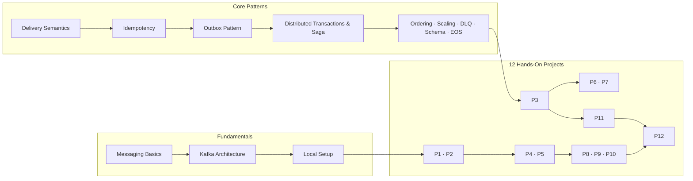

# System Design with Kafka — Hands-On Guide

> **Goal**: learn how real async, event-driven systems are designed and built — Kafka, the transactional outbox, sagas, idempotency, distributed transactions, and everything that surrounds them.

!!! quote "How to use this guide"
    Read a concept, then immediately build the matching project. The projects are a
    **ladder** — each one reuses the last one and adds exactly one hard problem. Do not
    skip ahead; the painful parts are the point.

## Why teach system design through Kafka?

Nearly every modern interview question and real-world architecture comes back to the
same core problems:

- How do you reliably move state between services **without losing or duplicating data**?
- How do you keep a **database and a message broker consistent** when one write is not atomic?
- How do you run a **transaction that spans multiple services**?
- How do you handle **retries, duplicates, and partial failures** gracefully?
- How do you **scale readers** without breaking ordering guarantees?

Kafka is the canonical tool for all of these — and the patterns (outbox, saga,
idempotency, DLQ) are tool-agnostic ideas you will reuse forever. If you understand
them on Kafka, you understand them anywhere.

## The learning path

| Stage | What you learn | Projects |
|-------|----------------|----------|
| **Fundamentals** | What a broker is, Kafka internals, running Kafka locally | P1–P2 |
| **Reliability basics** | Delivery semantics, idempotency, retries, offsets | P3 |
| **Atomic dual writes** | Transactional outbox, polling publisher, CDC with Debezium | P4–P5 |
| **Multi-service transactions** | Sagas: choreography vs orchestration, compensations | P6–P7 |
| **Production hardening** | DLQ, backoff, schema evolution, exactly-once | P8–P10 |
| **Patterns beyond Kafka** | Event sourcing, CQRS, observability | P11–P12 |

## What you build along the way

A progressively realistic **e-commerce platform** (orders → payments → inventory →
shipping). By the end you will have designed and built:

1. A **Kafka cluster** with topics, partition keys, and consumer groups
2. An **idempotent payment API** that survives retries and duplicates
3. **Transactional outbox** publishing (polling publisher *and* Debezium CDC)
4. A **saga** for placing orders — first by choreography, then by orchestration
5. **Dead letter queues** with retry/backoff and manual repair workflows
6. **Schema evolution** with a Schema Registry (Avro)
7. **Kafka transactions** and exactly-once semantics
8. An event-sourced **bank ledger** with CQRS read models
9. A **capstone** that ties it all together with tracing and slack-lag monitoring

## Prerequisites

- Comfortable with Python (the runs-able code is FastAPI + `confluent-kafka`)
- Basic Docker / Docker Compose
- Some SQL (a little PostgreSQL)
- No Kafka experience required — the fundamentals section is self-contained

## Tech stack used throughout

| Tool | Role |
|------|------|
| Kafka (KRaft mode) | The broker, topics, consumer groups |
| FastAPI | HTTP service APIs |
| confluent-kafka / librdkafka | Producer & consumer clients |
| PostgreSQL | Service databases (orders, payments, outbox) |
| Debezium | Change Data Capture from the outbox table |
| Confluent Schema Registry | Avro schemas + compatibility |
| kcat / Console scripts | CLI inspection of topics |
| Jaeger + OpenTelemetry | Distributed tracing (capstone) |

## A note on the code

Each project page shows **key snippets** inline (the parts that make the pattern work).
Full runnable code lives in `code/pXX-*/` added project-by-project as you go — or in
your own repo, which is even better for learning. Type things out yourself before
peeking.

!!! tip "The golden rule of this course"
    **Never trust a system you haven't broken.** Every project includes a
    "break it" section where you kill processes mid-flight, publish duplicates, and
    watch the system prove itself. That is where the learning happens.